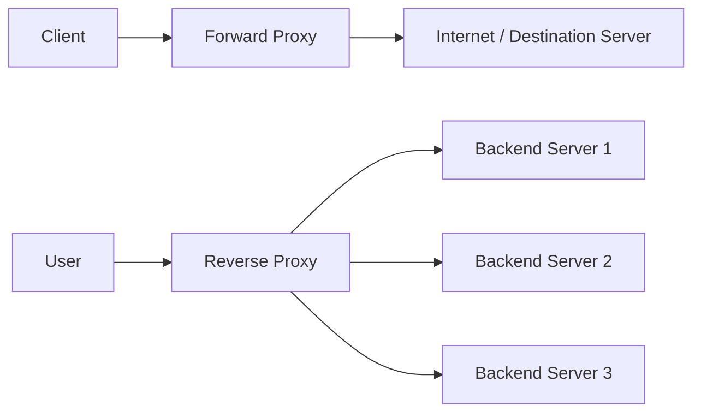
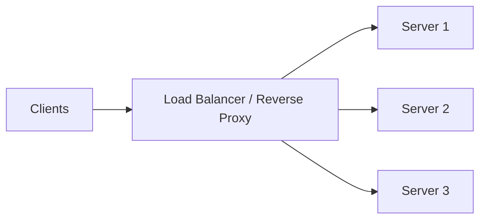
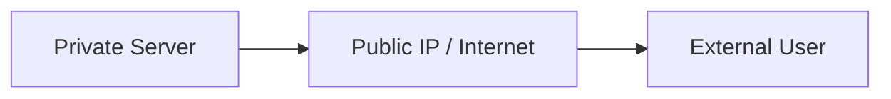
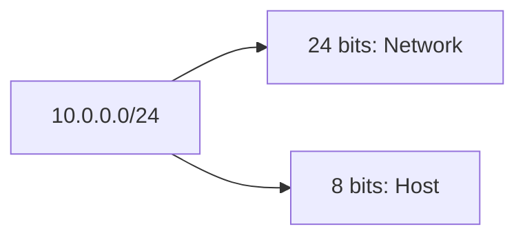
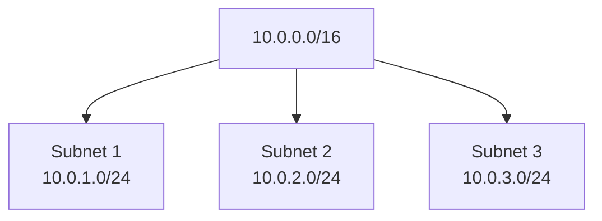
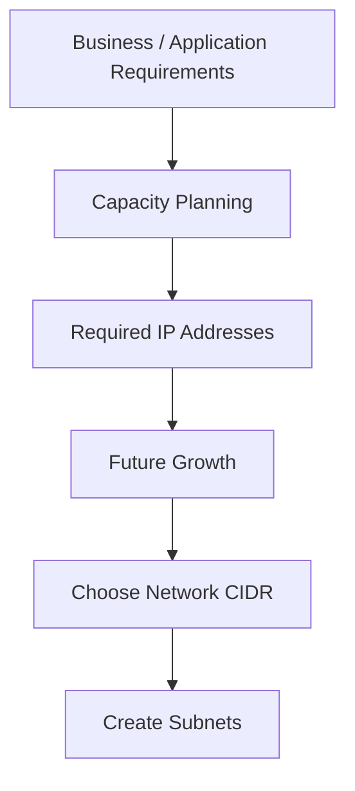
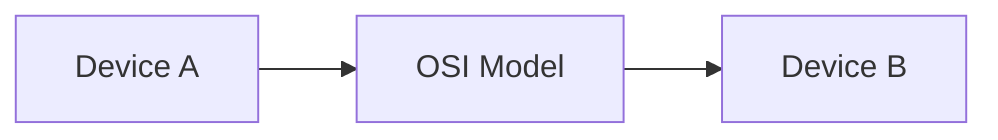

# DevOps Session — Networking Notes

**Date:** 26 Aug 2026
**Focus:** Proxies, networking fundamentals, IP addressing, CIDR/Subnets, introduction to OSI model

These notes are condensed from the instructor's portion of the transcript; participant discussions and repetition have been removed. 

---

## 1. Forward Proxy vs Reverse Proxy ⭐

### Basic idea



| Feature             | Forward Proxy                      | Reverse Proxy                         |
| ------------------- | ---------------------------------- | ------------------------------------- |
| Acts on behalf of   | **Client**                         | **Server**                            |
| Handles             | Outgoing requests                  | Incoming requests                     |
| Client knows proxy? | Usually **yes**                    | Usually **no**                        |
| Main purpose        | Access control, privacy, filtering | Load balancing, security, performance |
| Protects            | Client/network                     | Backend servers                       |
| Example             | Corporate proxy/firewall           | Nginx, Apache, Load Balancer          |

### Forward Proxy

Flow:

**Client → Forward Proxy → Destination**

Common uses:

* Block websites such as Instagram/Facebook in an organization
* Control internet access
* Content filtering
* Monitoring/logging
* Hide the client's source from the destination
* Caching to reduce bandwidth

A corporate firewall can also function as a forward proxy. 

### Reverse Proxy

Flow:

**Client → Reverse Proxy → Backend**

Common uses:

* Load balancing
* Caching
* Protecting backend/origin servers
* Preventing direct exposure of backend servers

A **load balancer is an example of a reverse proxy**.

For example:



If one backend server is removed, clients continue using the same load-balancer IP; traffic is redistributed to the remaining servers. 

### Important examples

* **Nginx / Apache HTTPD** → can act as reverse proxy
* **AWS Elastic Load Balancer** → reverse proxy
* **Azure Application Gateway** → reverse proxy
* **Palo Alto / F5 / Imperva** → can be used for proxy functionality 

> **Interview point:** Forward proxy = **client side**. Reverse proxy = **server side**.

---

# 2. VPN vs Forward Proxy

They are **not the same**.

| VPN                                     | Forward Proxy                          |
| --------------------------------------- | -------------------------------------- |
| Establishes private connectivity        | Forwards client requests               |
| Used to connect a remote device/network | Used to control/route outgoing traffic |
| Creates a secure/private network path   | Can apply access/filtering rules       |

Example: Connecting your laptop to your organization's private network remotely → **VPN**. 

---

# 3. Computer Network

A **computer network** is a collection of interconnected devices capable of sharing/exchanging information.

Devices can include:

* Servers
* Laptops/workstations
* Printers
* Other network-connected devices 

### Private vs Public Network

| Private Network                  | Public Network                                |
| -------------------------------- | --------------------------------------------- |
| Internal network                 | Internet/publicly accessible network          |
| Resources communicate internally | Resources can communicate over public routing |
| Used within organizations/VPCs   | Used for external communication               |

By default, resources in two separate private networks cannot communicate unless connectivity is explicitly configured. 

---

# 4. MAC Address vs IP Address ⭐

Every network device has both a **MAC address** and an **IP address**.

| MAC Address                         | IP Address                             |
| ----------------------------------- | -------------------------------------- |
| Hardware/physical address           | Network address                        |
| Identifies network interface/device | Identifies device's network location   |
| Mainly relevant to local networking | Used for network communication/routing |
| Generally fixed to hardware         | Can change                             |
| Example concept: hardware identity  | Example: `10.0.0.5`                    |

The instructor emphasized that **IP addressing is much more important for cloud/DevOps troubleshooting**. 

---

# 5. IPv4 vs IPv6

### IPv4

Example:

`10.6.7.8`

IPv4 = **32 bits**

```text
8 bits . 8 bits . 8 bits . 8 bits
   10      . 6      . 7      . 8
```

So IPv4 consists of **4 octets**, each containing 8 bits. 

### IPv6

IPv6 provides a much larger address space because the number of IPv4 addresses is limited.


For the course, the focus is primarily on **IPv4**, since it is heavily used in practical infrastructure work. 

---

# 6. Public IP vs Private IP ⭐

### Private IP

Used for communication **inside a private network**.

Example:

```text
Server A: 10.0.0.5
Server B: 10.0.0.6
```

They can communicate using their private IPs.

### Public IP

Used when communication needs to occur over the public Internet.



### Key difference

|                   | Private IP                                  | Public IP               |
| ----------------- | ------------------------------------------- | ----------------------- |
| Scope             | Private network                             | Internet                |
| Uniqueness        | Can be reused in different private networks | Must be globally unique |
| Internet-routable | ❌                                           | ✅                       |
| Typical use       | Internal server-to-server communication     | External access         |

Two different organizations can use the same private IP, e.g. `10.0.0.5`, because their private networks are separate. A public IP must be unique across the Internet. 

---

# 7. Static vs Dynamic IP

An IP can be:

* **Static** → remains the same
* **Dynamic** → can change over time

If an application must always be reachable at the same IP, a static IP may be required. 

---

# 8. IP Addressing & CIDR ⭐⭐⭐

This is one of the **most important topics for cloud and troubleshooting**.

Example:

`10.0.0.0/24`

The `/24` means:

* **24 bits** → network portion
* Remaining **8 bits** → host/address portion



### Common examples

| CIDR  | Total addresses | Typical usable addresses* |
| ----- | --------------: | ------------------------: |
| `/24` |             256 |                       254 |
| `/25` |             128 |                       126 |
| `/26` |              64 |                        62 |
| `/16` |          65,536 |                    65,534 |
| `/32` |               1 |                         1 |

*Traditional IPv4 subnet calculation; cloud platforms can have additional reserved addresses.

### Most important rule

**Higher CIDR number → smaller address range**

```text
/16  → Large network
/24  → Smaller network
/28  → Much smaller network
/32  → Single address
```


---

# 9. Example: `/24`

For:

`10.0.0.0/24`

Range:

`10.0.0.0 → 10.0.0.255`

Traditionally:

* `10.0.0.0` → Network address
* `10.0.0.255` → Broadcast address
* `10.0.0.1 → 10.0.0.254` → Usable host range

So there are **256 total addresses / 254 traditional usable addresses**. 

---

# 10. Choosing the CIDR

CIDR should be selected based on **capacity requirements**.

Example:

If you need hundreds of servers, `/24` may not be enough, so a larger range such as `/23` can be considered.

But don't unnecessarily create something huge like `/8`.

### Why?

Because you should:

1. Estimate current requirements
2. Consider future growth
3. Allocate an appropriate address range
4. Avoid unnecessarily large networks

The instructor also connected this to security: unnecessary unused address space can increase the potential attack surface. 

---

# 11. Subnets

A large network can be divided into smaller networks called **subnets**.

Example:



Important rule:

> **A subnet's CIDR range must fall within the parent network's CIDR range.**

Subnets don't necessarily have to be divided strictly as App/DB/Web tiers. They can be designed according to organizational and application requirements—for example, separate subnets for different applications or environments such as Dev and Prod. 

---

# 12. CIDR — Simple Definition

**CIDR = Classless Inter-Domain Routing**

In simple terms:

> CIDR is a method of representing/allocating IP address ranges using notation such as `10.0.0.0/24`.

You will often see **CIDR** and **IP address range** used together/interchangeably in cloud environments. 

---

# 13. Network Design Principle ⭐

Network size should be based on **requirements**, not a fixed template.



A solution architect's job is to design a solution that fits the **organization's actual requirements**, rather than simply using the same design everywhere. 

---

# 14. Why OSI Model?

There are many networking-device manufacturers such as Cisco and Juniper.

Without a common communication standard, devices from different vendors would have difficulty communicating.

The **OSI model** provides a standard conceptual framework for network communication. 



The instructor said the **7 OSI layers will be covered in the next class**. 

---

## 🔥 Interview Revision — Must Remember

| Question                            | Short Answer                                                       |
| ----------------------------------- | ------------------------------------------------------------------ |
| Forward proxy?                      | Acts on behalf of the **client**                                   |
| Reverse proxy?                      | Acts on behalf of the **server**                                   |
| Load balancer?                      | Common example of a **reverse proxy**                              |
| VPN vs proxy?                       | VPN provides private connectivity; proxy forwards/controls traffic |
| MAC address?                        | Hardware/network-interface address                                 |
| IP address?                         | Network-level address                                              |
| IPv4 size?                          | **32 bits**                                                        |
| IPv4 structure?                     | **4 × 8-bit octets**                                               |
| Public IP?                          | Internet-routable and globally unique                              |
| Private IP?                         | Used within private networks and can be reused                     |
| `/24`?                              | 24 network bits + 8 host bits                                      |
| `/24` total addresses?              | **256**                                                            |
| `/24` traditional usable addresses? | **254**                                                            |
| `/32`?                              | Single IP address                                                  |
| CIDR?                               | Classless Inter-Domain Routing                                     |
| Subnet?                             | Smaller network carved from a larger network                       |
| Higher `/number`?                   | **Smaller IP range**                                               |
| Why CIDR planning?                  | Capacity, security and future growth                               |
| OSI model?                          | Standard framework for network communication                       |

**One-line mental model:**

> **Forward Proxy = Client → Proxy → Internet**
> **Reverse Proxy = Internet → Proxy → Servers**
> **CIDR = How much IP space do I have?**
> **Subnet = How do I divide that IP space?** 
