# DevOps Session — Operating Systems Notes

**Date:** 28 Aug 2026
**Focus:** Operating System fundamentals, 32-bit vs 64-bit, OS types, OS functions, Unix/Linux architecture

I’ve kept this in the **same crisp format** as the previous notes, with tables, diagrams, and interview-focused points. The transcript is a 2,580-line session, and the main topic is Operating Systems followed by Unix/Linux fundamentals. ([GitHub][1]) 

---

# 1. What is an Operating System? ⭐⭐⭐

An **Operating System (OS)** is system software that acts as an intermediary between:

**User → Application → Operating System → Hardware**

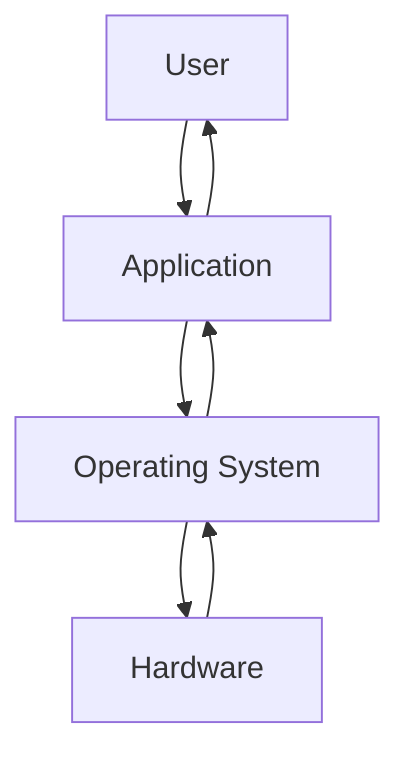

### Main responsibilities

* Manage hardware resources
* Manage CPU/processes
* Manage memory
* Manage files
* Manage devices
* Provide security
* Provide an interface for users/applications

The instructor describes the OS as essentially a **resource manager** for the computer. ([GitHub][1])

---

# 2. Components of a Computer System

A general-purpose computer can be viewed as:

| Component                | Examples                                            |
| ------------------------ | --------------------------------------------------- |
| **Hardware**             | CPU, RAM, storage, I/O devices                      |
| **Operating System**     | Windows, Linux, macOS                               |
| **System Programs**      | Compilers, editors, utilities, command interpreters |
| **Application Programs** | Browser, Java application, media player, etc.       |
| **Users**                | People interacting with the system                  |

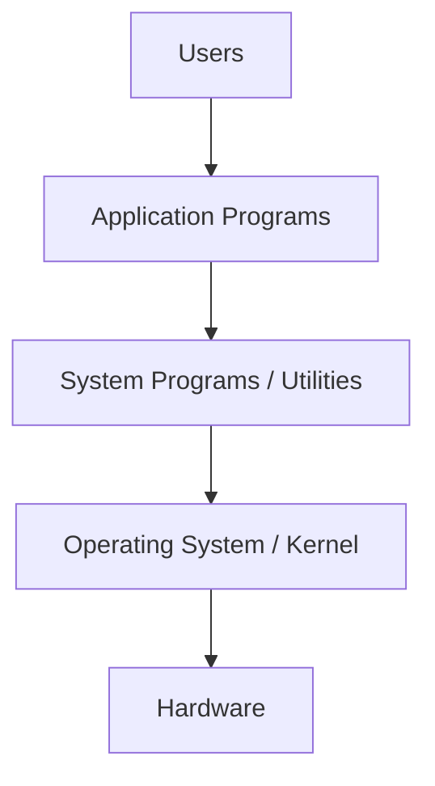

The **kernel remains active while the computer is running** and manages hardware resources for applications. ([GitHub][1])

---

# 3. Kernel ⭐⭐⭐

The **kernel is the core of the operating system**.

It directly interacts with hardware and manages resources such as:

* CPU
* Memory
* Storage
* Devices
* Processes
* Files

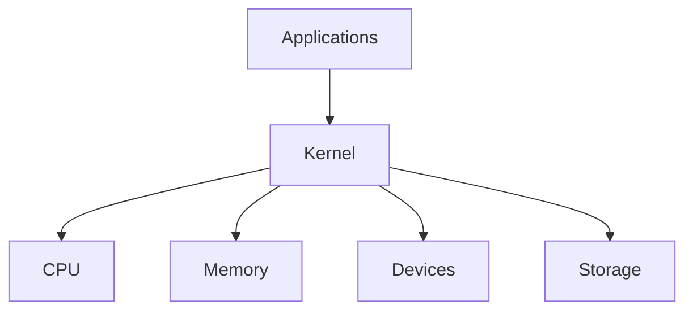

### Interview answer

> **Kernel is the core component of an OS that manages hardware resources and provides essential services to applications.**

([GitHub][1])

---

# 4. GUI vs CLI

An OS can provide different ways for users to interact with the system.

| GUI                          | CLI                         |
| ---------------------------- | --------------------------- |
| Graphical User Interface     | Command Line Interface      |
| Uses windows, icons, buttons | Uses commands               |
| Easy for general users       | Powerful for administrators |
| Example: Windows desktop     | Linux terminal              |

For DevOps, **CLI is extremely important** because Linux servers are commonly administered through the command line. ([GitHub][1])

---

# 5. 32-bit vs 64-bit ⭐⭐⭐

The bit architecture determines how much memory/address space a processor can handle.

### 32-bit

A 32-bit system can theoretically address:

**2³² = ~4 GB**

In practice, the usable RAM can be around **3.5 GB** because some address space is used by the OS/hardware. ([GitHub][1])

### 64-bit

A 64-bit system has a vastly larger theoretical address space:

**2⁶⁴ addresses**

Therefore, modern systems with large amounts of RAM use **64-bit processors/OSes**.

### Comparison

| 32-bit                          | 64-bit                        |
| ------------------------------- | ----------------------------- |
| Smaller address space           | Much larger address space     |
| ~4 GB theoretical address space | 2⁶⁴ theoretical address space |
| Limited for modern workloads    | Suitable for modern systems   |
| Older systems                   | Modern systems                |

### Easy interview point

> A machine with **8 GB RAM should use a 64-bit OS/processor**; otherwise, part of the memory cannot be addressed. ([GitHub][1])

---

# 6. Types of Operating Systems

The session covered several types:

| Type                | Purpose                                                  |
| ------------------- | -------------------------------------------------------- |
| **Batch OS**        | Processes groups of jobs with little/no user interaction |
| **Time-Sharing OS** | Gives multiple processes/users CPU time slices           |
| **Distributed OS**  | Coordinates multiple computers as a system               |
| **Network OS**      | Provides/manages network resources and services          |
| **Real-Time OS**    | Provides responses within strict timing requirements     |
| **Mobile OS**       | Designed for mobile devices                              |
| **Desktop OS**      | Designed for personal computers                          |

An OS can fit into **multiple categories** depending on its functionality. ([GitHub][1])

---

# 7. Batch Operating System

A **Batch OS** processes jobs in groups/queues.

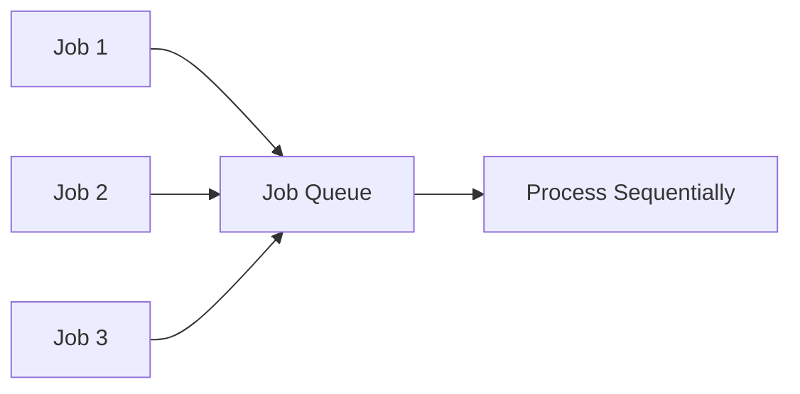

### Characteristics

* Jobs are collected together
* Jobs are processed one after another
* Little/no interaction during processing

Examples discussed include workloads such as:

* Reports
* Insurance claim processing
* Library records

([GitHub][1])

---

# 8. Time-Sharing / Multitasking OS ⭐⭐

A time-sharing OS allows multiple processes to share CPU time.

The CPU gives each process a **time slice (quantum)**.

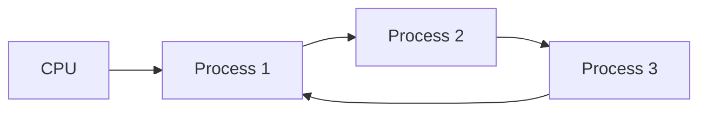

Example:

```text
P1 → small time slice
P2 → small time slice
P3 → small time slice
P1 → again...
```

This creates the appearance that multiple applications are running simultaneously.

Modern desktop operating systems such as Windows support multitasking. ([GitHub][1])

---

# 9. Distributed Operating System

A distributed OS coordinates multiple independent computers connected through a network.

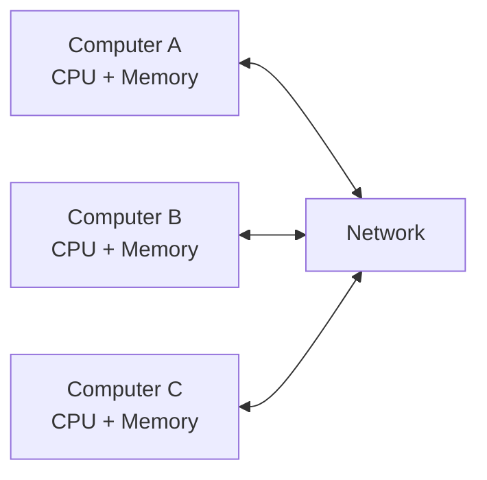

Each machine has its own:

* CPU
* Memory
* Resources

But they can cooperate as a larger system.

---

# 10. Network Operating System

A **Network OS** runs on systems/servers and manages network-related resources such as:

* Users
* Data
* Security
* Applications
* Network functions

The instructor discussed Unix/Linux and Windows Server in the context of network/server operating systems. ([GitHub][1])

---

# 11. Real-Time Operating System (RTOS)

A real-time OS is designed for systems where **response time is critical**.

Examples:

* Air traffic control
* Robotics
* Medical systems
* Scientific systems
* Missile/defense systems


### Key concept

> **RTOS focuses on predictable response time, not simply maximum performance.**

([GitHub][1])

---

# 12. Mobile & Desktop Operating Systems

### Mobile OS

Designed for smartphones/tablets.

Examples:

* Android
* iOS

### Desktop OS

Designed for personal computers.

Examples:

* Windows
* macOS

The instructor also emphasized that OS classifications aren't necessarily mutually exclusive. ([GitHub][1])

---

# 13. Main Functions of an OS ⭐⭐⭐

This is **very important for interviews**.

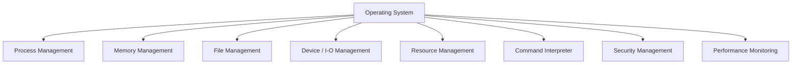

### Main functions

| Function               | What it does                             |
| ---------------------- | ---------------------------------------- |
| Process Management     | Creates, schedules and manages processes |
| Memory Management      | Allocates/deallocates memory             |
| File Management        | Organizes files/directories              |
| Device Management      | Manages hardware devices                 |
| Resource Management    | Allocates system resources               |
| Security Management    | Controls access and permissions          |
| Command Interpreter    | Interprets user commands                 |
| Performance Monitoring | Tracks system performance                |
| Error Detection        | Detects/logs system errors               |

([GitHub][1])

---

# 14. Process Management ⭐⭐⭐

The OS manages processes and CPU resources.

It handles:

* Process creation
* Process scheduling
* Process execution
* Process termination
* CPU allocation

It also helps prevent situations where processes wait indefinitely for resources. ([GitHub][1])

### DevOps relevance

When troubleshooting a Linux server, you'll frequently check:

```text
Is the process running?
Is it consuming too much CPU?
Is it stuck?
Is it consuming too much memory?
```

---

# 15. Memory Management ⭐⭐⭐

The OS controls how memory is allocated and released.

### Key activities

* Allocate memory
* Deallocate memory
* Protect processes from each other
* Manage RAM
* Use disk space when necessary

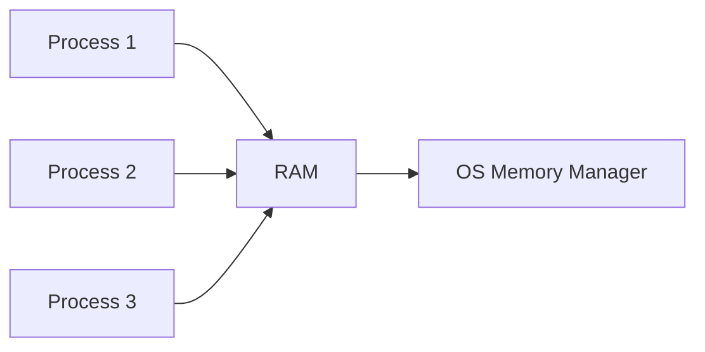

The instructor describes **allocation and deallocation** as key memory-management activities. ([GitHub][1])

---

# 16. Primary vs Secondary Memory

| Primary Memory                    | Secondary Memory            |
| --------------------------------- | --------------------------- |
| RAM                               | HDD / SSD                   |
| Faster                            | Slower                      |
| Used directly for active programs | Used for persistent storage |
| Volatile                          | Non-volatile                |

The OS manages both memory and storage, including available space and file storage. ([GitHub][1])

---

# 17. Device / I/O Management

The OS manages communication between software and hardware devices.

Examples:

* Printer
* Disk
* Keyboard
* Network devices
* Other I/O hardware

### Device Driver

A **device driver** acts as an interface between the OS and hardware.

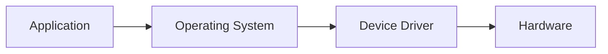

([GitHub][1])

---

# 18. Spooling ⭐

**Spooling** places work into a temporary queue so that the CPU/application doesn't have to wait for the slow device.

### Example: Printer

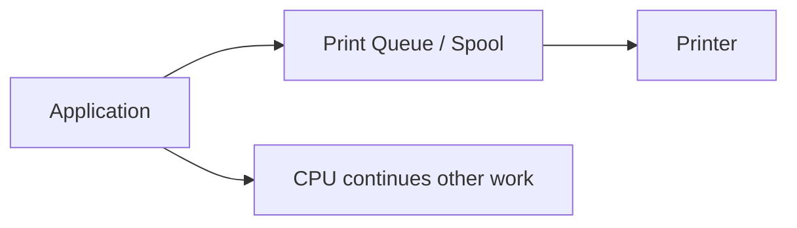

Instead of waiting for the printer to finish:

> **Job → Queue → Printer**

The CPU can continue processing other tasks. ([GitHub][1])

---

# 19. File Management ⭐⭐⭐

The OS manages:

* File creation
* Reading
* Writing
* Deletion
* File names
* File types
* File sizes
* Permissions
* Storage organization

### Common file categories

* Text
* Binary
* Executable

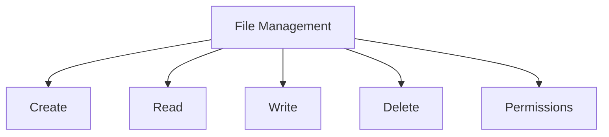

([GitHub][1])

---

# 20. Command Interpreter / Shell ⭐⭐⭐

The **command interpreter** provides a way for users to interact with the OS using commands.

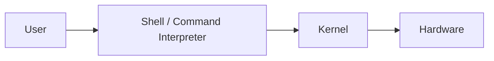

Example:

```bash
cp file1.txt /tmp/
```

The shell interprets the command and requests the required OS operations.

### DevOps relevance

This is extremely important because Linux administration heavily relies on:

> **Shell + Commands + Scripts**

([GitHub][1])

---

# 21. Security Management

The OS protects resources from unauthorized access.

### Responsibilities

* Authentication
* Authorization
* Access control
* User permissions
* Process permissions
* File protection
* Resource protection

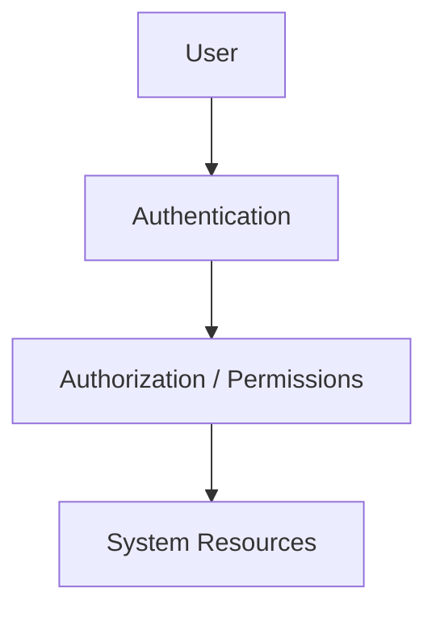

The instructor also mentioned protection against misuse, malware and denial-of-service situations. ([GitHub][1])

---

# 22. Performance Monitoring & Error Detection

The OS can help track:

### Performance

* CPU utilization
* Memory usage
* Resource consumption
* Bottlenecks

### Error handling

* Error logs
* Traces
* Dumps
* Diagnostics

### Job accounting

Records resource usage for:

* Auditing
* Optimization
* Resource analysis

([GitHub][1])

---

# 23. Why Unix/Linux for DevOps? ⭐⭐⭐

The instructor then moved the course focus to **Unix/Linux**.

The reason given is that a large majority of projects/environments use **Unix or Unix-like systems**, making Linux knowledge essential for DevOps. ([GitHub][1])

### Important terminology

The session uses **Unix/Linux** somewhat interchangeably for the course, while noting that Linux distributions include systems such as:

* Ubuntu
* Fedora
* Other Linux distributions

([GitHub][1])

---

# 24. What is Unix?

Unix is a:

> **Multi-user and multitasking operating system designed for stable, secure and efficient computing.**

It was originally developed at **AT&T Bell Labs** and influenced modern operating systems such as Linux, BSD and macOS. ([GitHub][1])

---

# 25. Important Unix Features ⭐⭐⭐

| Feature                     | Meaning                               |
| --------------------------- | ------------------------------------- |
| **Multi-user**              | Multiple users can use the system     |
| **Multitasking**            | Multiple processes can run            |
| **Portable**                | Can be adapted across hardware        |
| **Hierarchical filesystem** | Files/directories organized from root |
| **Security**                | Users/groups/permissions              |
| **Shell**                   | Command-based interaction             |
| **Scripting**               | Automation through scripts            |

([GitHub][1])

---

# 26. Unix Hierarchical File System ⭐⭐⭐

This is particularly important for your upcoming Linux commands.

Unlike Windows, where you commonly see:

```text
C:
D:
E:
```

Unix/Linux has a **single root**:

```text
/
```

Everything exists under this root hierarchy.

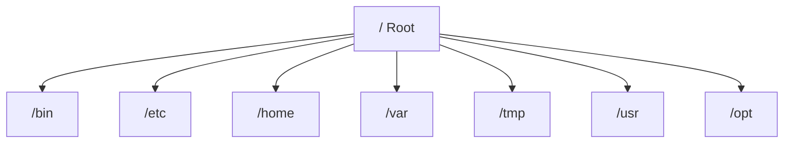

The instructor highlighted this as one of the **most important Unix concepts** for the upcoming Linux section. ([GitHub][1])

---

# 27. Unix/Linux Layered Architecture ⭐⭐⭐

The instructor introduced the Unix architecture as layers:

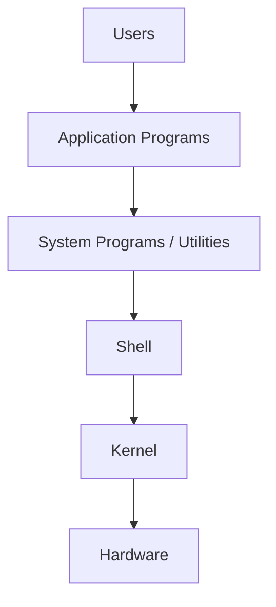

### Layers

| Layer               | Responsibility                |
| ------------------- | ----------------------------- |
| **Hardware**        | CPU, RAM, storage, I/O        |
| **Kernel**          | Core OS/resource management   |
| **Shell**           | User-command interface        |
| **System Programs** | Utilities and common commands |
| **Applications**    | User-level programs           |
| **Users**           | Interact with the system      |

The transcript specifically describes hardware → kernel → shell/system utilities → applications → users as the layered structure. ([GitHub][1])

---

# 28. Shell vs Kernel ⭐⭐⭐

A common interview question.

| Kernel                           | Shell                 |
| -------------------------------- | --------------------- |
| Core of OS                       | Interface to OS       |
| Directly interacts with hardware | Interacts with kernel |
| Manages resources                | Interprets commands   |
| Memory/process/device management | Runs commands/scripts |

### Simple flow

```text
User
 ↓
Shell
 ↓
Kernel
 ↓
Hardware
```

> **Shell is not the kernel.**

The shell provides a convenient interface through which users/programs request OS operations. ([GitHub][1])

---

# 29. Why Linux Matters for DevOps

The session is now moving from **OS fundamentals → Linux administration**.

The next practical skills depend heavily on understanding:

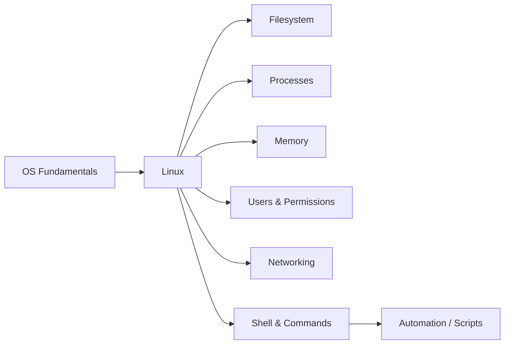

This foundation is important because DevOps engineers routinely work with Linux servers, processes, files, permissions, networking and shell automation. The instructor explicitly transitions from OS concepts into Linux/Unix and day-to-day commands. ([GitHub][1])

---

# 🔥 Interview Revision

| Question                 | Short Answer                                                                   |
| ------------------------ | ------------------------------------------------------------------------------ |
| What is an OS?           | Software that manages hardware/resources and provides services to applications |
| What is kernel?          | Core component of the OS                                                       |
| What does kernel manage? | CPU, memory, processes, devices, files/resources                               |
| GUI?                     | Graphical User Interface                                                       |
| CLI?                     | Command Line Interface                                                         |
| 32-bit address space?    | **2³² ≈ 4 GB**                                                                 |
| Why 64-bit?              | Supports much larger address space                                             |
| Batch OS?                | Processes jobs in batches                                                      |
| Time-sharing OS?         | Gives processes CPU time slices                                                |
| Distributed OS?          | Coordinates multiple connected computers                                       |
| RTOS?                    | Designed for strict response-time requirements                                 |
| OS memory management?    | Allocation/deallocation/protection of memory                                   |
| Device driver?           | Interface between OS and hardware                                              |
| Spooling?                | Queues work for slower devices                                                 |
| File management?         | Create/read/write/delete + organize/protect files                              |
| Command interpreter?     | Interprets user commands                                                       |
| Security management?     | Authentication, authorization, access control                                  |
| Unix?                    | Multi-user, multitasking OS                                                    |
| Linux?                   | Unix-like operating system                                                     |
| Unix filesystem root?    | `/`                                                                            |
| Shell?                   | Command interface between user and OS                                          |
| Kernel vs Shell?         | Kernel manages resources; Shell interprets commands                            |

---

# 🧠 Final Mental Model

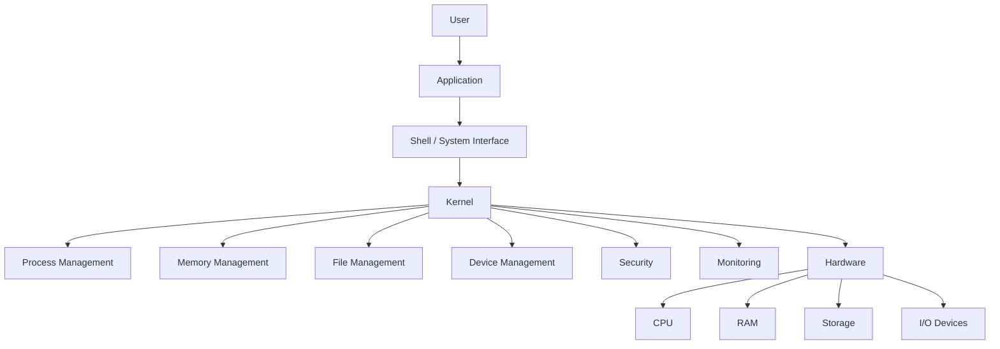

### ⭐ Remember these 7 points

1. **OS = Resource Manager**
2. **Kernel = Core of OS**
3. **Shell = Interface to OS**
4. **Process management = CPU/processes**
5. **Memory management = RAM allocation/deallocation**
6. **File management = Files + directories + permissions**
7. **Linux = Essential foundation for DevOps**