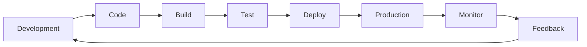
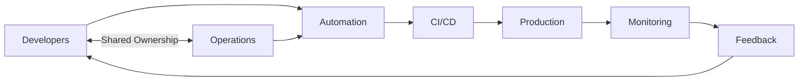
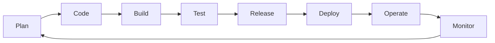
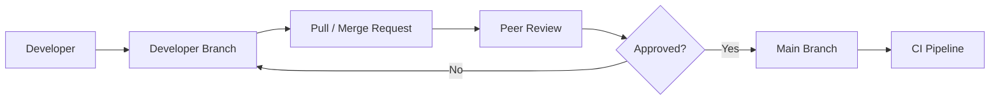
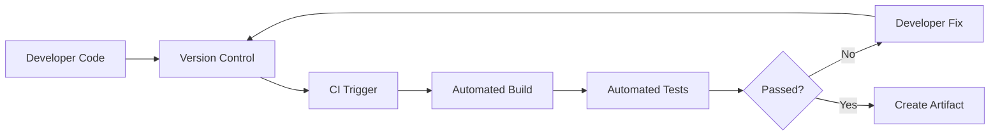
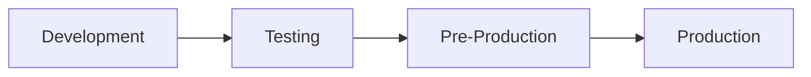
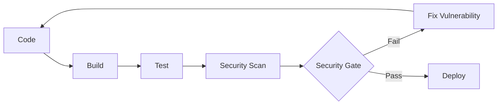
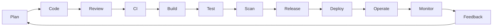

# DevOps Session — DevOps Fundamentals, CI/CD & Deployment Strategies

**Date:** 31 Aug 2026
**Instructor:** Rochak Agrawal
**Focus:** DevOps fundamentals → lifecycle → CI/CD → environments → deployment strategies → security → SRE/Platform/DevSecOps roles

I condensed the transcript into **study notes**, removed participant chatter/repetition, corrected obvious speech-to-text errors, and kept the interview-relevant points. ([GitHub][1])

---

## 1. What is DevOps?

### Simple definition

**DevOps is a way of working where development and operations share responsibility for delivering software safely, frequently and reliably.**

The goal is:

> **Small + frequent + reversible changes**

DevOps is **not a single technology or tool**. It is a combination of:

* Culture
* Practices
* Automation
* Collaboration
* Continuous feedback
* Tools


### Core idea



**Key point:** Production deployment is not the end. Monitoring production provides feedback that starts the next improvement cycle. 

---

# 2. Why Do We Need DevOps?

Traditional development often had a separation:

```text
Development Team
       ↓
     Code
       ↓
Operations Team
       ↓
   Production
```

Problems:

* "Works on my machine"
* Different development and production environments
* Manual deployment
* Large/infrequent releases
* Slow feedback
* Blame between Dev and Ops when something fails
* Difficult rollback
* Manual infrastructure provisioning

For example, an application may work on Windows because required libraries exist there but fail when deployed to Linux because the prerequisites are different. Containerization helps address this type of environment inconsistency. 

### DevOps solution



---

# 3. DevOps Culture

Before implementing tools, the **team culture must change**.

Important principles:

| Principle                      | Meaning                                   |
| ------------------------------ | ----------------------------------------- |
| Shared ownership               | Dev + Ops own the outcome                 |
| Blameless culture              | Fix the problem instead of blaming people |
| Small releases                 | Prefer small changes over huge releases   |
| Automation                     | Automate repetitive processes             |
| Continuous feedback            | Learn from production                     |
| Cross-functional collaboration | Dev, QA, Ops, Security work together      |

DevOps cannot simply be achieved by installing Jenkins, Docker or Terraform. The organization must also adopt the underlying practices. 

---

# 4. What DevOps is NOT

| Misconception                                    | Reality                         |
| ------------------------------------------------ | ------------------------------- |
| DevOps is a technology                           | ❌ It is a way of working        |
| DevOps is one tool                               | ❌ Uses many tools               |
| DevOps is only Jenkins                           | ❌ Jenkins is only one CI tool   |
| DevOps replaces Operations                       | ❌ It optimizes operations       |
| DevOps means no testing                          | ❌ Testing remains essential     |
| DevOps is only for startups                      | ❌ Applicable to enterprises too |
| Every DevOps engineer does exactly the same work | ❌ Responsibilities vary         |
| Learning one tool means knowing DevOps           | ❌ Fundamentals matter more      |

A DevOps engineer may work primarily on CI/CD, automation, configuration management, IaC, etc. 

---

# 5. DevOps Lifecycle — 8 Stages

The lifecycle discussed in the class can be represented as:



### 1. Plan

Define:

* Features
* User stories
* Tasks
* Timeline
* Priorities

### 2. Code

Developers write code using:

* Version control
* Branching
* Pull/Merge Requests
* Peer review

### 3. Build

Source code is converted into a deployable **artifact**.

```text
Source Code
     ↓
   Build
     ↓
Artifact / Executable
```

The production environment generally needs the deployable artifact, not the developer's raw source code. 

### 4. Test

Different types include:

* Unit testing
* Integration testing
* Functional testing
* Smoke testing
* Load testing
* UAT
* Non-functional testing

Some tests can be automated inside the pipeline. 

### 5. Release

The application is considered ready for release after testing and required approvals.

### 6. Deploy

Application is deployed to the target environment.

### 7. Operate

Keep the application and infrastructure running.

### 8. Monitor

Monitor:

* Application health
* CPU/memory
* Traffic
* Errors
* Performance
* Availability

Monitoring feeds information back into the planning stage. 

---

# 6. Version Control

Version control is not only for source code.

A mature DevOps repository can contain:

* Application code
* Infrastructure templates
* Configuration
* Pipeline definitions
* Environment configuration
* Environment-related files


### Pull/Merge Request flow



**Best practice:** Don't directly push unreviewed changes into the shared branch. 

---

# 7. Continuous Integration — CI

### Definition

**CI means developers frequently integrate their code into a shared codebase, and each integration triggers automated build/test validation.**

Why?

Suppose developers A, B and C are modifying the same application.

Their changes may individually work but conflict when combined.

CI detects such problems **early**, preferably in the development stage. 

### CI flow



### Important CI rule

> **A broken build should be treated as a priority.**

Do not simply bypass a failed quality/test stage to get a merge through. 

---

# 8. Build Once, Promote the Same Artifact

This is an important DevOps principle.

❌ Bad:

```text
Build → DEV
       ↓
Rebuild → TEST
       ↓
Rebuild → PROD
```

✅ Better:

```text
Source
  ↓
Build ONCE
  ↓
Artifact
  ↓
DEV
  ↓
TEST
  ↓
PRE-PROD
  ↓
PROD
```

The same artifact should be promoted through environments.

This avoids the situation where the artifact tested in one environment is different from the artifact deployed to production. 

---

# 9. Typical Environments

A common setup:



### Development

* Developers work here
* CI builds happen
* Initial automated validation

### Test

* QA/testing
* Functional and automated testing

### Pre-Production

Production-like environment.

Usually:

* Production-like configuration
* No real/live traffic
* UAT happens here

### Production

Real users access the application.

The number of environments can vary depending on the organization. 

---

# 10. Continuous Delivery vs Continuous Deployment

This is a **very important interview question**.

|                       | Continuous Delivery               | Continuous Deployment               |
| --------------------- | --------------------------------- | ----------------------------------- |
| Automation            | Automated pipeline                | Fully automated                     |
| Production deployment | Human/business approval           | Automatic                           |
| Artifact              | Production-ready                  | Automatically deployed              |
| Human gate            | Yes                               | No                                  |
| Suitable for          | Regulated/controlled environments | Mature teams with frequent releases |

### Continuous Delivery

Pipeline automatically takes the application up to a production-ready state.

```text
Code
 ↓
Build
 ↓
Test
 ↓
DEV
 ↓
TEST
 ↓
PRE-PROD
 ↓
[Business Approval]
 ↓
PROD
```

The application is **releasable**, but a person decides when to deploy it. 

### Continuous Deployment

```text
Code
 ↓
Build
 ↓
Test
 ↓
Quality Gates
 ↓
DEV → TEST → PRE-PROD → PROD
                              ↑
                         No manual gate
```

If all automated quality gates pass, production deployment happens automatically. 

### Easy interview answer

> **Continuous Delivery = automatically ready for production.**
> **Continuous Deployment = automatically deployed to production.**

---

# 11. Blue-Green Deployment

Two production environments:

```text
Blue  → V1 → Current production
Green → V2 → New version
```

Users initially access Blue.

Deploy V2 to Green and test it.

Then switch traffic:

```text
Before:
Users → Blue V1

After:
Users → Green V2
```


### Advantage

Fast rollback:

```text
Users → V2 ❌
       ↓
Switch back
       ↓
Users → V1 ✅
```

### Key characteristic

**Traffic switches essentially from one version to the other.**

---

# 12. Canary Deployment

Canary does **gradual traffic shifting**.

Example:

```text
V1 → 95%
V2 → 5%

       ↓

V1 → 80%
V2 → 20%

       ↓

V1 → 60%
V2 → 40%

       ↓

V1 → 20%
V2 → 80%

       ↓

V1 → 0%
V2 → 100%
```

You monitor the new version at each stage.


### Blue-Green vs Canary

| Blue-Green              | Canary                  |
| ----------------------- | ----------------------- |
| Switch traffic          | Gradually shift traffic |
| Big-bang traffic switch | Incremental             |
| Two versions            | Two versions            |
| Fast rollback           | Gradual validation      |
| Simpler                 | More controlled         |

**Interview keyword:**
👉 Canary = **gradual traffic**

---

# 13. Rolling Deployment

Rolling deployment replaces instances in batches while maintaining application capacity.

Example:

```text
Before:
Server1 → V1
Server2 → V1
Server3 → V1
Server4 → V1

Rolling update:

Server1 → V2
Server2 → V1
Server3 → V1
Server4 → V1

Server1 → V2
Server2 → V2
Server3 → V1
Server4 → V1

Server1 → V2
Server2 → V2
Server3 → V2
Server4 → V1

Finally:
All → V2
```

The objective is to avoid dropping capacity below an acceptable threshold. 

### Deployment strategies — quick comparison

| Strategy   | Traffic                                | Main idea                       |
| ---------- | -------------------------------------- | ------------------------------- |
| Blue-Green | Sudden switch                          | Two complete versions           |
| Canary     | Gradual                                | Increase traffic progressively  |
| Rolling    | Existing instances replaced in batches | Update infrastructure gradually |

🔥 **Interview tip:**
If asked **"Which deployment strategy gradually sends traffic to the new version?"** → **Canary**

---

# 14. Security / DevSecOps

Security should be integrated into the pipeline rather than treated as something done only after deployment.

### Testing vs Scanning

| Testing                          | Scanning                    |
| -------------------------------- | --------------------------- |
| Checks application functionality | Checks code/security issues |
| "Does it work?"                  | "Is it secure?"             |
| Functional behavior              | Vulnerabilities             |
| Example: login works             | Example: hardcoded password |


---

## 15. Never Hardcode Secrets

❌ Bad:

```text
DB_USER = root
DB_PASSWORD = myPassword123
```

Anyone with access to the source code may obtain the credentials.

✅ Better:

```text
Application
    ↓
Environment Variable / Secret
    ↓
DB Username
DB Password
```

Use appropriate:

* Environment variables
* Secret managers
* Secure configuration

The instructor specifically used hardcoded database credentials as an example of a vulnerability that scanning should detect. 

---

# 16. What Does Security Scanning Check?

Examples:

* Hardcoded credentials
* Vulnerable dependencies
* Outdated libraries
* Known security vulnerabilities
* Other code-level security issues

The transcript mentions security analysis such as:

* Software Composition Analysis (SCA)
* Static Application Security Testing (SAST)
* Dynamic Application Security Testing (DAST)


### DevSecOps



**DevSecOps = integrating security into the DevOps lifecycle.**

---

# 17. Verify / Production Monitoring

Verification is different from functional testing.

After deployment, you continuously monitor the application.

Example:

```text
Deploy
  ↓
Smoke checks
  ↓
Monitor metrics
  ↓
Detect abnormal behavior
  ↓
Investigate
  ↓
Fix / Scale / Rollback
```

An application can pass testing but still have issues under unexpected production traffic.

For example:

* Normal traffic = 10,000 users
* Actual traffic = 20,000 users

The application may need additional capacity or auto-scaling. 

---

# 18. Auto-Scaling

Depending on the platform:

```text
Traffic increases
       ↓
Monitoring detects load
       ↓
Auto-scaling
       ↓
More instances/containers
       ↓
Application handles traffic
```

For Kubernetes, scaling could mean increasing the number of application containers/pods. In other environments, additional servers/instances may be provisioned. 

---

# 19. DevOps vs SRE vs Platform Engineer

These roles overlap heavily.

| Role                   | Primary focus                               |
| ---------------------- | ------------------------------------------- |
| DevOps Engineer        | CI/CD, automation, reliable delivery        |
| SRE                    | Availability, reliability, scalability      |
| Platform Engineer      | Internal platforms and developer enablement |
| DevSecOps Engineer     | Security integration/scanning               |
| IaC Engineer           | Infrastructure automation                   |
| Observability Engineer | Monitoring, logs, metrics, tracing          |
| MLOps Engineer         | DevOps practices for ML systems             |

The same tools may be used by different roles; the **primary responsibility** changes. 

### Important concept

```text
                 DevOps
                   |
       ┌───────────┼───────────┐
       ↓           ↓           ↓
     SRE       Platform    DevSecOps
       ↓           ↓           ↓
 Reliability   Platforms    Security
```

The exact responsibilities depend on the organization. 

---

# 20. Is AWS Mandatory for DevOps?

**No.**

DevOps can be implemented on:

* AWS
* Azure
* GCP
* On-premises
* Other infrastructure

Cloud makes DevOps particularly convenient because infrastructure can be provisioned and scaled quickly, but DevOps itself is **not limited to cloud**. 

This is particularly relevant to your **AEM on-premises/IaaS background**.

---

# 21. IaaS vs PaaS vs SaaS — DevOps Perspective

The key question is:

> **How much control do you have over the application/infrastructure?**

Examples discussed:

* EC2 → IaaS
* Elastic Beanstalk → PaaS
* Office 365/Gmail → SaaS

For SaaS, you consume the software rather than control how the underlying application is built/deployed. DevOps practices are most directly relevant where the organization controls the application delivery process. 

---

# 22. IaC — Infrastructure as Code

Instead of manually creating infrastructure:

```text
Manual:
Create Server
Create Network
Configure Server
Configure Security
Configure Application
```

Use code/templates:

```text
IaC Code
   ↓
Tool
   ↓
Infrastructure
```

Example:

**Terraform**

IaC makes infrastructure more:

* Repeatable
* Automated
* Version-controlled
* Consistent

The instructor also emphasizes that IaC is a maturity practice, not a mandatory checkbox that every organization must implement immediately. 

---

# 23. DevOps Tools

There is no single "DevOps tool."

### CI/CD

| Tool             |
| ---------------- |
| Jenkins          |
| Azure Pipelines  |
| AWS CodePipeline |
| GitLab CI        |
| GitHub Actions   |
| Travis CI        |
| TeamCity         |
| Bamboo           |

### Configuration Management

| Tool    |
| ------- |
| Ansible |
| Puppet  |
| Chef    |
| Salt    |

The important point is to understand the **concept**, not memorize one particular product. 

For example:

```text
CI Concept
   ↓
Jenkins
Azure Pipelines
GitHub Actions
GitLab CI
AWS CodePipeline
```

If you understand CI/CD, moving from Jenkins to another CI tool becomes much easier.

---

# 24. DevOps is Continuously Evolving

DevOps is not something you "finish" after a course.

New practices/tools continue to emerge:

* GitOps
* Platform Engineering
* Observability
* MLOps
* DevSecOps
* New CI/CD tools

The fundamental concepts remain more important than any individual tool. 

---

# 🔥 Interview Revision

| Question                                 | Short answer                                                            |
| ---------------------------------------- | ----------------------------------------------------------------------- |
| What is DevOps?                          | A way of working combining Dev + Ops for fast, reliable delivery        |
| Is DevOps a tool?                        | No                                                                      |
| Is DevOps a technology?                  | No                                                                      |
| Why DevOps?                              | Faster, safer, reliable software delivery                               |
| What is CI?                              | Frequent code integration + automated build/test                        |
| What is Continuous Delivery?             | Automatically make software production-ready; production needs approval |
| What is Continuous Deployment?           | Automatically deploy passing changes to production                      |
| Build once, promote?                     | Same artifact should move across environments                           |
| What is Blue-Green?                      | Two versions; switch traffic from old to new                            |
| What is Canary?                          | Gradually shift traffic to new version                                  |
| What is Rolling?                         | Replace instances in batches                                            |
| Testing vs Scanning?                     | Testing checks functionality; scanning checks code/security             |
| Why environment variables?               | Avoid hardcoding secrets                                                |
| What is DevSecOps?                       | Security integrated into DevOps                                         |
| Is AWS mandatory?                        | No                                                                      |
| What does SRE focus on?                  | Reliability, availability and scalability                               |
| What does Platform Engineering focus on? | Internal platforms and developer enablement                             |
| What is IaC?                             | Managing infrastructure through code                                    |
| Is Jenkins = DevOps?                     | No, Jenkins is one CI/CD tool                                           |
| Is testing optional in DevOps?           | Absolutely not                                                          |

---

# 🧠 Final Mental Model

Remember the entire session like this:



And remember the **three most important interview concepts**:

### 1️⃣ CI

**Integrate code frequently + automatically build/test it.**

### 2️⃣ CD

**Continuous Delivery:**

> "Production-ready, but human approval."

**Continuous Deployment:**

> "Passed the pipeline → automatically goes to production."

### 3️⃣ Deployment strategies

> **Blue-Green = Switch**
> **Canary = Gradually shift traffic**
> **Rolling = Replace instances in batches**
