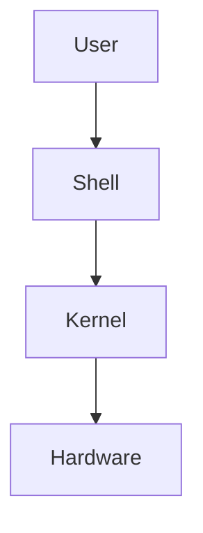
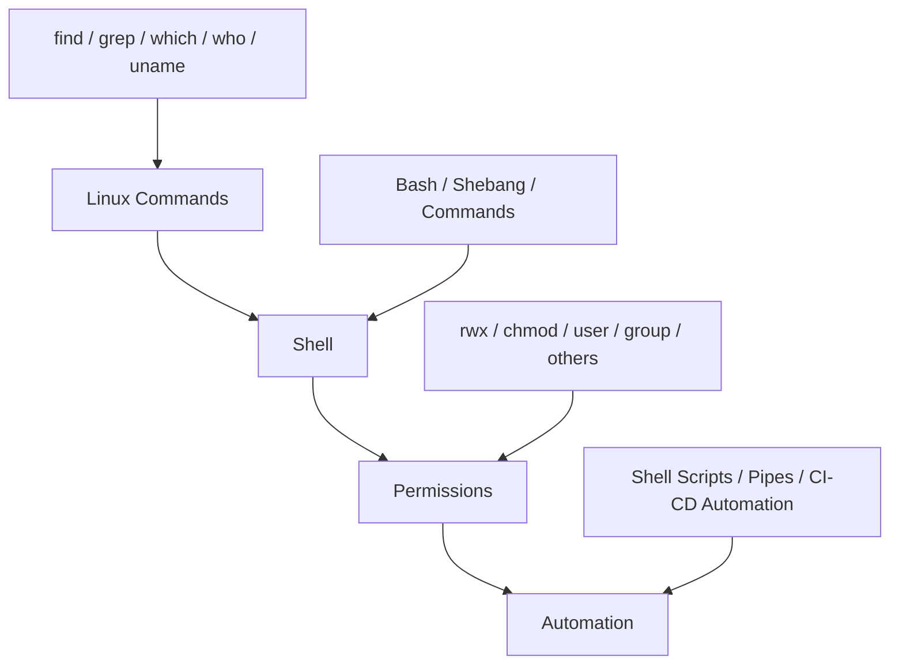

# DevOps Session — Linux Commands, Shell, File Permissions & Basic Shell Scripting

**Date:** 1 Sep 2026
**Instructor:** Rochak Agrawal
**Focus:** `find` vs `grep`, `which`, `who`, `whoami`, `uname`, Shell/Bash, file permissions, `chmod`, users/groups, command chaining and pipes.

I’ve condensed the instructor’s content, removed participant discussion/repetition, and corrected obvious transcript errors. 

---

## 1. `find` vs `grep`

One of the key distinctions from the session:

| Command | Purpose                              |
| ------- | ------------------------------------ |
| `find`  | Find **files/directories**           |
| `grep`  | Find a **pattern/text inside files** |

### `find`

Used to search for files/directories based on criteria such as:

* Name
* Type
* Size
* Modification time
* Owner/user

Example concept:

```bash
find /home -type f -name "*.txt"
```

Meaning:

```text
/home
  ↓
Search recursively
  ↓
type = file
  ↓
name ends with .txt
```

You can also search for log files, directories, files modified within a particular period, files belonging to a particular user, etc. 

### `grep`

`grep` searches **inside a file** for a particular pattern.

```text
find → Where is the file?

grep → What text is inside the file?
```

### 🔥 Interview Question

**Q: Difference between `find` and `grep`?**

> `find` searches for files/directories based on attributes such as name, type, size or modification time, whereas `grep` searches for a text pattern inside files.

---

# 2. `which`

`which` tells you **where the executable of a command is located**.

Example:

```bash
which python3
```

Possible output:

```text
/usr/bin/python3
```

If software is not installed or isn't available in the current `PATH`, `which` won't return its executable location.

The instructor demonstrated this by comparing `which java` with `which python3`. 

### Mental model

```text
which python3
      ↓
Is python3 available?
      ↓
Where is its executable?
      ↓
/usr/bin/python3
```

---

# 3. `who` vs `whoami`

### `who`

Shows users currently logged into the system.

```bash
who
```

### `whoami`

Shows the **current user**.

```bash
whoami
```

So:

| Command  | Meaning                        |
| -------- | ------------------------------ |
| `who`    | Who is logged into the system? |
| `whoami` | Which user am I currently?     |


---

# 4. `uname`

`uname` provides system/kernel information.

```bash
uname -a
```

It can provide information such as:

* Operating system/kernel
* Kernel release
* Architecture-related information
* Host/system information

The instructor demonstrated `uname -a` on a Linux system. 

---

# 5. Shell vs Kernel

This is an important Linux fundamental.



### Kernel

The **kernel interacts with the hardware**.

It handles communication between the operating system and underlying resources.

### Shell

The **shell acts as an interface between the user/programs and the kernel**.

For example:

```text
User
 ↓
cp file1 file2
 ↓
Shell
 ↓
Kernel
 ↓
Hardware
```


---

# 6. What is a Shell?

A **shell** is a command interpreter/interface through which users interact with the operating system.

Linux has multiple shells.

Examples include:

* Bash
* C shell
* Korn shell
* Z shell

The instructor emphasized that **Bash is the common shell used for normal day-to-day work** in the course. 

### Important distinction

**Shell ≠ Bash**

```text
Shell
 ├── Bash
 ├── C Shell
 ├── Korn Shell
 └── Z Shell
```

Bash is **one type of shell**.

---

# 7. Bash

**Bash = Bourne Again Shell**

It is one of the most commonly used shells in Linux environments.

As a DevOps engineer, you'll frequently use Bash for:

* Linux commands
* Automation
* Deployment scripts
* CI/CD scripts
* Server administration
* Troubleshooting

The instructor emphasized that most of the commands discussed can be used across shells, although different shells can provide different functionality/features. 

---

# 8. Shebang

A shell script commonly begins with:

```bash
#!/bin/bash
```

This is called the **shebang line**.

It tells the system which interpreter should execute the script.


### Example

```bash
#!/bin/bash

pwd
ls
whoami
```

The instructor described the shebang as a best practice because it explicitly identifies the shell/interpreter intended for the script. 

---

# 9. Linux File Permissions

This was one of the **most important parts of the session** and was explicitly highlighted as an interview topic. 

Linux permissions are divided into **three categories**:

```text
USER        GROUP        OTHERS
 ↓            ↓            ↓
rwx          rwx          rwx
```

And there are three basic permissions:

| Permission | Symbol | Numeric value |
| ---------- | -----: | ------------: |
| Read       |    `r` |             4 |
| Write      |    `w` |             2 |
| Execute    |    `x` |             1 |


---

# 10. Permission Calculation

The values are:

```text
Read     = 4
Write    = 2
Execute  = 1
```

Therefore:

| Permissions | Calculation | Value |
| ----------- | ----------: | ----: |
| `---`       |           0 |     0 |
| `--x`       |           1 |     1 |
| `-w-`       |           2 |     2 |
| `-wx`       |       2 + 1 |     3 |
| `r--`       |           4 |     4 |
| `r-x`       |       4 + 1 |     5 |
| `rw-`       |       4 + 2 |     6 |
| `rwx`       |   4 + 2 + 1 | **7** |

### Easy way to remember

```text
r = 4
w = 2
x = 1

        4 2 1
        ↓ ↓ ↓
       r w x
```


---

# 11. Understanding `644`

Suppose a file has:

```text
644
```

Break it into:

```text
6    4    4
↓    ↓    ↓
User Group Others
```

### User = 6

```text
4 + 2 = 6
r + w
```

So user has:

```text
rw-
```

### Group = 4

```text
r--
```

### Others = 4

```text
r--
```

Therefore:

```text
644
 ↓
User   = rw-
Group  = r--
Others = r--
```


---

# 12. Understanding `755`

```text
755
```

means:

```text
User   → 7 → rwx
Group  → 5 → r-x
Others → 5 → r-x
```

So:

```text
rwxr-xr-x
```

This is a very common permission for executable files/directories.

---

# 13. `chmod`

`chmod` means **change mode** and is used to modify permissions.

### Numeric method

```bash
chmod 744 script.sh
```

This means:

```text
User   → 7 → rwx
Group  → 4 → r--
Others → 4 → r--
```

The instructor demonstrated changing a script's permission from `644` to `744`, after which the user could execute the script. 

---

# 14. `chmod 777`

```bash
chmod 777 file
```

means:

```text
User   → rwx
Group  → rwx
Others → rwx
```

Everyone gets:

```text
Read + Write + Execute
```

The instructor demonstrated this concept and then changed it to `766`, where:

```text
User   → rwx
Group  → rw-
Others → rw-
```


⚠️ **Practical point:** Don't blindly use `777` in production. Giving everyone write/execute access can create security risks.

---

# 15. Symbolic `chmod`

Permissions don't have to be changed only with numbers.

You can use:

```text
u = user
g = group
o = others
a = all
```

And:

```text
+ = add permission
- = remove permission
= = set permission
```

Examples:

```bash
chmod u+x script.sh
```

Add execute permission for the user.

```bash
chmod g+w script.sh
```

Add write permission for the group.

```bash
chmod u-x script.sh
```

Remove execute permission from the user.


### Multiple changes

You can combine changes:

```bash
chmod u+x,g+w script.sh
```

The instructor demonstrated that multiple permission modifications can be provided in one command. 

---

# 16. File Permissions vs Directory Permissions

Permissions also apply to directories.

```text
Files       → permissions
Directories → permissions
```

The instructor explained that directory permissions have their own meaning and can be modified recursively. 

### Recursive permissions

```bash
chmod -R ...
```

`-R` means apply the operation **recursively** to the directory and its contents. 

---

# 17. User, Group and Others

Suppose a system has:

```text
A
B
C
D
E
```

And:

```text
dev group = A, B, C
```

If A owns a file:

```text
Owner  = A
Group  = dev
Others = D, E
```

Therefore:

```text
USER
 ↓
File owner

GROUP
 ↓
Members of the file's group

OTHERS
 ↓
Everyone else
```


### Important

A Linux user belongs to a group, and groups can be used to manage access for multiple users collectively. Custom groups can be created for roles such as administrators, network administrators, etc. 

---

# 18. Why Permissions Matter for DevOps

This is particularly important for a DevOps engineer.

Example:

```text
Terraform
   ↓
Generates log file
   ↓
DevOps engineer tries to read
   ↓
Permission denied
```

You need to understand:

* Who owns the file?
* Which group owns it?
* Does the user have read permission?
* Does the group have permission?
* Do others have permission?

The instructor specifically explained that permissions aren't only an administrator's responsibility; DevOps engineers may need to troubleshoot permissions on files generated by their automation/tools. 

---

# 19. Shell Script

The instructor's definition is simple:

> **A shell script is a sequence of commands executed together.**

Instead of manually executing:

```bash
pwd
ls
whoami
date
```

you can put them into a script:

```bash
#!/bin/bash

pwd
ls
whoami
date
```

Then execute the script.


---

# 20. Running Multiple Commands

Multiple independent commands can be executed together using `;`.

Example:

```bash
ls -lrt; whoami
```

Here:

```text
ls -lrt
   ↓
independent

whoami
   ↓
independent
```

The output of the first command does **not** become input to the second command.

The semicolon simply lets you execute commands sequentially. 

---

# 21. Pipe `|`

This is different from `;`.

### Semicolon

```bash
command1 ; command2
```

Means:

> Run command 1 and then command 2 independently.

### Pipe

```bash
command1 | command2
```

Means:

> Take the output of command 1 and provide it as input to command 2.


The instructor introduced this as **piping**. 

---

# 22. Example of Pipe

To count lines from command output:

```bash
ls -la | wc -l
```

Conceptually:

```text
ls -la
  ↓
List files
  ↓
Output
  ↓
|
  ↓
wc -l
  ↓
Count lines
```

So the output from `ls -la` becomes the input to `wc -l`. 

This becomes extremely useful when working with thousands of files/log entries.

---

# 23. `;` vs `|`

🔥 **Very important**

| Symbol | Purpose                                 |                                                |
| ------ | --------------------------------------- | ---------------------------------------------- |
| `;`    | Run commands sequentially/independently |                                                |
| `      | `                                       | Pass output of one command as input to another |

### Example

```bash
ls -l; whoami
```

```text
ls output ──X──> whoami
```

Whereas:

```bash
ls -l | wc -l
```

```text
ls output ──────> wc -l input
```

---

# 24. Linux as a DevOps Prerequisite

The instructor emphasized that Linux is an important foundation for DevOps because many DevOps tools run on Linux systems.

Examples:

```text
Linux
  ↓
Jenkins
Terraform
Kubernetes tools
Ansible
Docker
Shell Scripts
...
```

Therefore, you don't necessarily need to become a Linux administrator, but you should be comfortable with everyday Linux commands and troubleshooting. 

For your AEM/DevOps work, this is especially relevant because you'll commonly troubleshoot:

* Logs
* Permissions
* Processes
* Disk usage
* CPU/memory
* Network connectivity
* Deployment scripts

---

# 🔥 Interview Revision

| Question                           | Answer                                                            |                                  |                          |
| ---------------------------------- | ----------------------------------------------------------------- | -------------------------------- | ------------------------ |
| `find` vs `grep`?                  | `find` locates files/directories; `grep` searches text patterns   |                                  |                          |
| What does `which` do?              | Shows the executable path of a command                            |                                  |                          |
| `who` vs `whoami`?                 | `who` shows logged-in users; `whoami` shows current user          |                                  |                          |
| What does `uname -a` do?           | Displays system/kernel information                                |                                  |                          |
| What is a shell?                   | Command interpreter/interface between user and OS/kernel          |                                  |                          |
| What is Bash?                      | A commonly used Linux shell                                       |                                  |                          |
| What is shebang?                   | First line identifying the script interpreter, e.g. `#!/bin/bash` |                                  |                          |
| Permission types?                  | Read, Write, Execute                                              |                                  |                          |
| Numeric values?                    | `r=4`, `w=2`, `x=1`                                               |                                  |                          |
| What is `644`?                     | User `rw-`, group `r--`, others `r--`                             |                                  |                          |
| What is `755`?                     | User `rwx`, group `r-x`, others `r-x`                             |                                  |                          |
| What does `chmod` do?              | Changes file/directory permissions                                |                                  |                          |
| What does `chmod -R` mean?         | Apply recursively                                                 |                                  |                          |
| User/group/others?                 | Owner / group members / everyone else                             |                                  |                          |
| `;` vs `                           | `?                                                                | `;` runs independent commands; ` | ` passes output as input |
| Why is Linux important for DevOps? | Most DevOps tools/automation commonly operate on Linux            |                                  |                          |

---

# 🧠 Final Mental Model

Think of this session as **four layers**:



### Remember these 10 things:

```text
1. find  → find files
2. grep  → find text
3. which → find executable
4. who   → logged-in users
5. whoami → current user
6. Shell → interface to OS/kernel
7. Bash → common shell
8. chmod → change permissions
9. r=4, w=2, x=1
10. | → output of one command becomes input to another
```

And the **most important DevOps connection**:

```text
Linux
 ↓
Commands
 ↓
Shell
 ↓
Permissions
 ↓
Shell Scripts
 ↓
Automation
 ↓
CI/CD
 ↓
DevOps
```