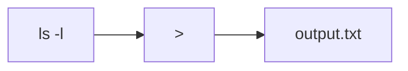
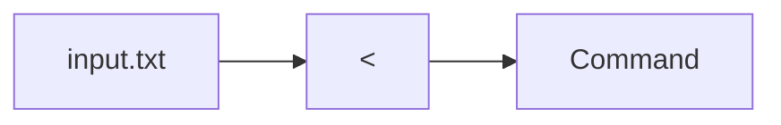
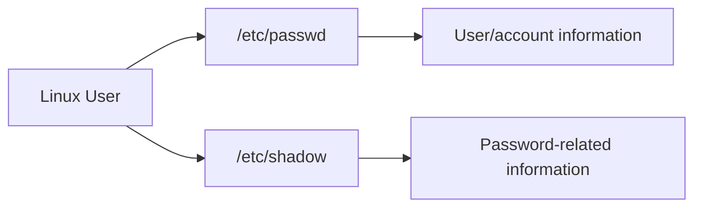
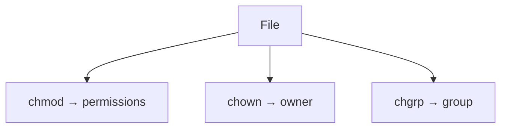
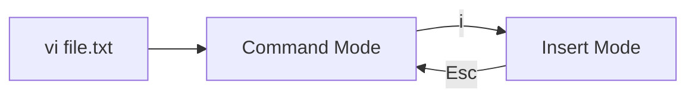
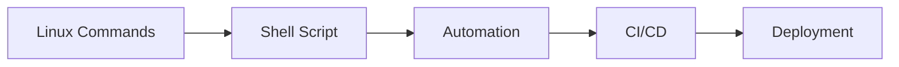
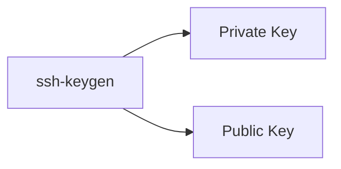

# DevOps Session — Linux Users, Groups, Permissions, Redirection, `vi` & Shell Scripting

**Date:** 2 Sep 2026
**Instructor:** Rochak Agrawal
**Focus:** Linux users/groups, `sudo`, file ownership, `chown`, `chgrp`, pipes, redirection, `vi`, shell scripting, command anatomy and SSH keys.

I’ve kept this in the same **crisp + interview-focused format**, removed participant chatter, and corrected obvious speech-to-text errors. The transcript is about 3,400 lines, with the instructor covering several practical Linux demonstrations. ([GitHub][1])

---

# 1. Pipe vs Redirection

The session starts by continuing from the previous day's Linux permissions and piping discussion.

There are **two important concepts**:

1. **Piping `|`**
2. **Redirection `>`, `>>`, `<`, `2>`**


---

## 2. Piping `|`

A pipe sends the **standard output of one command to the standard input of another command**.

```bash
ls -l | wc -l
```

Flow:


Here:

* `ls -l` → produces a list
* `|` → passes that output
* `wc -l` → counts lines

So:

> **Pipe = command output → another command's input**


### Multiple pipes

You can chain more than two commands:

```bash
command1 | command2 | command3
```


The instructor emphasizes that piping is essentially **command chaining through output/input streams**. 

---

# 3. Redirection

Redirection means changing where a command gets its input or sends its output.

Normally:

```text
Keyboard → Command → Screen
   stdin              stdout
```

With redirection:

```text
File → Command → File
```


### Standard streams

| Stream   | Meaning         | Typical source/destination |
| -------- | --------------- | -------------------------- |
| `stdin`  | Standard input  | Keyboard                   |
| `stdout` | Standard output | Screen                     |
| `stderr` | Standard error  | Screen                     |

The instructor primarily explains the concept through standard input and standard output, then demonstrates error redirection. 

---

# 4. Output Redirection `>`

```bash
ls -l > output.txt
```

Instead of displaying the output on the screen, it goes into `output.txt`.



### Important

`>` **overwrites** the file if it already exists.

Example:

```bash
echo "Hello" > file.txt
```

Then:

```bash
echo "World" > file.txt
```

The previous content is replaced.

The instructor demonstrates this overwrite behavior explicitly. 

---

# 5. Append Redirection `>>`

If you want to **add** output to an existing file:

```bash
echo "New line" >> file.txt
```

`>>` appends instead of overwriting.

```text
>   → overwrite
>>  → append
```

### Easy interview question

**Q: Difference between `>` and `>>`?**

> `>` overwrites the destination file, while `>>` appends to the existing content.


---

# 6. Input Redirection `<`

Input can also come from a file instead of the keyboard.

Conceptually:

```bash
command < input.txt
```



So:

```text
< → file becomes command input
```

The instructor demonstrates input redirection while explaining standard input. 

---

# 7. Error Redirection `2>`

Linux separates:

```text
stdout → normal output
stderr → error output
```

You can redirect errors separately:

```bash
command 2> error.log
```

Then:

```text
Normal output → screen
Error output  → error.log
```

The instructor demonstrates an invalid command and redirects its error into an `error.log` file. 

### Very important

```text
>    → stdout
>>   → append stdout
<    → stdin
2>   → stderr
```

---

# 8. Pipe vs Redirection

🔥 **Very important interview distinction**

| Pipe `|` | Redirection |
|---|---|
| Connects commands | Connects command with file/stream |
| Output → another command | Output/input → file or other destination |
| Used for command chaining | Used to control input/output |
| `ls \| wc -l` | `ls > output.txt` |

### Mental model

```text
PIPE
Command A ──output──> Command B


REDIRECTION
Command ──output──> File
```

The instructor explicitly clarifies that piping and redirection are **not the same thing**. 

---

# 9. Linux Users

The session then moves into Linux user management.

The instructor explains three broad types of users:

| User type    | Purpose                       |
| ------------ | ----------------------------- |
| Root         | Superuser/administrator       |
| Regular user | Normal human/user account     |
| System user  | Used by applications/services |


---

# 10. Root User

`root` is the Linux superuser.

Key characteristics:

* Exists on Linux systems
* Has extensive administrative privileges
* Can perform privileged operations
* Can manage users, files, services, etc.

```text
root
 ↓
Administrative privileges
```

The instructor explains that the root user is present when a Linux server is provisioned rather than being a normal user you create for everyday work. 

### ⚠️ Best practice

Don't use root unnecessarily.

Use a normal account and elevate privileges only when required.

That's where `sudo` comes in.

---

# 11. Regular User

A regular user has limited permissions.

For example:

```text
ec2-user
```

can perform normal operations but may require elevated privileges for administrative tasks.

You can grant additional permissions through:

* Groups
* `sudo`
* File permissions
* Ownership


---

# 12. System Users

System users are generally associated with applications/services.

Examples from the session:

```text
nginx
jenkins
nobody
systemd-network
```

For example:

```text
Install NGINX
     ↓
NGINX user
     ↓
NGINX process runs under that identity
```

Similarly, Jenkins can have its own service account.

This is important because files created by a service may be owned by the service user. 

---

# 13. `/etc/passwd` and `/etc/shadow`

Linux maintains user information in system files.

### `/etc/passwd`

Contains information about users such as:

* Username
* UID
* GID
* Home directory
* Default shell

### `/etc/shadow`

Contains password-related information in protected form.

The instructor demonstrates these files while explaining Linux users and password storage. 

### Mental model



---

# 14. UID and GID

Every Linux user has a:

**UID = User ID**

Groups have:

**GID = Group ID**

Example concept:

```text
User
 ↓
UID = 1000

Group
 ↓
GID = 1001
```

The instructor demonstrates how Linux associates users with numeric IDs. 

These IDs matter because Linux permissions ultimately operate based on user/group identity.

---

# 15. Creating a User

Linux provides commands such as:

```bash
useradd
```

Example concept:

```bash
useradd -m -s /bin/bash rochak
```

The options discussed include:

| Option | Meaning               |
| ------ | --------------------- |
| `-m`   | Create home directory |
| `-s`   | Specify login shell   |

The instructor demonstrates creating a user and assigning Bash as the default shell. 

---

# 16. Setting a Password

After creating a user, a password can be assigned using:

```bash
passwd username
```

Administrative privileges may be required depending on the account you're using.

The instructor demonstrates using `sudo` because the operation requires administrative privileges. 

---

# 17. `sudo`

`sudo` allows an authorized user to execute a command with elevated privileges.

Think:

```text
Normal User
     ↓
sudo
     ↓
Administrative privileges
     ↓
Execute privileged command
```

Example:

```bash
sudo yum install nginx
```

The instructor compares `sudo` with running directly as root: if you're already root, you generally don't need `sudo`. 

---

# 18. `sudo` and Groups

Whether a user can execute `sudo` commands depends on the system's privilege configuration.

The instructor demonstrates the **`wheel` group** on the Linux environment:

```text
User
 ↓
wheel group
 ↓
sudo privileges
```

A user who is not authorized through the relevant sudo configuration/group won't automatically be able to run administrative commands. 

### Important distinction

Being a Linux user does **not** automatically mean:

> "I can run every command."

Privileges are controlled.

---

# 19. Switching Users

You can switch to another user using tools such as:

```bash
su username
```

The instructor demonstrates switching from the current user to another user and checking the identity using:

```bash
whoami
```


### Mental model

```text
whoami
   ↓
Who am I currently?

su user
   ↓
Switch identity
```

---

# 20. File Ownership

Remember from the previous session:

```text
-rwxr-xr-x
 ↑   ↑   ↑
User Group Others
```

But permissions aren't the entire story.

Every file also has:

```text
Owner
Group
```

Example:

```text
-rwxr-x---
Owner = rochak
Group = devops
```

The instructor demonstrates changing both ownership and group ownership. 

---

# 21. `chown`

`chown` = **change owner**

Used to change the user ownership of a file.

Conceptually:

```bash
chown user file
```

Example:

```bash
chown priya script.sh
```

Now:

```text
Owner → priya
```

The instructor demonstrates changing the owner of `script.sh` and explains why this matters when files are created by services such as NGINX. 

---

# 22. `chgrp`

`chgrp` = **change group**

Used to change the group ownership.

Conceptually:

```bash
chgrp group file
```

Example:

```bash
chgrp devops script.sh
```

Now:

```text
Group → devops
```


---

# 23. `chmod` vs `chown` vs `chgrp`

🔥 **Very important interview table**

| Command | Changes     |
| ------- | ----------- |
| `chmod` | Permissions |
| `chown` | Owner       |
| `chgrp` | Group       |



### Example

```text
script.sh

Owner:  rochak
Group:  devops
Mode:   755
```

You could change:

```text
chmod  → 755
chown  → priya
chgrp  → developers
```

Each command changes a different property.

---

# 24. Why Ownership Matters in DevOps

This is a very practical troubleshooting scenario.

Suppose NGINX creates:

```text
nginx.conf
```

and it is owned by:

```text
nginx:nginx
```

Your user may not have permission to modify it.

You may need to investigate:

```text
Who owns it?
       ↓
Which group?
       ↓
What permissions?
       ↓
Can my user access it?
```

The instructor specifically uses service-created files such as NGINX configuration as an example. 

---

# 25. `vi` Editor

The session then introduces the `vi` editor.

```bash
vi filename
```

If the file doesn't exist, `vi` can create it.

The instructor emphasizes that **practice is essential** because `vi` has its own command/mode system. 

---

# 26. Three Important `vi` Modes

The key modes are:

```text
Command Mode
     ↓
Insert Mode
     ↓
Command/Last-line Mode
```

### Command mode

When you initially open:

```bash
vi file.txt
```

you start in **command mode**.

You don't simply start typing text.

The instructor emphasizes this as a critical point. 

---

# 27. Insert Mode

To start entering text, use:

```text
i
```

This enters insert mode.

Then you can type normally.

Conceptually:



---

# 28. Common `vi` Commands

### Navigation

| Key | Purpose       |
| --- | ------------- |
| `h` | Left          |
| `j` | Down          |
| `k` | Up            |
| `l` | Right         |
| `w` | Next word     |
| `b` | Previous word |

The instructor demonstrates these as navigation commands in command mode. 

---

### Delete

| Command | Meaning                           |
| ------- | --------------------------------- |
| `x`     | Delete character                  |
| `dd`    | Delete current line               |
| `D`     | Delete from cursor to end of line |

The transcript's speech-to-text occasionally merges these commands, but the demonstrated concepts are standard `vi` editing operations. 

---

### Copy/Paste

Common commands:

```text
yy → copy/yank line
p  → paste
```


---

# 29. Saving and Exiting `vi`

Important commands:

```text
:w
```

→ Save

```text
:q
```

→ Quit

```text
:wq
```

→ Save and quit

```text
:q!
```

→ Quit without saving

The instructor specifically demonstrates `:q!` and explains that changes made after opening the file are discarded when using it. 

### 🔥 Memorize

```text
:w    Save
:q    Quit
:wq   Save + Quit
:q!   Quit without saving
```

---

# 30. Shell Scripting

A key point from this session:

> **A shell script is essentially a sequence of commands executed together.**

It doesn't have to be thought of as a complicated programming language.

Example:

```bash
#!/bin/bash

uptime
df -h
free -h
```

Running the script executes these commands together. 

---

# 31. Shell Script + Automation

Imagine you need to check server health.

Manually:

```bash
uptime
df -h
free -h
```

Instead:

```text
health-check.sh
```

```bash
#!/bin/bash

uptime
df -h
free -h
```

Then:

```text
Run one script
      ↓
Multiple commands
      ↓
Server information
```

The instructor uses exactly this type of example to explain why scripting is useful. 

---

# 32. Shell Script Anatomy

A command can generally be understood as:

```text
Command
   +
Arguments
   +
Options
```

For example:

```bash
cp source.txt /tmp/
```

```text
cp          → command
source.txt  → source/input
/tmp/       → destination
```

The instructor explains this through the `cp` command and emphasizes first identifying **what command is required**, then determining its inputs and destination. 

---

# 33. Example — Copying Files

`cp` is used to copy files/directories.

Conceptually:

```bash
cp source destination
```

Example:

```bash
cp file.txt /tmp/
```

In a script:

```bash
#!/bin/bash

cp "$source" "$destination"
```

The instructor points out that source and destination can be provided as inputs to make scripts reusable. 

---

# 34. Why Scripting Matters in DevOps

This is the key connection:



Instead of manually running 10 commands every time:

```text
Manual:
Command 1
Command 2
Command 3
...
Command 10
```

you automate:

```text
Script
 ↓
All commands
 ↓
Repeatable process
```

The instructor repeatedly emphasizes that **knowing the commands first is the foundation for writing useful scripts**. 

---

# 35. SSH Keys

The session also touches SSH key generation.

The instructor demonstrates:

```bash
ssh-keygen
```

which generates a public/private key pair.

Conceptually:



A `.pub` file represents the public key; the private key must be protected.

The instructor demonstrates these files under the `.ssh` directory and notes that they are still files with normal Linux ownership/permission metadata, even though they aren't ordinary text documents. 

### Important

```text
Private key → Keep secret
Public key  → Can be shared
```

---

# 36. Linux Commands Can Be Practiced Anywhere

One useful clarification from the instructor:

> **AWS is not required to learn Linux.**

AWS is simply one platform where you can provision a Linux VM.

You could use:

* AWS
* Azure
* Another cloud
* Local Linux
* Virtual machine

The commands discussed are generally applicable across Linux distributions, although specific package-management commands can vary. 

### Mental model

```text
Cloud Provider
     ↓
Linux VM
     ↓
Linux Commands
```

AWS is **not the Linux command itself**.

---

# 🔥 Interview Revision

| Question              | Answer                                                                               |
| --------------------- | ------------------------------------------------------------------------------------ |
| What is piping?       | Passing stdout of one command as stdin of another                                    |
| What is redirection?  | Redirecting command input/output to another destination                              |
| `>` vs `>>`?          | Overwrite vs append                                                                  |
| What does `<` do?     | Takes input from a file                                                              |
| What does `2>` do?    | Redirects stderr                                                                     |
| Pipe vs redirection?  | Pipe connects commands; redirection connects command streams with files/destinations |
| Types of Linux users? | Root, regular, system/service users                                                  |
| What is root?         | Linux superuser with administrative privileges                                       |
| What is `sudo`?       | Execute a command with elevated privileges                                           |
| What is UID?          | Numeric user ID                                                                      |
| What is GID?          | Numeric group ID                                                                     |
| `/etc/passwd`?        | User/account information                                                             |
| `/etc/shadow`?        | Protected password-related information                                               |
| `useradd`?            | Creates a user                                                                       |
| `passwd`?             | Sets/changes user password                                                           |
| `chmod`?              | Changes permissions                                                                  |
| `chown`?              | Changes file owner                                                                   |
| `chgrp`?              | Changes group ownership                                                              |
| What is `vi`?         | Command-line text editor                                                             |
| `i` in vi?            | Enter insert mode                                                                    |
| `Esc`?                | Return to command mode                                                               |
| `:w`?                 | Save                                                                                 |
| `:q`?                 | Quit                                                                                 |
| `:wq`?                | Save and quit                                                                        |
| `:q!`?                | Quit without saving                                                                  |
| `ssh-keygen`?         | Generates SSH key pair                                                               |
| Why shell scripting?  | Automate multiple Linux commands                                                     |

---

# 🧠 Final Mental Model

This session connects the previous **Linux permissions** topic to actual **DevOps automation**:

```mermaid
flowchart TB
    Linux[Linux]
    Linux --> Users[Users & Groups]
    Linux --> Permissions[Permissions]
    Linux --> Commands[Commands]

    Users --> Sudo[sudo]
    Permissions --> Chmod[chmod]
    Permissions --> Ownership[chown / chgrp]

    Commands --> Pipe[Pipe |]
    Commands --> Redirect[Redirection]
    Commands --> Vi[vi]
    Commands --> Script[Shell Script]

    Pipe --> Automation[Automation]
    Redirect --> Automation
    Script --> Automation

    Automation --> CICD[CI/CD]
    CICD --> Deployment[Deployment]
```

### The 12 things I'd memorize from this session:

```text
1.  |    → command output → next command
2.  >    → overwrite output file
3.  >>   → append output
4.  <    → input from file
5.  2>   → redirect errors
6.  root → superuser
7.  sudo → elevated command execution
8.  UID  → user ID
9.  GID  → group ID
10. chmod → permissions
11. chown → owner
12. chgrp → group
```

And for `vi`:

```text
i    → Insert
Esc  → Command mode
:w   → Save
:q   → Quit
:wq  → Save + quit
:q!  → Quit without saving
```

The **big DevOps connection** is:

> **Linux commands → Shell scripting → Automation → CI/CD → Deployment**

That is why Linux command-line knowledge is a foundation for the DevOps work you're learning. 