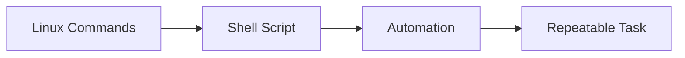
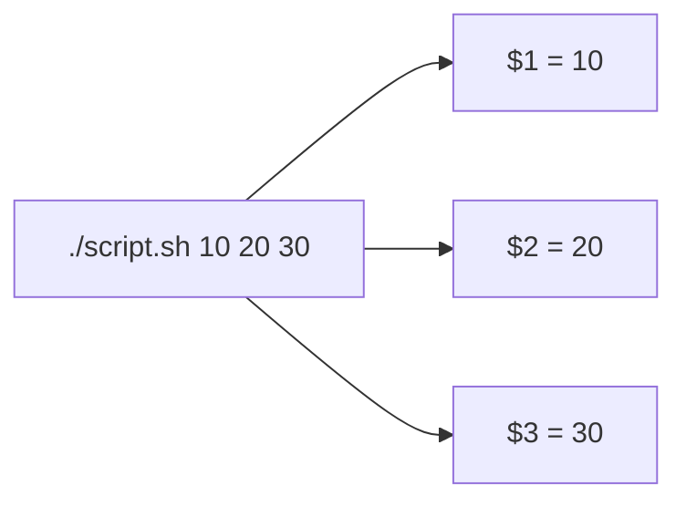
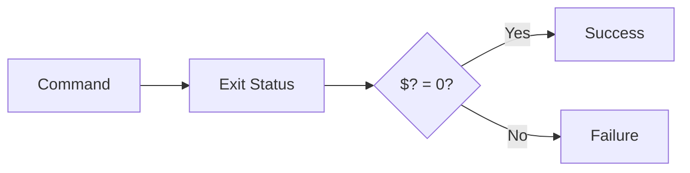
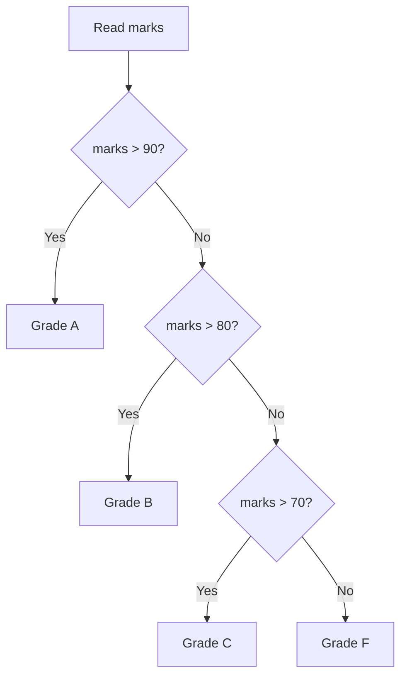
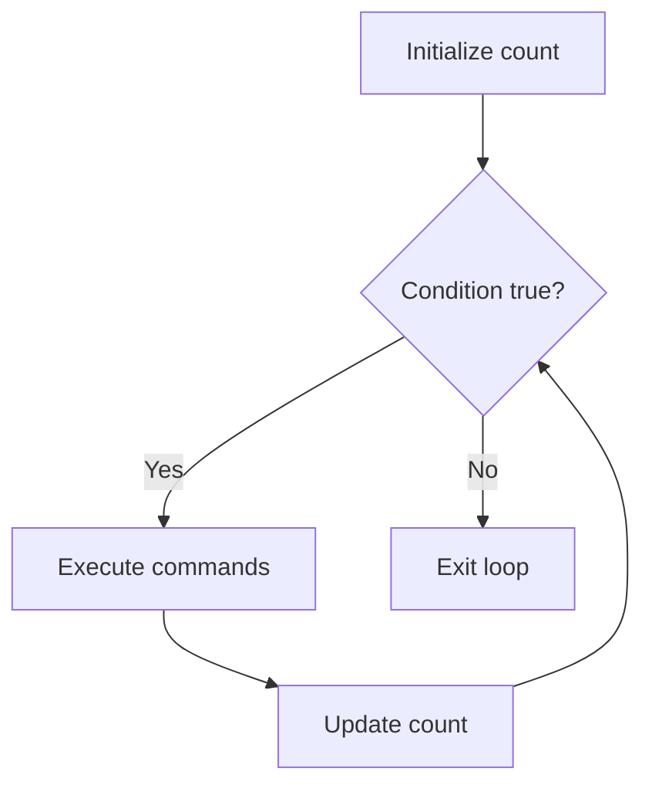
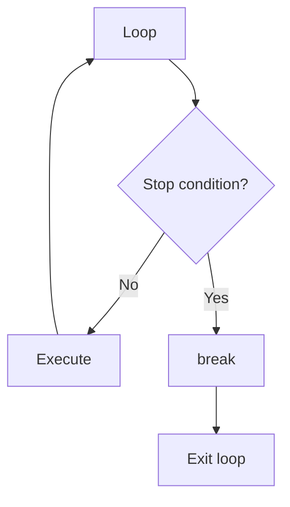
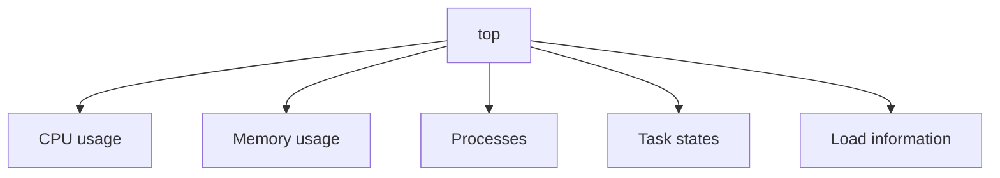
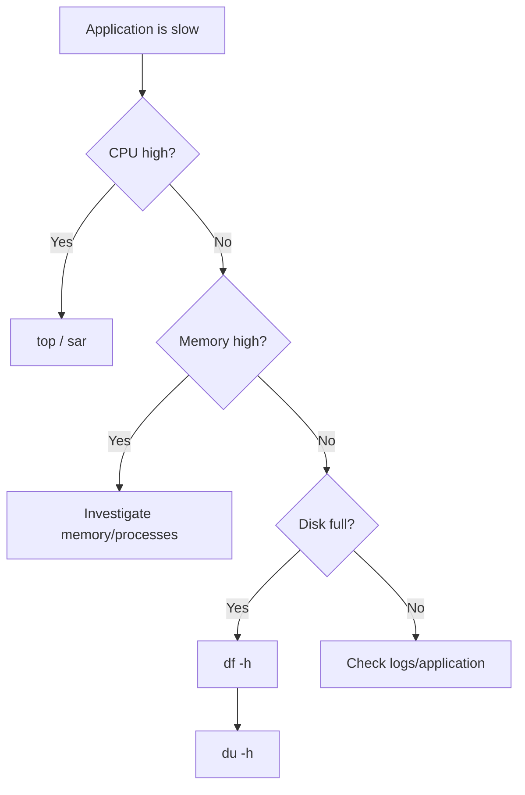
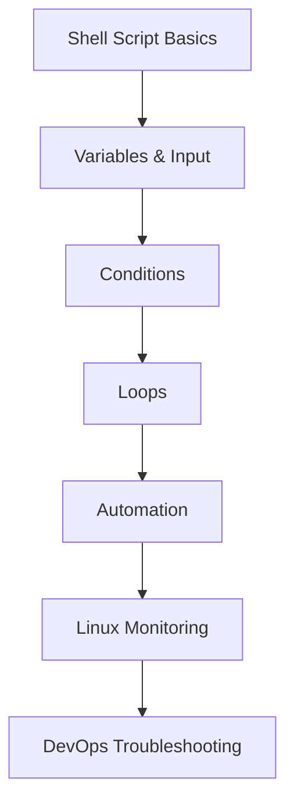

# DevOps Session — Shell Scripting, Control Flow & Linux Resource Monitoring

**Date:** 3 Sep 2026
**Instructor:** Rochak Agrawal
**Focus:** Shell-script structure, variables, `read`, positional parameters, `if/elif/else`, loops, `break`/`continue`, real-world scripting use cases, and Linux CPU/memory/disk monitoring.

I’ve kept the same **crisp + practical + interview-focused format**, removing participant chatter and correcting obvious speech-to-text errors. 

---

# 1. What is Shell Scripting?

The instructor defines a shell script as a **sequence of commands written together to achieve a meaningful task**.

For example:

```bash
pwd
ls -lrt
touch file.txt
```

Instead of executing these manually every time, put them into a `.sh` file and execute the script. 

### Mental model



This is one of the most important DevOps connections:

> **Shell scripting = automating repetitive Linux operations.**

---

# 2. Basic Shell Script Structure

A typical script starts with a **shebang**:

```bash
#!/bin/bash
```

Then commands follow:

```bash
#!/bin/bash

pwd
ls -lrt
touch file.txt
```

### Shebang

The shebang tells the system which interpreter should execute the script.

```text
#!/bin/bash
     ↓
Use Bash interpreter
```

It is technically possible to execute some scripts without explicitly specifying a shebang, but the instructor recommends it as a good practice. 

---

# 3. Make the Script Executable

A shell script needs execute permission if you want to run it directly.

```bash
chmod +x script.sh
```

or:

```bash
chmod 744 script.sh
```

Then:

```bash
./script.sh
```

### Complete flow


The instructor demonstrated that without the appropriate execute permission, the script cannot be directly executed. 

---

# 4. `./script.sh` — Why `./`?

If the script is in the current directory:

```bash
./script.sh
```

`./` means:

> **Look for the executable in the current directory.**

You don't have to be physically inside the script's directory. You can provide its path:

```bash
/path/to/script.sh
```

The instructor specifically demonstrates that a script can be executed from another directory by providing its path. 

---

# 5. Comments in Shell Scripts

Comments start with `#`.

Example:

```bash
#!/bin/bash

# Display current directory
pwd

# List files
ls -lrt

# Create a file
touch file.txt
```

Comments improve **readability and maintainability**.

### Good practice

Don't comment every obvious line.

Instead, explain:

* Why something is being done
* Complex logic
* Important assumptions
* Non-obvious commands

The instructor emphasizes that comments are useful for whoever needs to understand or maintain the script later. 

---

# 6. `echo`

`echo` prints information to standard output.

```bash
echo "Hello World"
```

Output:

```text
Hello World
```

It is similar to a **print statement** in programming languages.

Example:

```bash
echo "Current directory:"
pwd

echo "Files:"
ls -lrt
```

The instructor demonstrates `echo` repeatedly for displaying messages and variable values. 

---

# 7. Commands Execute Sequentially

Suppose your script contains:

```bash
echo "Starting"
pwd
ls
touch file.txt
echo "File created"
```

Execution occurs in sequence:

```text
Starting
   ↓
pwd
   ↓
ls
   ↓
touch file.txt
   ↓
File created
```

A failure in one command does **not automatically mean the entire script stops**. The instructor demonstrates that if one command is invalid, subsequent commands can still execute. 

---

# 8. Shell Script vs Compiled Program

The instructor introduces the distinction between **compiled** and **interpreted** execution.

### Compiled languages

Conceptually:

```text
Source Code
    ↓
Compiler
    ↓
Executable
    ↓
Run
```

Examples discussed include languages such as C and Java.

### Shell scripting

Conceptually:

```text
Shell Script
     ↓
Interpreter
     ↓
Execute commands
```

The shell processes commands as the script executes rather than first producing a conventional compiled executable.

The instructor's key point is:

> **Shell scripting is interpreted and executed sequentially.** 

### ⚠️ Interview nuance

Don't oversimplify this to "compiled programs always execute all at once." The useful interview distinction is that **shell scripts are interpreted**, while languages such as C are conventionally compiled before execution.

---

# 9. Variables

You can define variables:

```bash
x=10
y=20
```

To access the value:

```bash
echo $x
echo $y
```

### Important syntax

```bash
x=10       # assignment
echo $x    # access value
```

There should not be spaces around `=` in ordinary Bash variable assignment.

```bash
x=10       # ✅
x = 10     # ❌
```

The instructor demonstrates storing values and retrieving them using `$variable`. 

---

# 10. Shell Variables Are Generally Strings

By default, shell variables are treated as strings.

For example:

```bash
x=10
```

doesn't mean Bash has declared an integer variable in the same way as a strongly typed programming language.

For numerical operations, appropriate shell arithmetic mechanisms can be used; the instructor mentions `expr` as one approach. 

### Mental model

```text
x=10
 ↓
Shell variable
 ↓
Default interpretation = string
```

---

# 11. `read` — Take Input from User

The `read` command accepts input from the user.

Example:

```bash
#!/bin/bash

echo "Enter your name:"
read name

echo "Good morning $name"
```

If the user enters:

```text
Jeevana
```

Output:

```text
Good morning Jeevana
```

### Flow


The instructor explains that `read` makes a script interactive and reusable because the input doesn't have to be hardcoded. 

---

# 12. Why Avoid Hardcoding?

Bad/restricted reuse:

```bash
file="fileA.txt"
cp "$file" /tmp/
```

Every execution works with the same file.

Instead, make the script accept input:

```bash
read file
cp "$file" /tmp/
```

Now:

```text
Run 1 → fileA.txt
Run 2 → fileB.txt
Run 3 → fileC.txt
```

Same script, different input.

The instructor uses this concept to explain **script reusability**. 

---

# 13. `read` vs Script Arguments

There are two common ways to provide input.

### Method 1 — `read`

```bash
read name
```

The script waits for the user to enter a value.

### Method 2 — Command-line arguments

```bash
./script.sh Jeevana
```

The value is automatically available through positional parameters.

The instructor emphasizes that **both approaches are valid**; which one you use depends on the use case. 

---

# 14. Positional Parameters

This is one of the **most important interview topics from this session**.

Suppose:

```bash
./script.sh 10 20 30
```

Bash provides special variables:

```text
$1 → 10
$2 → 20
$3 → 30
```

### Mental model



The instructor calls these **shell arguments / positional parameters**. 

---

# 15. `$0`

`$0` represents the script/command name.

Example:

```bash
./test.sh 10 20
```

Conceptually:

```text
$0 → ./test.sh
$1 → 10
$2 → 20
```

So don't confuse:

```text
$0 → script itself
$1 → first argument
$2 → second argument
```

The instructor explains the positional parameter numbering beginning with `$0`. 

---

# 16. `$#` — Number of Arguments

`$#` tells you **how many arguments were passed**.

Example:

```bash
./script.sh 10 20
```

Then:

```bash
echo $#
```

Output:

```text
2
```

Another example:

```bash
./script.sh 10 20 30 40
```

```text
$# = 4
```

This is particularly useful for validating user input. 

---

# 17. `$@` — All Arguments

`$@` represents the arguments passed to the script.

Example:

```bash
./script.sh 10 20 30
```

Then:

```bash
echo "$@"
```

can represent:

```text
10 20 30
```

The instructor describes `$@` as representing the passed arguments individually, particularly when used appropriately in quoted contexts. 

### Interview table

| Variable | Meaning                         |
| -------- | ------------------------------- |
| `$0`     | Script name                     |
| `$1`     | First argument                  |
| `$2`     | Second argument                 |
| `$3`     | Third argument                  |
| `$#`     | Number of arguments             |
| `$@`     | All arguments                   |
| `$?`     | Exit status of previous command |

The instructor explicitly identifies `$#`, `$?`, positional parameters, and `$@` as important concepts to remember. 

---

# 18. `$?` — Exit Status

`$?` contains the exit status of the **most recently executed command**.

Generally:

```text
0      → success
non-zero → failure/error
```

Example:

```bash
ls
echo $?
```

If `ls` succeeds:

```text
0
```

If a command fails:

```text
non-zero value
```

The instructor specifically highlights `$?` as an interview-relevant shell variable. 

---

# 19. Why `$?` Matters in DevOps

This becomes very important in automation.

```bash
some_deployment_command

if [ $? -eq 0 ]; then
    echo "Deployment successful"
else
    echo "Deployment failed"
fi
```

Conceptually:



CI/CD pipelines rely heavily on **exit status** to determine whether commands succeeded or failed.

---

# 20. Validating Arguments

Suppose a script requires exactly two numbers:

```bash
./argument.sh 10 20
```

You can check:

```bash
if [ $# -ne 2 ]; then
    echo "Please provide exactly two arguments"
fi
```

Conceptually:

```text
Arguments
   ↓
$#
   ↓
Exactly 2?
 ┌───────┴───────┐
Yes              No
 ↓                ↓
Continue       Show error
```

The instructor demonstrates this pattern and explains why `$#` is useful for validating the input provided to scripts. 

---

# 21. `if / elif / else`

Shell scripting supports conditional logic.

Basic structure:

```bash
if [ condition ]; then
    commands
elif [ condition ]; then
    commands
else
    commands
fi
```

### Important keywords

```text
if
elif
else
fi
```

`fi` marks the end of the `if` block. 

---

# 22. Example — Grade Calculation

Conceptually:

```bash
if [ "$marks" -gt 90 ]; then
    grade="A"
elif [ "$marks" -gt 80 ]; then
    grade="B"
elif [ "$marks" -gt 70 ]; then
    grade="C"
else
    grade="F"
fi
```

Flow:



The instructor uses a marks/grade example to explain `if`, `elif`, `else`, and `fi`. 

---

# 23. `for` Loop

Use a `for` loop when you have a **known/definite set of iterations**.

Example:

```bash
for i in 1 2 3 4 5
do
    echo $i
done
```

Output:

```text
1
2
3
4
5
```

The basic structure is:

```text
for
 ↓
items/range
 ↓
do
 ↓
commands
 ↓
done
```

The instructor demonstrates iterating over numbers and explains that `for` is useful when the number/range of iterations is known. 

---

# 24. Range in `for`

Instead of writing:

```bash
for i in 1 2 3 4 5 6 7 8 9 10
```

you can use a range:

```bash
for i in {1..10}
do
    echo $i
done
```

For a larger range:

```bash
for i in {1..100}
do
    echo $i
done
```

This is useful for repetitive operations such as processing many files or running commands against a known set of values. 

---

# 25. `while` Loop

Use `while` when you want to continue executing **as long as a condition remains true**.

Example:

```bash
count=1

while [ $count -le 10 ]
do
    echo $count
    ((count++))
done
```

Flow:



The instructor demonstrates a counter increasing until the condition becomes false. 

---

# 26. `for` vs `while`

🔥 **Important interview question**

| `for`                                | `while`                          |
| ------------------------------------ | -------------------------------- |
| Known/definite iterations            | Condition-based                  |
| Good for lists/ranges                | Good for indefinite repetition   |
| Number of iterations generally known | Number may not be known          |
| Easier to control                    | Can accidentally become infinite |

### Simple rule

> **Known number → `for`**
> **Unknown number / condition-based → `while`**

The instructor repeatedly emphasizes this distinction. 

---

# 27. Infinite Loop

A `while` loop can become infinite if its condition never becomes false.

Example concept:

```bash
while true
do
    echo "Running"
done
```

This continues indefinitely.

The instructor demonstrates an infinite loop and manually stops it using:

```text
Ctrl + C
```


### Why is this dangerous?

In production automation, an infinite loop can:

* Consume CPU
* Generate huge logs
* Hang a deployment
* Consume resources
* Prevent a pipeline from completing

---

# 28. `break`

`break` immediately exits the loop.

Example:

```bash
while true
do
    if [ "$count" -eq 1000 ]; then
        break
    fi
    ((count++))
done
```

Flow:



The instructor demonstrates using `break` to stop a loop when a specified condition is reached. 

---

# 29. `continue`

`continue` does **not** terminate the entire loop.

Instead:

> It skips the current iteration and moves to the next iteration.

Example:

```bash
for i in {1..10}
do
    if [ "$i" -eq 5 ]; then
        continue
    fi

    echo $i
done
```

Output:

```text
1
2
3
4
6
7
8
9
10
```

`5` is skipped.

The instructor uses exactly this concept to explain `continue`. 

---

# 30. `break` vs `continue`

🔥 **Memorize this**

```text
break
 ↓
EXIT LOOP


continue
 ↓
SKIP CURRENT ITERATION
 ↓
NEXT ITERATION
```

| Statement  | Effect                  |
| ---------- | ----------------------- |
| `break`    | Terminates the loop     |
| `continue` | Skips current iteration |

A practical example given is processing/compressing files while skipping certain file types. 

---

# 31. Real-World Shell Scripting Use Cases

The instructor gives several practical examples.

### 1. Collect logs

Suppose you have a 5-node environment:

```text
Server 1 ─┐
Server 2 ─┤
Server 3 ─┤
Server 4 ─┤ → Script → Collect logs → Compress
Server 5 ─┘
```

Instead of manually collecting logs from every server, automate it.

### 2. Monitoring

A shell script can check:

* CPU
* Memory
* Disk
* Connectivity

### 3. Check multiple IPs

Suppose you have:

```text
100 IPs
200 IPs
2000 IPs
```

Instead of checking each manually, a script can loop through them and determine whether they're reachable.

The instructor specifically gives these examples as practical scripting use cases. 

---

# 32. Shell Scripting vs Modern Monitoring Tools

Shell scripts are still useful, but many tasks have dedicated tools today.

For example:

```text
Server monitoring
      ↓
AWS → CloudWatch
Kubernetes → Prometheus/Grafana
```

So you don't necessarily write a shell script for every monitoring requirement.

Shell scripts remain useful for:

* Supporting tasks
* Housekeeping
* Custom automation
* Small utilities
* Data collection
* Deployment helpers

The instructor specifically notes that ready-made monitoring tools have reduced the need to build monitoring entirely with shell scripts. 

---

# 33. Shell vs Python

This was discussed in the Q&A.

### Shell

Good for:

* Linux commands
* OS-level automation
* Simple administration
* Command chaining
* Lightweight scripts

### Python

Good for:

* More complex logic
* Larger automation
* APIs
* Applications
* Advanced monitoring
* Web applications/dashboards

The instructor describes Python as both a scripting and full programming language, allowing more advanced functionality than typical shell scripting. 

### Simple mental model

```text
Simple Linux automation
        ↓
      Bash

Complex automation/application logic
        ↓
      Python
```

This isn't a hard rule—choose based on the use case.

---

# 34. Linux Resource Monitoring

Near the end, the instructor moves into **server resource monitoring**.

Always think about three major resources:

```text
CPU
Memory
Disk
```

This is an excellent troubleshooting mental model for DevOps. 

---

# 35. `df -h` — Disk Filesystem Usage

```bash
df -h
```

`df` shows filesystem disk usage.

`-h` means **human-readable**.

It shows information such as:

* Filesystem
* Total size
* Used space
* Available space
* Usage percentage
* Mount point

Example concept:

```text
Filesystem   Size   Used   Avail   Use%   Mounted
/dev/...      8G    1.7G    6.4G    21%     /
```

The instructor demonstrates `df -h` and explains that it shows mounted filesystems and their capacity/usage. 

---

# 36. `du` — Directory/File Disk Usage

`du` is useful when you want to find **how much disk space a directory or its contents are consuming**.

Conceptually:

```bash
du -h
```

or:

```bash
du -sh /path
```

### Difference

| Command | Purpose                    |
| ------- | -------------------------- |
| `df -h` | Filesystem-level usage     |
| `du -h` | Directory/file-level usage |

### Troubleshooting example

```text
df -h
 ↓
Disk is 95% full
 ↓
Which directory is consuming space?
 ↓
du
 ↓
Find large directory
 ↓
Investigate files/logs
```

The instructor demonstrates that `du` can traverse directories and may encounter permission-denied messages when the current user lacks access. 

---

# 37. `sar` — System Activity Reporting

`sar` can be used to observe system activity over time.

The instructor demonstrates CPU sampling using `sar`, where parameters specify the number of reports and the interval between them.

Conceptually:

```bash
sar -u 5 5
```

can be understood as collecting CPU-related statistics repeatedly at a specified interval.

The exact options can vary depending on what resource you want to monitor. 

---

# 38. `top`

🔥 **Very important interview command**

```bash
top
```

Think of `top` as:

> **Linux equivalent of Windows Task Manager**

It provides information about:

* Running processes
* CPU usage
* Memory usage
* Process states
* System load
* Resource consumption

The instructor explicitly identifies `top` as an interview-relevant command. 

### Mental model



---

# 39. `uptime`

```bash
uptime
```

Provides information including:

* How long the system has been running
* Number of logged-in users
* Load average

Example:

```text
10:30:00 up 2 days, 3:15, 1 user, load average: 0.50, 0.40, 0.30
```

The important part for this session is:

```text
load average:
0.50, 0.40, 0.30
```

These correspond approximately to:

```text
1 minute
5 minutes
15 minutes
```

The instructor emphasizes understanding these values in relation to the number of CPU cores. 

---

# 40. Load Average

This is one of the **most important interview topics from today's session**.

Three values:

```text
1 min    5 min    15 min
  ↓        ↓        ↓
 1.2      0.8      0.5
```

They represent the system's recent load over those time windows.

### Trend

If:

```text
1 min > 5 min > 15 min
```

it can indicate that system pressure/load is increasing.

If:

```text
1 min < 5 min < 15 min
```

the recent load may be decreasing.

The instructor specifically explains comparing the 1-minute and 15-minute values to understand the direction of system load. 

---

# 41. Load Average Depends on CPU Cores

This is where many interview candidates make mistakes.

**Don't interpret load average without knowing the number of CPU cores.**

### Example: 1-core system

```text
Load = 1.0
```

Approximately:

```text
100% of one CPU's capacity
```

### Example: 2-core system

```text
Load = 1.0
```

Approximately:

```text
50% of total CPU capacity
```

### Example: 4-core system

```text
Load = 2.0
```

Approximately:

```text
50% of total capacity
```

```text
Load = 4.0
```

Approximately:

```text
100% of total capacity
```

The instructor stresses that a load value alone isn't enough to conclude that a server is overloaded—you need to know the number of cores. 

### Formula

A useful simplified mental model:

```text
Relative load ≈ Load Average / CPU Cores
```

Example:

```text
4-core server
Load = 2

2 / 4 = 50%
```

---

# 42. DevOps Troubleshooting Flow

This session gives you a very useful real-world troubleshooting model:



This is how the Linux knowledge starts becoming **actual DevOps troubleshooting knowledge**.

---

# 🔥 Interview Revision

| Question                      | Answer                                             |
| ----------------------------- | -------------------------------------------------- |
| What is a shell script?       | Sequence of shell commands used to automate a task |
| What is shebang?              | Specifies the interpreter, e.g. `#!/bin/bash`      |
| Why `chmod +x`?               | Gives execute permission                           |
| Why `./script.sh`?            | Executes the script from the current directory     |
| What does `echo` do?          | Prints output                                      |
| What does `read` do?          | Takes user input                                   |
| How do you access a variable? | `$variable`                                        |
| Default shell variable type?  | Generally treated as string                        |
| `$0`?                         | Script name                                        |
| `$1`?                         | First argument                                     |
| `$2`?                         | Second argument                                    |
| `$#`?                         | Number of arguments                                |
| `$@`?                         | All arguments                                      |
| `$?`?                         | Previous command's exit status                     |
| `if/elif/else`?               | Conditional execution                              |
| `fi`?                         | Ends an `if` block                                 |
| `for` loop?                   | Known/definite iterations                          |
| `while` loop?                 | Condition-based iteration                          |
| Infinite loop?                | Loop whose termination condition is never met      |
| `break`?                      | Exit loop                                          |
| `continue`?                   | Skip current iteration                             |
| `df -h`?                      | Filesystem disk usage                              |
| `du`?                         | Directory/file disk usage                          |
| `sar`?                        | System activity/resource statistics                |
| `top`?                        | Processes and CPU/memory/resource monitoring       |
| `uptime`?                     | Uptime, users and load average                     |
| Load average values?          | 1, 5 and 15-minute averages                        |
| Is load 2 always high?        | No; depends on CPU core count                      |

---

# 🧠 Final Mental Model

Today's class can be remembered as **five layers**:



### 1️⃣ Script

```text
#!/bin/bash
commands
```

### 2️⃣ Input

```text
read
$1 $2 $3
$# $@ $?
```

### 3️⃣ Decision

```text
if
elif
else
fi
```

### 4️⃣ Repetition

```text
for
while
break
continue
```

### 5️⃣ Server troubleshooting

```text
CPU    → top / sar
Memory → top
Disk   → df / du
Load   → uptime
```

---

## ⭐ What I would prioritize for your DevOps interviews

Don't try to memorize every shell command from this session. Focus especially on:

**High priority**

1. `$1`, `$2`, `$#`, `$@`, `$?`
2. `read` vs positional arguments
3. `if / elif / else`
4. `for` vs `while`
5. `break` vs `continue`
6. `df` vs `du`
7. `top`
8. Load average + CPU cores

**Medium priority**
9. Shebang
10. `chmod +x`
11. `echo`
12. Shell variables
13. `sar`

The instructor himself notes that shell scripting is **not usually the major focus of a DevOps interview**, but interviewers can ask general questions around permissions, positional parameters and special variables such as `$?`, `$#`, and `$@`. 

And for your AEM/DevOps background, the most useful practical connection is:

```text
AEM / Application Issue
        ↓
Linux Server
        ↓
Check CPU → top
Check Memory → top
Check Disk → df -h
Find large directories → du
Check recent load → uptime
Automate repetitive checks → Bash
```

That's the point where these Linux fundamentals start becoming directly useful in real production troubleshooting.
