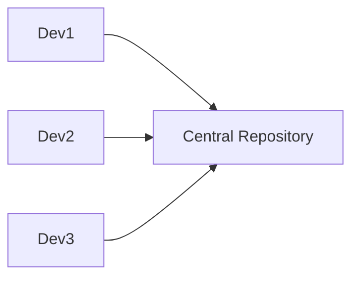
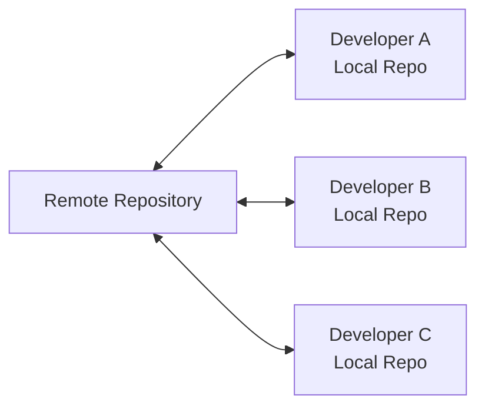
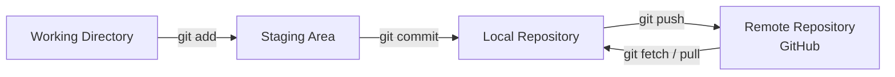
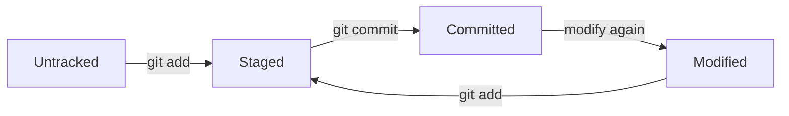
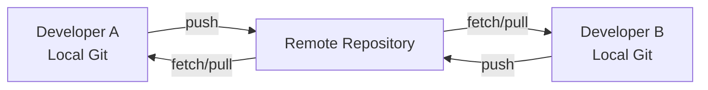
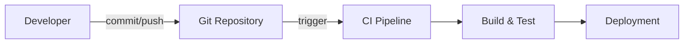
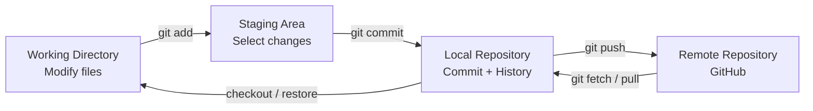

Absolutely — I went through the **September 4, 2026 DevOps class transcript** and condensed it in the same format as your previous notes. I removed participant chatter and corrected obvious speech-to-text errors such as “get” → `git`. 

# DevOps Session — Git & Version Control Notes

**Date:** 04-Sep-2026
**Instructor:** Rochak Agrawal
**Focus:** Git fundamentals, Version Control Systems, Git architecture, staging, commits, push/pull/fetch, local vs remote repositories

> **Note:** These notes focus on the instructor's technical content and exclude classroom discussions/repetition. 

---

## 1. Version Control System (VCS)

A **Version Control System** records changes made to files over time.

It allows us to:

* Track previous versions
* Know **who** changed something
* Know **when** it changed
* Maintain change history
* Roll back unwanted changes
* Work in parallel with other developers
* Maintain a single source of truth

Without VCS:

```text
File V1
  ↓
Modify
  ↓
File V2
  ↓
Modify
  ↓
File V3
```

The previous content can easily be lost/overwritten.

With VCS:

```text
V1 → V2 → V3 → V4 → V5
             ↑
       Can go back to
       previous versions
```


---

## 2. What Can Be Version Controlled?

VCS is not limited to source code.

It can track:

| Type           | Example                  |
| -------------- | ------------------------ |
| Source code    | `.java`, `.py`, `.js`    |
| Configuration  | `.xml`, `.yaml`, `.json` |
| Infrastructure | Terraform files          |
| Scripts        | `.sh`                    |
| Documentation  | `.md`, `.txt`            |
| Other files    | Images, PDFs, etc.       |

For DevOps, this is particularly important because **application code, infrastructure definitions and pipeline configuration can all be version controlled.** 

---

# 3. Types of Version Control Systems

There are three concepts discussed:

### A. Local VCS

History exists only on the local machine.

```text
Developer Laptop
      │
      └── Local Repository
```

Suitable mainly for individual work.

---

### B. Centralized VCS

A central repository contains the main history.

Examples:

* SVN / Subversion
* Older centralized systems



Developers depend heavily on the central repository for version history and collaboration.


---

### C. Distributed VCS

Each developer gets a **complete repository/history locally**.

Git is the major example.



Each local repository contains the history, allowing developers to perform many Git operations without continuously depending on the remote repository. 

---

# 4. Centralized vs Distributed VCS

| Feature              | Centralized    | Distributed    |
| -------------------- | -------------- | -------------- |
| Main history         | Central server | Local + remote |
| Local history        | Limited        | Complete       |
| Offline work         | Limited        | Yes            |
| Dependency on server | High           | Lower          |
| Collaboration        | Central server | Push/Pull      |
| Example              | SVN            | Git            |
| Branching            | More complex   | Easier         |
| Modern usage         | Mostly legacy  | Widely used    |

### Interview Question

**Q: What is the biggest difference between SVN and Git?**

**Answer:**
SVN is centralized, where the main version history is maintained on the central server. Git is distributed, where every cloned repository contains the complete history locally. 

---

# 5. Git vs GitHub

This is **very important**.

### Git

Git is the **version control tool** installed on your machine.

### GitHub

GitHub is a **remote collaboration/repository platform**.

Other platforms include:

* GitLab
* Azure Repos

```text
Developer Laptop
      │
     Git
      │
      │ push / pull
      ▼
GitHub / GitLab / Azure Repos
```

Git is installed locally; GitHub provides the remote repository/collaboration platform. 

---

# 6. Git Installation Verification

After installing Git:

```bash
git --version
```

Example:

```text
git version 2.x.x
```

This confirms Git is installed and available from the command line. 

---

# 7. Three Important Areas in Git

This is probably the **most important concept from this session**.

Git workflow has:

1. **Working Directory**
2. **Staging Area**
3. **Local Repository**
4. **Remote Repository**

The first three are local to your machine.




---

# 8. Working Directory

This is where you actually work on files.

Example:

```text
pom.xml
index.jsp
application.properties
```

You modify files here.

Example:

```text
pom.xml
1.8 → 2.0
```

Git can detect that the file has changed.

```bash
git status
```

Output will indicate that the file is modified.


---

# 9. Staging Area

The **staging area** is an intermediate area between your working directory and local repository.

You use:

```bash
git add <file>
```

Example:

```bash
git add pom.xml
```

You can select only the changes you want to include in the next commit.

### Example

Suppose you have:

```text
pom.xml       → completed
new.txt       → completed
not-ready.txt → still working
```

You can stage:

```bash
git add pom.xml
git add new.txt
```

Then commit only those two files.

`not-ready.txt` remains outside the commit.


### Mental Model

> **Staging = "These changes are ready for my next version."**

---

# 10. Commit

A commit saves staged changes into your **local Git repository**.

Basic command:

```bash
git commit -m "Add application configuration"
```

`-m` specifies the commit message.

A good commit should represent a **meaningful logical change**.

### Good

```bash
git commit -m "Update database configuration"
```

### Bad

```bash
git commit -m "changes"
```

Meaningful commits make history easier to understand and troubleshoot. 

---

# 11. Git Log

To see commit history:

```bash
git log
```

It shows information such as:

* Commit ID
* Author
* Date
* Commit message

Example:

```text
commit abc123...
Author: Rochak
Date: ...

    Update application configuration
```

Git uses commit identifiers to track versions. 

---

# 12. HEAD

**HEAD** points to the current position/version in your Git history.

Simplified:

```text
V1 → V2 → V3 → V4
              ↑
             HEAD
```

Normally, your working directory reflects the currently checked-out/latest version.

The instructor also demonstrated that `.git/HEAD` contains information about the current branch reference. 

---

# 13. `.git` Directory

When a directory becomes a Git repository, Git creates:

```text
.git/
```

This contains Git's internal repository information.

It stores information related to:

* Objects
* Commit history
* References
* HEAD
* Configuration
* Branch/tag references

```text
Project/
├── pom.xml
├── src/
├── README.md
└── .git/
    ├── objects/
    ├── refs/
    ├── HEAD
    └── config
```

**Important:** deleting `.git` removes the Git repository metadata/history from that working directory.


---

# 14. Git Object Database

Inside `.git/objects`, Git stores objects representing things such as:

* Commits
* Files/blobs
* Trees

Git identifies objects using hashes/checksums.

You generally **do not manually modify these files**. 

---

# 15. `git clone`

Used when an existing remote repository needs to be copied to your local machine.

```bash
git clone <repository-url>
```

Conceptually:

```text
GitHub Repository
       │
       │ git clone
       ▼
Local Repository
```

After cloning, Git also knows the remote repository from which it was cloned. 

---

# 16. `git remote -v`

Shows configured remote repositories.

```bash
git remote -v
```

Typical output:

```text
origin  https://github.com/user/project.git (fetch)
origin  https://github.com/user/project.git (push)
```

This tells Git where to send/fetch remote changes.


---

# 17. `git push`

After committing locally:

```text
Working Directory
       ↓
   git add
       ↓
 Staging Area
       ↓
  git commit
       ↓
Local Repository
       ↓
   git push
       ↓
Remote Repository
```

Important:

> **`git commit` does NOT send changes to GitHub.**

You need:

```bash
git push
```

to send local commits to the remote repository. 

---

# 18. `git fetch`

Used to retrieve changes from the remote repository.

```bash
git fetch
```

It downloads remote changes/references to your local repository.

The instructor emphasized that Git does **not automatically synchronize** your local repository with the remote repository; you explicitly perform fetch/pull or automate it. 

### Simple distinction

```text
git fetch
    ↓
Get remote changes
    ↓
Review/integrate separately
```

---

# 19. `git pull`

`git pull` is used to get remote changes and integrate them into the current local branch.

For interview purposes:

| Command     | Purpose                                                   |
| ----------- | --------------------------------------------------------- |
| `git clone` | Get repository for the first time                         |
| `git fetch` | Download remote changes without directly integrating them |
| `git pull`  | Fetch + integrate changes                                 |
| `git push`  | Send local commits to remote                              |

The session primarily demonstrated `clone`, `fetch`, and `push`; detailed pull behavior can be covered with the later Git workflow. 

---

# 20. `git status`

One of the most frequently used commands.

```bash
git status
```

It tells you the current state of files.

Example:

```text
modified
untracked
staged
nothing to commit
```

Typical workflow:

```text
Modify file
    ↓
git status
    ↓
git add
    ↓
git status
    ↓
git commit
```


---

# 21. File States in Git

A file can move through different states:



### Example

```text
Create file
   ↓
Untracked
   ↓ git add
Staged
   ↓ git commit
Committed
   ↓ modify
Modified
   ↓ git add
Staged again
```

The staging area determines what goes into the **next commit**. 

---

# 22. Starting a New Local Repository

If you have a new project directory:

```bash
cd my-project
git init
```

Git initializes an empty repository and creates the `.git` directory.

```text
my-project/
     │
     ├── application files
     │
     └── .git/
```

`git init` is used when starting version control for an existing local directory. 

---

# 23. `git clone` vs `git init`

| `git clone`                            | `git init`                        |
| -------------------------------------- | --------------------------------- |
| Existing repository                    | New repository                    |
| Usually starts from remote             | Starts locally                    |
| Copies existing history                | Creates new Git metadata          |
| Common for joining an existing project | Common for starting a new project |

---

# 24. Local Repository vs Remote Repository

### Local repository

Exists on your machine.

Contains Git history.

### Remote repository

Exists on platforms such as:

* GitHub
* GitLab
* Azure Repos



This enables collaboration between developers. 

---

# 25. Git in DevOps — Who Does What?

Git is primarily used by developers for source-code version control, but DevOps engineers also need a strong understanding of it.

### Developer responsibilities

* Write code
* Commit changes
* Create branches
* Merge branches
* Resolve code conflicts
* Push code

### DevOps responsibilities

* Repository/platform administration
* User permissions
* Repository access
* Branch protection/policies
* Security policies
* Integration with CI/CD
* Automation

The instructor specifically highlighted branch policies and permissions as important DevOps responsibilities. 

---

# 26. Git + CI/CD

This is where Git becomes very important for DevOps.



A typical DevOps flow is:

```text
Developer
   ↓
Git commit
   ↓
Git push
   ↓
GitHub/GitLab
   ↓
CI Pipeline
   ↓
Build
   ↓
Test
   ↓
Deploy
```

This connects directly with the DevOps lifecycle you learned earlier.

---

# 🔥 Interview Revision

### 1. What is Git?

Git is a **distributed version control system** used to track changes and manage source code/history.

### 2. Git vs GitHub?

**Git** = version control tool.
**GitHub** = remote repository/collaboration platform.

### 3. SVN vs Git?

SVN is centralized; Git is distributed.

### 4. What is a staging area?

An intermediate area where you select changes that should be included in the next commit.

### 5. Does `git commit` push code to GitHub?

**No.**

```text
git add
 ↓
git commit
 ↓
Local repository
 ↓
git push
 ↓
Remote repository
```

### 6. `git clone` vs `git pull`?

`clone` is generally used to obtain a repository for the first time.
`pull` is used to bring subsequent remote changes into an existing local repository.

### 7. What does `git status` do?

Shows the current state of files and the working tree.

### 8. What is `.git`?

The hidden directory containing Git's local repository metadata/history.

### 9. What is `HEAD`?

A reference indicating the current position in Git history, typically the currently checked-out branch/commit.

### 10. Why are meaningful commits important?

They make history easier to understand, review, troubleshoot and roll back.

---

# 🧠 Final Mental Model

Remember this one diagram:



### The 7 commands to remember from this class

```bash
git --version
git clone <url>
git status
git add <file>
git commit -m "message"
git push
git fetch
```

And for a brand-new local project:

```bash
git init
```