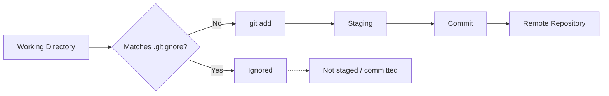
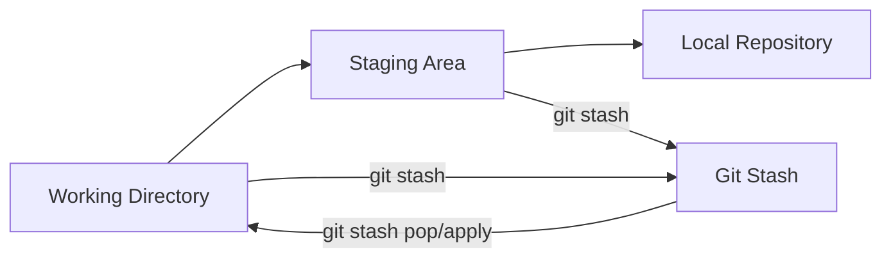
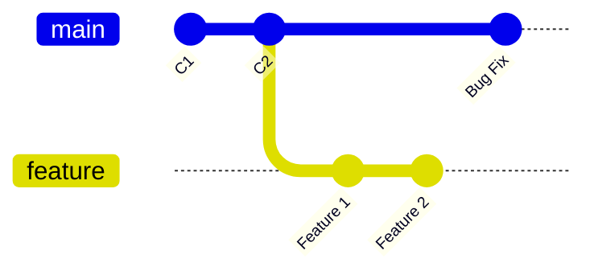
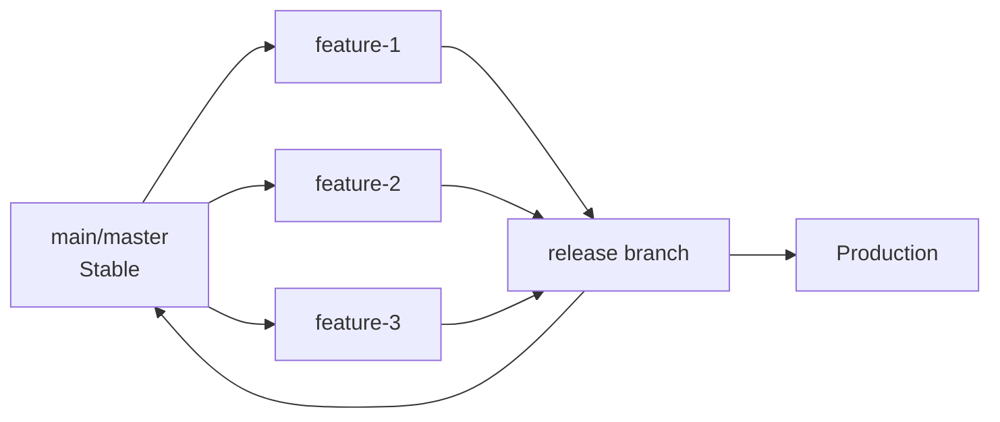
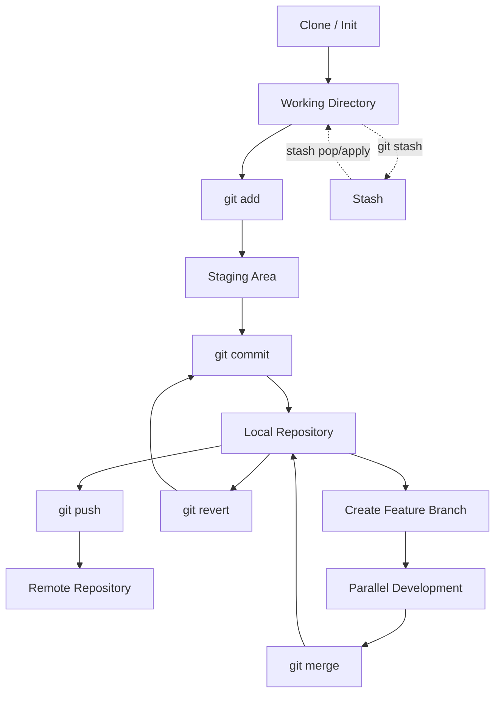
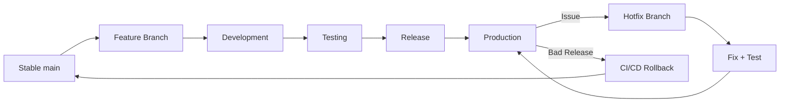

Yes — this session is a **continuation of Git**, and it covers some very important interview topics: **`.gitignore`, `git revert`, `git stash`, branching, branch switching, merging, hotfixes, and rollback strategy**. I’ve kept it crisp and removed the participant discussion/repetition. 

# DevOps Session — Git Advanced Notes

**Date:** 09-Sep-2026
**Instructor:** Rochak Agrawal
**Focus:** `.gitignore`, Revert, Stash, Branching, Merge, Hotfix & Rollback

---

## 1. `.gitignore`

`.gitignore` tells Git which files/directories should **not be tracked**.

Typical files that should not be committed:

| Type              | Examples           |
| ----------------- | ------------------ |
| Logs              | `*.log`            |
| Temporary files   | `tmp/`, `temp/`    |
| Build output      | `dist/`, `target/` |
| Python cache      | `__pycache__/`     |
| Node dependencies | `node_modules/`    |
| Environment files | `.env`             |
| Credentials       | `credentials.json` |

Example:

```gitignore
*.log
node_modules/
__pycache__/
dist/
.env
credentials.json
```

`*` is a wildcard.

For example:

```gitignore
*.log
```

matches:

```text
app.log
server.log
error.log
```

The instructor demonstrated that ignored files remain in the **working directory**, but don't move into the staging area or commits. 

### Important security point

Never commit:

```text
.env
credentials.json
password files
API keys
private keys
```

`.gitignore` is useful for preventing accidental tracking, but **it is not a secret-management system**.

---

## 2. `.gitignore` Flow



### Interview Question

**Q: What does `.gitignore` do?**

> `.gitignore` contains patterns that tell Git which untracked files or directories should be ignored so they are not added to the staging area or committed.


---

# 3. `git revert`

Suppose your history is:

```text
C1 → C2 → C3
```

You discover that **C2 introduced a bug**.

You can run:

```bash
git revert <commit-id>
```

Git creates a **new commit** that reverses the changes introduced by C2.

```text
C1 → C2 → C3 → C4
          ↑     ↑
        wrong   revert
        commit  commit
```

The important concept:

> **`git revert` does not delete the old commit.**

It creates a new commit that undoes its changes. 

---

## 4. Why `git revert` is called Non-Destructive

Original:

```text
C1 → C2 → C3
```

After:

```text
C1 → C2 → C3 → C4
```

Where:

```text
C4 = inverse of C2
```

C2 still exists in history.

This is why `git revert` is generally safer for changes that have already been shared/pushed.

---

## 5. `git revert` Example

```bash
git log --oneline
```

Find the problematic commit:

```text
abc123 Add feature
def456 Introduce bug
789xyz Initial version
```

Then:

```bash
git revert def456
```

Git creates a new commit reversing the changes from `def456`.

### Important

`git revert` works on a **specific commit**.

It doesn't simply mean "undo the last file change."


---

# 6. `git revert` vs Rollback

This distinction is important for DevOps interviews.

### Code-level undo

```bash
git revert <commit>
```

Creates a new Git commit.

### Deployment rollback

Suppose production has:

```text
Release 1 → Release 2 → Release 3
```

Release 3 has a production problem.

Instead of modifying Git history, CI/CD can deploy the previous known-good release:

```text
Production
    ↓
R3 ❌
    ↓
Rollback
    ↓
R2 ✅
```

The instructor's recommended operational approach was to restore the previous production version quickly, then investigate/fix the issue using a hotfix branch. 

---

# 7. Git Stash ⭐

`git stash` is one of the **important Git interview questions** from this session.

It allows you to temporarily store your **uncommitted changes** without creating a commit.

Think:

> **Stash = temporary parking area for unfinished work.**

Git's stash can hold both staged and unstaged changes. 

---

## 8. Why Do We Need `git stash`?

Imagine you're working on:

```text
Feature A
```

Your work is incomplete.

Suddenly:

> 🚨 Production bug!

You don't want to commit incomplete Feature A just to switch context.

Instead:

```bash
git stash
```

Your working directory becomes clean.

Now you can:

```text
Feature A (unfinished)
       ↓
    git stash
       ↓
Clean working directory
       ↓
Fix production bug
       ↓
Return to Feature A
       ↓
Restore stash
```

This is the main practical use case discussed in class. 

---

# 9. Important Stash Commands

### Save changes

```bash
git stash
```

### List stashes

```bash
git stash list
```

Example:

```text
stash@{0}
stash@{1}
stash@{2}
```

### Restore latest stash and remove it

```bash
git stash pop
```

### Restore a specific stash

```bash
git stash apply stash@{1}
```

Difference:

| Command           | Restore changes | Remove stash |
| ----------------- | --------------: | -----------: |
| `git stash apply` |               ✅ |            ❌ |
| `git stash pop`   |               ✅ |            ✅ |

The session specifically demonstrated that multiple stashes can exist and can be listed using `git stash list`. 

---

# 10. Git Stash Mental Model



### Key point

Stash is **not a replacement for a commit**.

It's temporary storage for work that isn't ready to become a proper commit.

---

# 11. Branching

A **branch is a movable pointer to a commit**.

Its main purpose is to create a **separate line of development**.

Suppose:

```text
C1 → C2 → C3 → C4
```

C4 is stable.

You want to develop a new feature without affecting stable code.

Create:

```text
                 → Feature
                /
C1 → C2 → C3 → C4
                \
                 → Master
```

The new branch starts from a specific commit. 

---

# 12. Why Use Branches?

Without branches:

```text
Feature A
   ↓
Feature B
   ↓
Bug Fix
   ↓
Feature C
```

Everything modifies the same line.

With branches:



Different work can progress independently.

### Typical branches

```text
main/master
dev
feature/login
feature/payment
release
hotfix
```

Branch names are conventions; organizations can choose their own strategy. 

---

# 13. `git branch`

List branches:

```bash
git branch
```

Example:

```text
* master
  dev
```

`*` indicates the branch you're currently on.

Create a branch:

```bash
git branch dev
```

Switch to it:

```bash
git checkout dev
```

A modern alternative is:

```bash
git switch dev
```

The instructor demonstrated branch creation and switching using `git branch` and `git checkout`. 

---

# 14. HEAD

`HEAD` represents your **current checked-out position**.

Example:

```text
C1 → C2 → C3 → C4
                ↑
               HEAD
```

If you're on `dev`:

```text
HEAD
 ↓
dev
 ↓
C4
```

Switch to master:

```bash
git checkout master
```

Now:

```text
HEAD
 ↓
master
 ↓
C4
```

The instructor demonstrated that HEAD moves when you switch branches. 

---

# 15. Branches Share History Initially

Suppose:

```text
C1 → C2 → C3
          ↑
       master
          ↑
         dev
```

At this point both branches point to the same commit.

Now commit on dev:

```text
             → D1 → D2
            /
C1 → C2 → C3
            ↑
          master
```

`master` doesn't automatically receive D1/D2.

That's the benefit of branching.


---

# 16. Remote Repository vs Branch

This distinction was explicitly discussed.

### Remote repository

Used mainly for:

> **Collaboration / sharing**

Example:

```text
GitHub
GitLab
Azure Repos
```

### Branch

Used mainly for:

> **Parallel development**

```text
Remote Repository = collaboration
Branch = parallel development
```

A remote repository can contain multiple branches, and those branches can also be shared with other developers. 

---

# 17. Recommended Branching Practice

A common practice discussed was:

> Don't directly develop on the stable `master/main` branch.

Instead:

```text
main/master
     │
     ├── feature-1
     ├── feature-2
     ├── feature-3
     │
     └── release
```

Features are developed separately, tested, and eventually merged into the stable branch.

The exact branching strategy is organization-dependent rather than a universal hard rule. 

---

# 18. Feature → Release → Production

A simplified workflow from the session:



After the release is tested and stable, it can be merged back into the stable branch. 

---

# 19. Hotfix Branch ⭐

Very important real-world DevOps scenario.

Suppose:

```text
main/master
     ↓
Production Release
     ↓
🚨 Production Bug
```

Create:

```text
main/master
     │
     └── hotfix
           ↓
       Fix bug
           ↓
       Test
           ↓
      Production
```

Then merge the fix appropriately back into the main development line.

The instructor specifically described creating a hotfix branch from the stable production code, deploying the fix, and then merging it back. 

---

# 20. Production Rollback Strategy

Suppose:

```text
R1 ✅
R2 ✅
R3 ❌
```

R3 is currently deployed.

Instead of immediately rewriting Git history:

```text
CI/CD
  ↓
Deploy R2
  ↓
Production stable
```

Then:

```text
Create hotfix branch
        ↓
Investigate R3 issue
        ↓
Fix
        ↓
Test
        ↓
Deploy fixed version
```

This separates:

**Immediate recovery** from **root-cause fixing**.

That's a very useful DevOps interview scenario. 

---

# 21. Git Merge

Suppose:

```text
main: C1 → C2 → C3

feature:        → F1 → F2
```

After completing the feature, switch to the destination branch:

```bash
git checkout main
```

Then merge:

```bash
git merge feature
```

Conceptually:

```text
        F1 → F2
       /
C1 → C2 → C3
             \
              merged
```

The session demonstrated merging the development branch into master and then optionally deleting the branch. 

---

# 22. Delete a Branch

After successful merge:

```bash
git branch -d feature
```

This deletes the local branch pointer.

The commits themselves aren't simply erased if they're still reachable from history.

Example:

```text
Before:

main ──────────────┐
                   ↓
feature → F1 → F2

After merge:

main → F1 → F2

feature branch → deleted
```


---

# 23. Simple Merge vs Rebase

The session introduced **rebase** but deferred detailed explanation to the next session.

For now remember:

### Merge

Combines histories.

```bash
git merge feature
```

### Rebase

Replays commits onto another base and changes the commit ancestry.

```bash
git rebase main
```

The instructor specifically noted that rebase is an important interview topic and would be covered separately. 

---

# 24. Complete Git Workflow

Put everything together:



---

# 🔥 Interview Revision

| Question                           | Short Answer                                                          |
| ---------------------------------- | --------------------------------------------------------------------- |
| What is `.gitignore`?              | Defines patterns for files Git should ignore                          |
| Why ignore log files?              | They constantly change and can unnecessarily increase repository size |
| Why ignore `.env`?                 | It may contain credentials/secrets                                    |
| What is `git revert`?              | Creates a new commit that reverses an earlier commit                  |
| Does revert delete the old commit? | **No**                                                                |
| Is revert destructive?             | Generally no; history is preserved                                    |
| What is `git stash`?               | Temporarily parks uncommitted work                                    |
| Why use stash?                     | Switch tasks without committing incomplete work                       |
| `stash apply` vs `stash pop`?      | Apply restores; pop restores and removes the stash                    |
| What is a branch?                  | A movable pointer/reference to a commit                               |
| Why branches?                      | Parallel development                                                  |
| What is HEAD?                      | Reference to current checked-out position                             |
| What does `git checkout` do?       | Can switch branches or check out a specific commit                    |
| What is remote repository for?     | Collaboration/sharing                                                 |
| What are branches for?             | Parallel development                                                  |
| What is a hotfix branch?           | Branch used to quickly fix a production issue                         |
| How do you merge?                  | `git checkout main` → `git merge feature`                             |
| How do you delete a merged branch? | `git branch -d feature`                                               |
| Merge vs rebase?                   | Merge combines histories; rebase replays commits onto a new base      |

---

# 🧠 Most Important Mental Model

Remember these **five Git concepts**:

```text
1. .gitignore
      ↓
What should NOT be tracked?

2. git revert
      ↓
How do I safely undo a committed change?

3. git stash
      ↓
How do I temporarily park unfinished work?

4. Branch
      ↓
How do I develop features independently?

5. Merge
      ↓
How do I bring branch changes together?
```

### Real DevOps scenario



**One correction to keep in your notes:** the transcript occasionally says “master” as the default branch. In modern Git hosting, the default branch is often named `main`; `master` is still valid, but the name is configurable. 

