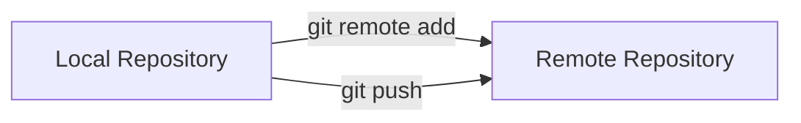
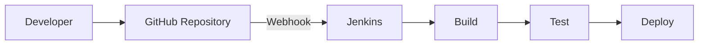
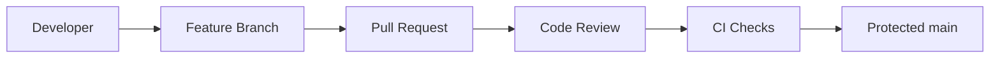
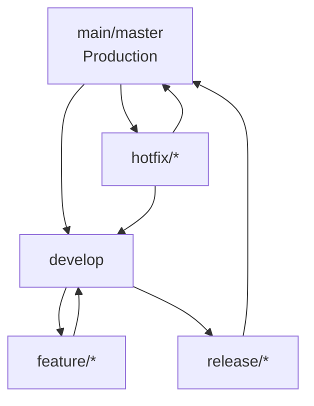
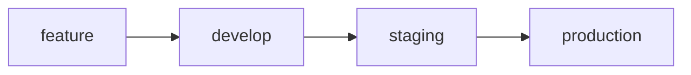
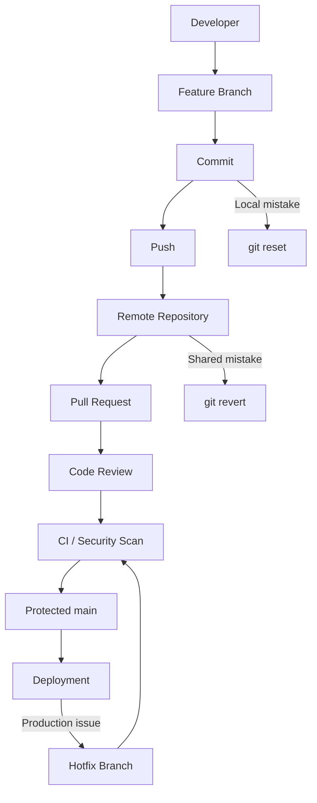

Absolutely. I went through the **10-Sep-2026 transcript**. This session is a continuation of Git and is especially important for interviews because it covers **`git reset`, `git revert`, GitHub branch protection, Pull Requests, Git branching strategies, Git Flow, and repository/security concepts**. 

# DevOps Session — Git Reset, PRs & Branching Strategies

**Date:** 10-Sep-2026
**Instructor:** Rochak Agrawal
**Focus:** Git Reset, Revert, Remote Repositories, Pull Requests, Branch Protection, Git Flow & Branching Strategies

> **Note:** Participant discussions and repetition have been removed. Obvious transcript errors such as “get” → `git` have been corrected.

---

# 1. `git reset` ⭐⭐⭐

`git reset` moves the **HEAD/branch pointer backward** to an earlier commit.

Example:

```text
C1 → C2 → C3
          ↑
         HEAD
```

After:

```bash
git reset <commit>
```

the branch pointer moves back:

```text
C1 → C2
     ↑
    HEAD
```

Unlike `git revert`, reset changes the visible commit history by moving the branch pointer. 

---

# 2. `git revert` vs `git reset`

This is a **must-know interview question**.

### Revert

```text
C1 → C2 → C3 → C4
              ↑
          revert C3
```

`C4` is a **new commit** that reverses the changes from C3.

The original C3 remains in history.

### Reset

```text
C1 → C2 → C3
     ↑
    HEAD
```

Reset moves HEAD backward, making later commits no longer part of the current branch history.

| Feature                            | `git revert`        | `git reset`                 |
| ---------------------------------- | ------------------- | --------------------------- |
| Creates new commit                 | ✅                   | ❌                           |
| Original commit remains in history | ✅                   | ❌ from branch history       |
| Changes history                    | No                  | Yes                         |
| Safe for shared branch             | Generally yes       | Generally no                |
| Typical use                        | Undo shared changes | Undo local/unpublished work |

The instructor emphasized **not resetting commits that have already been pushed/shared** because this can make local and remote histories diverge. 

---

# 3. Three Types of `git reset`

This is one of the most important parts of the session:

1. `--soft`
2. `--mixed`
3. `--hard`

Remember:

```text
Commit
  ↑
Staging Area
  ↑
Working Directory
```

Each reset mode affects a different level.

---

# 4. `git reset --soft`

Example:

```bash
git reset --soft HEAD~1
```

The commit is removed from the current branch history, but the changes remain **staged**.

```text
Before:

Working Directory
       ↓
Staging
       ↓
C1 → C2
       ↑
      HEAD


After soft reset:

Working Directory
       ↓
Staging ← changes remain here

C1
↑
HEAD
```

### Use case

You committed too early or used the wrong commit message and want to make another commit.

```bash
git reset --soft HEAD~1
git commit -m "Better commit message"
```

The instructor demonstrated that after a soft reset, the changes remain in the staging area ready to be recommitted. 

---

# 5. `git reset --mixed`

This is the **default reset mode**.

```bash
git reset HEAD~1
```

is equivalent to:

```bash
git reset --mixed HEAD~1
```

It:

* Moves HEAD backward
* Removes the commit from current history
* **Unstages** the changes
* Keeps the changes in the working directory

```text
Before:

Working Directory
       ↓
Staging
       ↓
C1 → C2


After mixed reset:

Working Directory ← changes remain
       ↓
Staging ← empty/unstaged

C1
↑
HEAD
```

The instructor explicitly highlighted that **mixed is the default** when no reset option is specified. 

---

# 6. `git reset --hard` ⚠️

```bash
git reset --hard HEAD~1
```

This is destructive.

It:

* Moves HEAD backward
* Removes the commit from current branch history
* Clears staging
* Changes the working directory to match the target commit

```text
Before:

Working Directory
       ↓
Staging
       ↓
C1 → C2


After hard reset:

Working Directory ← reverted
       ↓
Staging ← cleared

C1
↑
HEAD
```

### ⚠️ Important

Uncommitted changes can be lost.

The instructor specifically warned to use hard reset **very carefully** because it can destroy working-directory changes. 

---

# 7. Reset Modes — Easy Memory Table

| Reset     | Commit     | Staging                 | Working Directory |
| --------- | ---------- | ----------------------- | ----------------- |
| `--soft`  | ↩️ Removed | ✅ Changes remain staged | ✅ Unchanged       |
| `--mixed` | ↩️ Removed | ❌ Changes unstaged      | ✅ Unchanged       |
| `--hard`  | ↩️ Removed | ❌ Cleared               | ❌ Changed/lost    |

### 🧠 Remember

```text
SOFT  → Keep staged
MIXED → Unstage
HARD  → Throw away working changes
```

---

# 8. Reset With Number of Commits

Suppose:

```text
C1 → C2 → C3 → C4
              ↑
             HEAD
```

To move back **2 commits**:

```bash
git reset --soft HEAD~2
```

Now:

```text
C1 → C2
     ↑
    HEAD
```

`HEAD~2` means **two commits before HEAD**.

The instructor demonstrated moving the HEAD pointer back by specifying how many commits should be reset. 

---

# 9. `git show`

The session also covered how to inspect what changed in a commit.

```bash
git show <commit-id>
```

It can show the commit information and changes associated with it.

Example:

```bash
git show abc123
```

This is useful when you want to understand **what exactly a particular commit changed** rather than relying only on the commit message. 

### Why meaningful commit messages matter

Bad:

```text
update
changes
test
```

Better:

```text
Fix database connection timeout
Update Dispatcher configuration
Add authentication validation
```

Meaningful commit messages make troubleshooting and history analysis easier. 

---

# 10. Never Reset Shared/Already-Pushed Commits ⚠️

This is an important DevOps rule from the session.

Suppose:

```text
Local:
C1 → C2 → C3

Remote:
C1 → C2 → C3
```

You execute:

```bash
git reset HEAD~1
```

Local becomes:

```text
C1 → C2
```

Remote still has:

```text
C1 → C2 → C3
```

Now histories differ.

### Better approach for shared changes

Use:

```bash
git revert <commit>
```

because the history remains intact.

The instructor's recommendation was to use reset primarily for work that is still local/unpublished. 

---

# 11. Connecting a Local Repository to Remote

If you already have a local Git repository and want to connect it to a remote repository:

```bash
git remote add origin <repository-url>
```

Check it:

```bash
git remote -v
```

Then push:

```bash
git push -u origin main
```

Conceptually:



The session demonstrated creating an empty remote repository and connecting an existing local repository to it. 

---

# 12. `git pull`

If the remote repository has changes that your local repository doesn't have:

```bash
git pull
```

Conceptually:

```text
Remote Repository
       ↓
    git pull
       ↓
Local Repository
```

The instructor demonstrated a remote commit being created and then using `git pull` to bring the remote changes into the local repository. 

### Simple comparison

| Command     | Direction                          |
| ----------- | ---------------------------------- |
| `git push`  | Local → Remote                     |
| `git pull`  | Remote → Local                     |
| `git fetch` | Remote → Local repository metadata |
| `git clone` | Remote → New local repository      |

---

# 13. Webhook + CI/CD ⭐

A repository can use a **webhook** to notify a CI/CD system when changes occur.

Example:



Typical flow:

```text
Developer pushes code
        ↓
GitHub detects change
        ↓
Webhook
        ↓
Jenkins
        ↓
Build
        ↓
Test
        ↓
Deploy
```

The instructor explained that the repository webhook can point to Jenkins so that source-code changes automatically trigger a build. 

This connects directly to the **CI/CD lifecycle** you learned earlier.

---

# 14. Branch Protection Rules ⭐⭐⭐

A stable branch such as `main`/`master` should generally be protected.

Typical rules:

* No direct pushes
* Pull Request required
* Code review required
* Minimum number of approvals
* Code-owner review
* Signed commits
* Status checks before merging

Example:



The instructor demonstrated configuring a stable branch as protected/read-only so developers cannot directly push changes to it. 

---

# 15. Why Protect `main`?

Without protection:

```text
Developer
   ↓
git push
   ↓
main ❌
```

With protection:

```text
Developer
   ↓
Feature Branch
   ↓
Pull Request
   ↓
Review
   ↓
CI checks
   ↓
main ✅
```

This prevents accidental or unreviewed changes from reaching the stable branch.

---

# 16. Pull Request (PR)

A **Pull Request** is a request to merge changes from one branch into another.

Example:

```text
feature/login
      ↓
   Pull Request
      ↓
    main
```

Important:

> **Creating a Pull Request does NOT mean the code has already been merged.**

The PR must normally go through:

1. Review
2. Approval
3. CI checks
4. Merge

The instructor demonstrated this workflow in GitHub. 

---

# 17. Pull Request vs Merge Request

Different platforms use different names.

| Term               | Commonly used by |
| ------------------ | ---------------- |
| Pull Request (PR)  | GitHub           |
| Merge Request (MR) | GitLab           |

Conceptually, both represent a request to review and merge changes from one branch into another. 

---

# 18. What Happens During a PR?

Example:

```text
main
 │
 └── feature/payment
          │
          ├── Commit 1
          ├── Commit 2
          └── Commit 3
                  │
                  ▼
             Pull Request
                  │
                  ▼
              Code Review
                  │
                  ▼
              CI / Tests
                  │
                  ▼
                Merge
                  │
                  ▼
                main
```

Reviewers can inspect:

* Files changed
* Lines added/removed
* Commit history
* Comments
* CI results

The instructor emphasized that reviewers can see exactly what changes are going to be merged. 

---

# 19. Branching Strategies

The session introduced several strategies:

* Git Flow
* GitHub Flow
* GitLab Flow
* Environment-based branches
* Trunk-based development

These are **guidelines/frameworks**, not mandatory rules. Teams can combine or modify them according to their needs. 

---

# 20. Git Flow ⭐⭐⭐

A simplified Git Flow model:



Typical branches:

| Branch        | Purpose                 |
| ------------- | ----------------------- |
| `main/master` | Production-ready code   |
| `develop`     | Integration/development |
| `feature/*`   | Individual feature      |
| `release/*`   | Release preparation     |
| `hotfix/*`    | Production fixes        |

The instructor described Git Flow as a robust branching strategy while also emphasizing that organizations can customize it. 

---

# 21. Hotfix Branch

Suppose production is running:

```text
main → Release 5
          ↓
        🚨 Bug
```

Create:

```text
main
 │
 └── hotfix
       ↓
    Fix issue
       ↓
    Test
       ↓
    Merge
       ↓
   Production
```

The hotfix is created from the stable production-ready branch.

After fixing:

```text
hotfix → main
hotfix → develop
```

This ensures the fix is reflected in both production and future development. 

---

# 22. GitHub Flow

Simpler than Git Flow.

Typical model:

```text
main
 │
 ├── feature-1
 │       ↓
 │      PR
 │       ↓
 └───── main
```

Typical process:

```text
Create branch
     ↓
Develop
     ↓
Push
     ↓
Pull Request
     ↓
Review + CI
     ↓
Merge to main
```

This works well for teams practicing frequent delivery.

---

# 23. Environment Branches

Some organizations use branches representing environments:

```text
feature
   ↓
development
   ↓
staging
   ↓
production
```

For example:



This is an organizational choice, not a Git requirement. 

---

# 24. Trunk-Based Development

Concept:

> Developers frequently integrate changes into one main/trunk branch.

Simplified:

```text
Developer A ─┐
Developer B ─┼──→ main/trunk
Developer C ─┘
```

Incomplete functionality can be hidden behind **feature flags**.

The instructor mentioned trunk-based development as an alternative strategy and emphasized that teams should choose the strategy appropriate for their workflow. 

---

# 25. Most Important Branching Rule ⭐

Regardless of which strategy you use:

> **Keep branches short-lived and merge frequently.**

Why?

Long-lived branches create:

* More merge conflicts
* Larger differences from main
* Integration problems
* Difficult troubleshooting

Example:

```text
Good:

Feature → 3 days → PR → Merge


Risky:

Feature → 6 months → PR → 💥 Huge conflicts
```

The instructor strongly emphasized keeping branches short-lived and merging completed work frequently. 

---

# 26. One Feature = One Branch

For multiple independent features:

```text
main
 ├── feature/login
 ├── feature/payment
 └── feature/search
```

Instead of:

```text
main
 └── development
      ├── login
      ├── payment
      └── search
```

The instructor recommended **individual branches for individual features**. 

---

# 27. GitHub Security & Code Scanning

The session also introduced repository security features.

Examples:

### Code scanning

Tools such as:

* CodeQL
* SonarQube

can identify vulnerabilities/errors.

### Secret scanning

Can detect accidentally committed sensitive information such as:

```text
API keys
Passwords
Private keys
Tokens
Credentials
```

The instructor explained that organizations can use native platform security features or tools such as SonarQube in their CI/CD pipeline. 

---

# 28. GitHub Actions

GitHub provides its own CI/CD system called:

**GitHub Actions**

It can automate:

```text
Code Push
   ↓
Build
   ↓
Test
   ↓
Security Scan
   ↓
Deploy
```

The instructor mentioned GitHub Actions but stated that the course would focus on **Jenkins** for CI/CD. 

---

# 29. Repository Visibility

### Public repository

Anyone can access the repository without being granted repository credentials.

Common use:

* Open-source projects
* Public examples
* Learning projects

### Private repository

Access is restricted to authorized users.

Typical enterprise code should generally be private.

### Important distinction

**External collaboration does not necessarily mean a repository must be public.**

You can give authorized external users access to a private repository. 

---

# 30. Managed vs Self-Managed Git Platform

The session also discussed two deployment models.

| Managed/SaaS                             | Self-managed                                   |
| ---------------------------------------- | ---------------------------------------------- |
| Provider operates platform               | Organization operates platform                 |
| Less infrastructure management           | More infrastructure control                    |
| Faster setup                             | More administration                            |
| Provider manages platform infrastructure | Organization manages infrastructure            |
| Example: hosted GitHub/GitLab            | GitHub Enterprise Server / self-managed GitLab |

Enterprise environments may choose self-managed platforms because of organizational, compliance, security or control requirements. 

---

# 🔥 Interview Revision

### Q1. Difference between reset and revert?

**Reset** moves the branch pointer and can rewrite local history.

**Revert** creates a new commit that reverses an earlier commit.

---

### Q2. Difference between soft, mixed and hard reset?

```text
soft  → commit removed, changes staged
mixed → commit removed, changes unstaged
hard  → commit removed, staging + working changes reset
```

---

### Q3. Which reset is default?

```bash
git reset
```

uses **mixed reset** by default.

---

### Q4. Should you reset a pushed commit?

**Generally no**, especially on a shared branch.

Use:

```bash
git revert <commit>
```

instead.

---

### Q5. What is a Pull Request?

A request to merge changes from one branch into another after review and validation.

---

### Q6. Does creating a PR merge the code?

**No.**

```text
PR created
   ↓
Review
   ↓
Approval
   ↓
CI checks
   ↓
Merge
```

---

### Q7. Why protect the main branch?

To prevent direct/unreviewed changes and ensure code goes through review and CI validation.

---

### Q8. What is Git Flow?

A branching strategy using branches such as:

```text
main
develop
feature
release
hotfix
```

---

### Q9. What is a hotfix branch?

A branch created from production/stable code to quickly fix a production issue.

---

### Q10. Why should branches be short-lived?

To minimize merge conflicts and integration problems.

---

# 🧠 Final Mental Model

This is the complete picture from your **Sep 4 + Sep 9 + Sep 10 Git classes**:



### Your Git interview cheat sheet

```text
git add
    ↓
Staging

git commit
    ↓
Local history

git push
    ↓
Remote

git pull
    ↓
Remote → Local

git revert
    ↓
Safe undo of shared commit

git reset --soft
    ↓
Undo commit + keep staged

git reset --mixed
    ↓
Undo commit + unstage

git reset --hard
    ↓
Undo commit + discard working changes

Branch
    ↓
Parallel development

Pull Request
    ↓
Review + merge

Branch Protection
    ↓
Protect stable code

Git Flow
    ↓
Structured branching strategy
```

**Highest-priority interview topics from this session:**
**`reset vs revert` → `soft/mixed/hard reset` → PR/MR → branch protection → Git Flow → hotfix → short-lived branches → webhook + Jenkins.** 
