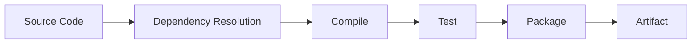
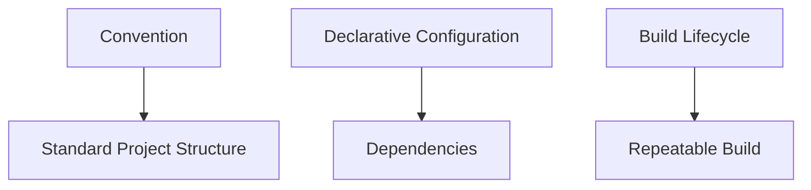
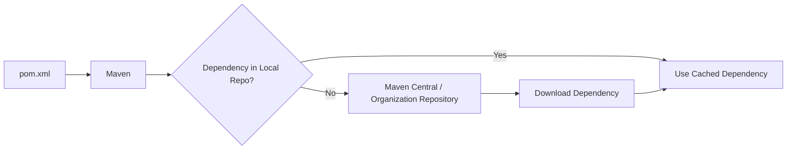
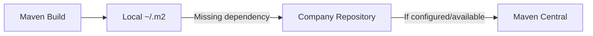
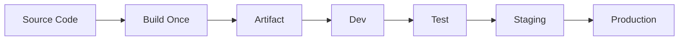
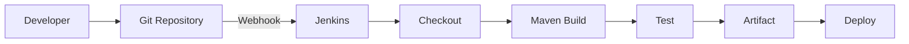
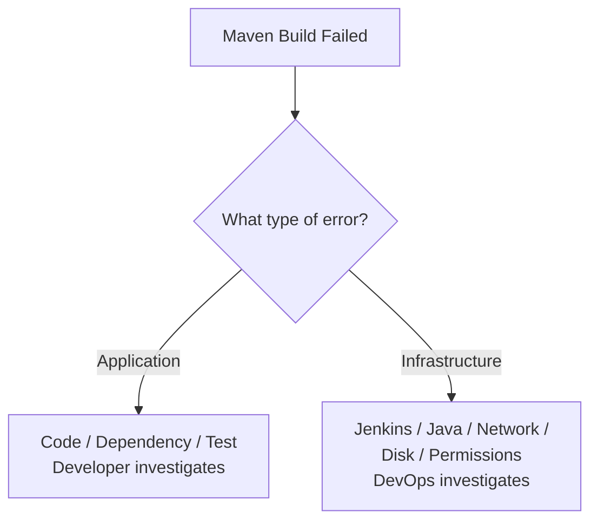
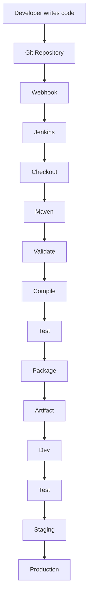

# DevOps Session — Maven & CI/CD Fundamentals

**Date:** 11-Sep-2026
**Instructor:** Rochak Agrawal
**Focus:** Build process, Build tools, Maven, `pom.xml`, dependencies, plugins, Maven lifecycle, repositories, artifacts, and CI/CD pipeline flow

> **Note:** I removed participant chatter and repetition, and corrected obvious transcript errors. One important correction: Maven is primarily a **Java build tool**, not a JavaScript tool. The transcript later correctly contrasts Maven with npm for Node.js. 

---

# 1. What Is a Build Process?

Developers write **source code**, but end users normally don't directly run the source files.

The source code needs to be transformed into a **deployable artifact**.

Example:

```text
Source Code
    ↓
Compile
    ↓
Test
    ↓
Package
    ↓
Deployable Artifact
```

For Java:

```text
.java
  ↓
.class
  ↓
.jar / .war
```

For other technologies, artifacts can have different formats such as `.exe`, `.dll`, containers, etc. 

---

# 2. What Is a Build Tool?

A **build tool automates the steps required to turn source code into a deployable artifact**.

Typical responsibilities:

* Resolve dependencies
* Compile code
* Run tests
* Package the application
* Generate reports
* Create artifacts
* Install/deploy artifacts



For a Java application, Apache Maven is one of the commonly used build tools. 

---

# 3. Why Do We Need a Build Tool?

Imagine a project containing:

```text
100+ source files
Multiple libraries
Configuration files
Test cases
Different versions
```

Doing everything manually would be difficult and inconsistent.

A build tool gives us a **standard, repeatable process**.

```text
Developer
    ↓
Source Code
    ↓
Build Tool
    ↓
Compile + Test + Package
    ↓
Artifact
```

### Important DevOps concept

> **The output of the build becomes the input for deployment.**

We should not deploy raw source code directly to production. 

---

# 4. Build Tool Responsibilities

| Responsibility        | Purpose                                      |
| --------------------- | -------------------------------------------- |
| Dependency management | Download required libraries                  |
| Compilation           | Convert source into executable/compiled form |
| Testing               | Run automated tests                          |
| Packaging             | Create JAR/WAR/etc.                          |
| Verification          | Validate build quality                       |
| Installation          | Store artifact locally                       |
| Deployment            | Publish artifact                             |
| Reporting             | Generate reports/documentation               |

Maven can also generate things such as test and code-coverage reports through appropriate plugins/configuration. 

---

# 5. Build Tools for Different Technologies

Maven is not the only build tool.

| Technology      | Common tool                        |
| --------------- | ---------------------------------- |
| Java            | Maven / Gradle                     |
| Python          | pip / build-related Python tooling |
| Node.js         | npm                                |
| .NET            | MSBuild                            |
| JavaScript/Node | npm                                |

The important DevOps concept is:

> **The CI/CD pipeline can remain conceptually similar even though the build command/tool changes.** 

Example:

```text
Java       → Maven
Node.js    → npm
.NET       → MSBuild
```

---

# 6. Maven's Three Fundamental Concepts

The instructor highlighted three important Maven principles:

### 1. Convention over configuration

Maven follows a standard project structure.

### 2. Declarative dependency management

You declare **what dependencies you need**, rather than manually specifying how to download/build them.

### 3. Standard build lifecycle

Maven follows predefined build phases in a standard order. 



---

# 7. Imperative vs Declarative

This was explained using a simple analogy.

### Imperative

You specify **how** to accomplish something.

```text
Step 1 → Do this
Step 2 → Do that
Step 3 → Do this
```

Examples:

* Shell scripting
* Python

### Declarative

You specify **what you want**, while the tool determines how to achieve it.

Examples discussed:

* Maven
* Terraform
* Kubernetes
* Jenkins configuration/pipeline concepts


### Easy memory trick

```text
Imperative  → HOW
Declarative → WHAT
```

---

# 8. Maven Project Structure ⭐

A standard Maven project commonly looks like:

```text
my-app/
├── pom.xml
└── src/
    ├── main/
    │   └── java/
    │       └── application source code
    │
    └── test/
        └── java/
            └── test cases
```

### `src/main`

Contains application source code.

### `src/test`

Contains test code.

### `pom.xml`

Contains Maven project/build configuration.

Maven's conventions make it easier for developers and CI/CD systems to understand where project files are located. 

---

# 9. `pom.xml` ⭐⭐⭐

`pom.xml` stands for **Project Object Model**.

It is the primary Maven build configuration file.

It can define:

* Project information
* Group ID
* Artifact ID
* Version
* Packaging type
* Dependencies
* Plugins
* Build configuration

Example simplified structure:

```xml
<project>
    <groupId>com.example</groupId>

    <artifactId>my-app</artifactId>

    <version>1.0</version>

    <packaging>jar</packaging>

    <dependencies>
        ...
    </dependencies>

    <build>
        ...
    </build>
</project>
```

The instructor demonstrated these elements in the sample `pom.xml`. 

---

# 10. Group ID, Artifact ID & Version

These three are extremely important.

```text
groupId
   +
artifactId
   +
version
   ↓
Identify the artifact
```

### Example

```xml
<groupId>com.company</groupId>
<artifactId>my-app</artifactId>
<version>1.0.0</version>
```

Think of it as:

| Element      | Meaning                        |
| ------------ | ------------------------------ |
| `groupId`    | Organization/project namespace |
| `artifactId` | Application/artifact name      |
| `version`    | Artifact version               |

---

# 11. Packaging

The `packaging` element tells Maven what type of artifact should be produced.

Example:

```xml
<packaging>jar</packaging>
```

Common Java packaging types:

```text
JAR → Java Archive
WAR → Web Application Archive
```

The session discussed JAR as common for modern Spring Boot backend applications and WAR for traditional web applications. 

---

# 12. Dependency Management ⭐⭐⭐

A **dependency** is an external library/framework that your application requires.

Example:

```text
Your Application
       ↓
   Spring library
       ↓
   Logging library
       ↓
   JUnit
```

Instead of manually downloading every library, you declare it in `pom.xml`.

Example:

```xml
<dependency>
    <groupId>org.junit</groupId>
    <artifactId>junit</artifactId>
    <version>...</version>
</dependency>
```

Maven can then resolve and download it.


---

# 13. Maven Dependency Flow



Maven first checks the local repository. If the required dependency is not available locally, it can retrieve it from a configured remote repository and cache it locally. 

---

# 14. Maven Local Repository

Maven maintains a local repository under:

```text
~/.m2/repository
```

It stores downloaded dependencies and artifacts.

Example:

```text
~/.m2/
└── repository/
    ├── junit/
    ├── org/
    ├── springframework/
    └── ...
```

### Why cache dependencies?

Suppose you build multiple times.

First build:

```text
Maven
  ↓
Local repository?
  ↓ No
Remote repository
  ↓
Download
  ↓
Store locally
```

Next build:

```text
Maven
  ↓
Local repository
  ↓
Use cached dependency
```

This avoids unnecessary downloads. 

---

# 15. Maven Central vs Organization Repository

### Maven Central

Public repository containing many Java packages/plugins.

### Organization repository

Companies may use an internal repository to control and manage dependencies/artifacts.

Examples mentioned:

* Nexus
* JFrog
* Azure Artifacts


Typical enterprise flow:



---

# 16. `pom.xml` vs `settings.xml` ⭐⭐⭐

This is a common interview question.

| `pom.xml`                   | `settings.xml`                         |
| --------------------------- | -------------------------------------- |
| Project-level configuration | Machine/user-level Maven configuration |
| Defines build instructions  | Defines environment/configuration      |
| Dependencies                | Repository configuration               |
| Plugins                     | Local repository location              |
| Packaging                   | Credentials/settings                   |
| Part of project             | Usually not committed with the project |

### Easy way to remember

```text
pom.xml
   ↓
"What does THIS project need?"

settings.xml
   ↓
"What does THIS Maven environment use?"
```

The instructor specifically highlighted repository configuration, local repository location and credentials as examples of `settings.xml` configuration. 

---

# 17. Maven Plugins ⭐⭐⭐

A Maven **plugin extends Maven's functionality**.

Examples:

* Compiler plugin
* Surefire/test plugin
* Javadoc plugin
* Packaging-related plugins

Conceptually:

```text
Maven Core
    ↓
Plugin
    ↓
Actual operation
```

For example:

```text
Compile
   ↓
Maven Compiler Plugin
   ↓
Compile Java source
```

Maven's lifecycle invokes plugins to perform the actual work. 

---

# 18. Dependency vs Plugin

Very important distinction:

### Dependency

Used by the **application**.

```text
Application
   ↓
Spring / JUnit / Logging library
```

### Plugin

Used by **Maven/build process** to perform an operation.

```text
Maven
   ↓
Compiler Plugin
   ↓
Compile application
```

### Memory trick

```text
Dependency → Application needs it

Plugin → Build needs it
```

The instructor explicitly distinguished application dependencies from build plugins. 

---

# 19. Maven Build Lifecycle ⭐⭐⭐

The standard Maven lifecycle discussed in this session:

```text
validate
   ↓
compile
   ↓
test
   ↓
package
   ↓
verify
   ↓
install
   ↓
deploy
```


---

## 20. Lifecycle Phase Meaning

| Phase      | Purpose                                      |
| ---------- | -------------------------------------------- |
| `validate` | Validate project structure/configuration     |
| `compile`  | Compile source code                          |
| `test`     | Run tests                                    |
| `package`  | Create JAR/WAR/etc.                          |
| `verify`   | Perform verification/quality checks          |
| `install`  | Install artifact into local Maven repository |
| `deploy`   | Publish artifact to a remote repository      |

The phases execute in order when you invoke a later lifecycle phase. 

---

# 21. Maven Commands

### Compile

```bash
mvn compile
```

### Test

```bash
mvn test
```

### Package

```bash
mvn package
```

### Verify

```bash
mvn verify
```

### Install

```bash
mvn install
```

### Deploy

```bash
mvn deploy
```

### Clean

```bash
mvn clean
```

---

# 22. Important Maven Concept — Later Phase Runs Earlier Phases ⭐⭐⭐

If you execute:

```bash
mvn package
```

Maven does **not only execute package**.

It runs the required preceding phases first:

```text
validate
   ↓
compile
   ↓
test
   ↓
package
```

Similarly:

```bash
mvn deploy
```

runs the lifecycle phases leading up to deploy.


### Interview Question

**Q: If I execute `mvn package`, will Maven only package the application?**

**Answer:** No. Maven executes the lifecycle phases leading up to `package`, such as validation, compilation and testing. 

---

# 23. Build Failure Stops the Pipeline

Suppose:

```text
validate ✅
   ↓
compile ✅
   ↓
test ❌
   ↓
package ❌
```

If a required phase fails, subsequent phases do not execute.

Example:

```bash
mvn package
```

If compilation fails:

```text
validate ✅
compile ❌
test → NOT RUN
package → NOT RUN
```

If tests fail:

```text
validate ✅
compile ✅
test ❌
package → NOT RUN
```

This is extremely important for CI/CD because a failed build should not produce/promote a successful production artifact. 

---

# 24. `mvn clean`

`clean` removes the previous build output, commonly the:

```text
target/
```

directory.

Example:

```bash
mvn clean
```

Conceptually:

```text
Old target/
     ↓
mvn clean
     ↓
target/ removed
     ↓
Fresh build
```

The instructor described using clean when you want to eliminate previous build output before a fresh build. 

---

# 25. `target/` Directory

After a Maven build, the `target/` directory contains build output.

Example:

```text
target/
├── classes/
├── test-classes/
├── reports/
└── my-app.jar
```

The final deployable artifact can be generated inside `target/`. 

---

# 26. Artifact

An **artifact** is the output of the build that can be stored or deployed.

Examples:

```text
my-app.jar
my-app.war
Docker image
```

Think:

```text
Source Code
    ↓
Maven Build
    ↓
Artifact
    ↓
Repository
    ↓
Deployment
```

### Very important DevOps principle

> **Build once, promote the same artifact across environments.**

The instructor specifically explained that you should not repeatedly rebuild the application for dev, test, staging and production. 

---

# 27. Build Once → Promote Everywhere ⭐⭐⭐

Correct approach:



Avoid:

```text
Source
  ↓
Build → Dev

Source
  ↓
Build → Test

Source
  ↓
Build → Staging

Source
  ↓
Build → Production
```

Why?

Because rebuilding can potentially produce different outputs due to changing dependencies, tools, environment or configuration.

The preferred CI/CD principle is:

```text
ONE BUILD
   ↓
SAME ARTIFACT
   ↓
MULTIPLE ENVIRONMENTS
```


---

# 28. Maven + Jenkins ⭐⭐⭐

This is where the session connects Maven with DevOps.

Jenkins can execute Maven commands inside a CI/CD pipeline.

Typical flow:



The instructor described the source-code repository triggering Jenkins, with Jenkins then executing pipeline stages such as checkout, build, test and deployment. 

---

# 29. What Does a DevOps Engineer Need to Know About Maven?

You don't necessarily need to develop the Java application or design the application's dependencies.

But you should understand:

* What Maven does
* `pom.xml`
* Maven lifecycle
* Dependencies
* Plugins
* Build failures
* Artifacts
* Maven repository
* How Jenkins invokes Maven
* How to troubleshoot build errors

The instructor emphasized that DevOps engineers should distinguish **application/build errors** from **infrastructure/platform errors**. 

---

# 30. Application Error vs Infrastructure Error ⭐⭐⭐

Suppose Jenkins runs:

```bash
mvn package
```

### Scenario 1 — Application error

```text
Compilation failed
Dependency version incorrect
Test case failed
Java source error
```

Usually involve the development/application team.

### Scenario 2 — Infrastructure/platform error

```text
Jenkins disk full
Jenkins server memory exhausted
Java/Maven unavailable
Permission denied
Network unavailable
Repository unreachable
```

These may require DevOps/platform troubleshooting.



This distinction was one of the practical DevOps points emphasized in the session. 

---

# 31. Multi-Branch Pipeline ⭐⭐⭐

A CI/CD system can run different pipelines for different Git branches.

Example:

```text
Git
│
├── feature-A → Pipeline A
├── feature-B → Pipeline B
├── develop   → Pipeline
├── release   → Pipeline
└── hotfix    → Pipeline
```

This allows a hotfix branch, for example, to be independently built and deployed without first merging it into another branch.

The instructor specifically connected **multi-branch pipelines** with the ability to build/deploy hotfix branches independently. 

---

# 32. Branches = Independent Development Streams

Suppose:

```text
main
 ├── feature-A
 ├── feature-B
 └── hotfix
```

Until branches are merged, they represent separate development streams.

They can potentially be:

```text
Developed independently
        ↓
Built independently
        ↓
Tested independently
        ↓
Deployed independently
```

A multi-branch pipeline supports this model. 

---

# 33. CI/CD Environment Flow ⭐⭐⭐

The session connected branches and Maven builds to environments:

```text
Developer
    ↓
Git
    ↓
Jenkins
    ↓
Build
    ↓
Dev
    ↓
Test
    ↓
Staging
    ↓
Production
```

But an important point:

> **The pipeline does not necessarily execute every environment's deployment stage every time.**

The stages executed depend on the target environment and pipeline design. 

---

# 34. Dev vs Test vs Staging vs Production

| Environment | Main purpose                                                          |
| ----------- | --------------------------------------------------------------------- |
| Dev         | Development/build/integration                                         |
| Test        | Testing                                                               |
| Staging     | Pre-production validation, UAT/load testing depending on organization |
| Production  | Live application                                                      |

The instructor emphasized that the build happens once and the resulting artifact is promoted through the environments. 

---

# 35. Complete DevOps Flow From This Session



This ties together the Git concepts from your previous sessions with today's Maven and CI/CD concepts. 

---

# 🔥 Interview Revision

### 1. What is Maven?

Maven is a Java build automation and dependency-management tool.

### 2. What is a build?

The process of converting source code into a deployable artifact while performing activities such as dependency resolution, compilation and testing.

### 3. What is `pom.xml`?

The primary Maven project configuration file containing project information, dependencies, plugins and build configuration.

### 4. What is a dependency?

A library/framework required by the application.

### 5. What is a Maven plugin?

A component that extends Maven and performs build-related operations such as compilation, testing or documentation generation.

### 6. Dependency vs plugin?

```text
Dependency → Application needs it

Plugin → Build process needs it
```

### 7. What is Maven's local repository?

```text
~/.m2/repository
```

It caches downloaded dependencies and artifacts.

### 8. `pom.xml` vs `settings.xml`?

```text
pom.xml
→ Project/build configuration

settings.xml
→ Maven environment/user configuration
```

### 9. What happens with `mvn package`?

It executes the required earlier lifecycle phases and then packages the application.

### 10. What happens if a test fails?

The Maven build fails and subsequent lifecycle phases don't execute. 

### 11. What is `mvn clean`?

It removes previous build output, commonly the `target/` directory.

### 12. What is an artifact?

The deployable output produced by the build, such as a JAR or WAR.

### 13. Should we rebuild separately for every environment?

The preferred CI/CD approach discussed here is **build once and promote the same artifact** through environments. 

### 14. What does Jenkins do with Maven?

Jenkins can execute Maven commands as part of the CI/CD pipeline.

### 15. How do you identify whether a build failure is DevOps or developer-related?

Check the error:

```text
Application / compilation / dependency / test
        → Development

Jenkins / disk / memory / Java / network /
permissions / repository connectivity
        → DevOps / infrastructure
```

---

# 🧠 Final Mental Model

Remember this:

```text
              GIT
               ↓
         Source Code
               ↓
            JENKINS
               ↓
          ┌─────────┐
          │  MAVEN  │
          └─────────┘
               ↓
      Validate → Compile
               ↓
             Test
               ↓
            Package
               ↓
           ARTIFACT
               ↓
             DEV
               ↓
            TEST
               ↓
           STAGING
               ↓
          PRODUCTION
```

And remember the **three most important Maven concepts**:

```text
1. pom.xml
      ↓
Project/build configuration

2. Dependency
      ↓
Libraries required by application

3. Plugin
      ↓
Performs/extends build operations
```

### ⭐ Highest-priority interview topics from this session

**Build process → Maven → `pom.xml` → dependencies → plugins → `.m2` repository → `settings.xml` → Maven lifecycle → `mvn package` → build failure → artifacts → build once/promote → Maven + Jenkins → multi-branch pipeline.**
