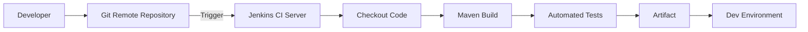
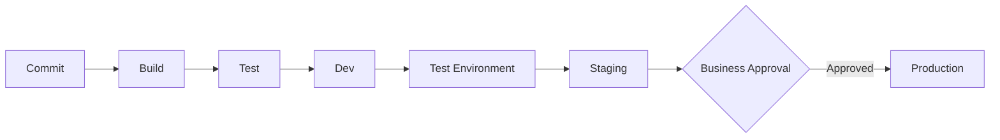
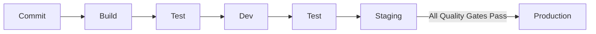
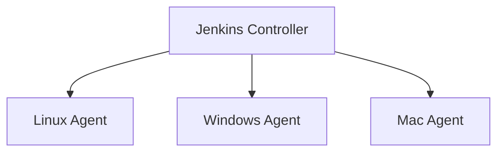

# DevOps Session — Jenkins & CI/CD Notes

**Date:** 14 September 2026
**Instructor:** Rochak Agrawal
**Focus:** Jenkins, CI/CD, Jenkins architecture, plugins, tools, agents/nodes, credentials, security and jobs

> **Note:** I removed participant chatter/repetition and corrected obvious transcript speech-to-text errors while keeping the instructor’s technical concepts. 

---

## 1. Continuous Integration — CI

### Why do we need CI?

In a multi-developer team, multiple developers continuously commit code to a central repository.

Merging code alone does **not** prove that the integrated application works.

CI automatically:

1. Detects a code change/commit.
2. Checks out the latest code.
3. Builds it.
4. Runs automated tests.
5. Produces an artifact.
6. Gives fast feedback if something fails.
7. Can deploy the resulting build to the development environment.


### CI flow



### Important CI principles

| Principle            | Meaning                                     |
| -------------------- | ------------------------------------------- |
| Frequent commits     | Developers integrate changes regularly      |
| Automated build      | No manual build steps                       |
| Automated testing    | Validate changes automatically              |
| Fast feedback        | Failures are identified quickly             |
| Shared build server  | Build should not depend on developer laptop |
| Short-lived branches | Avoid long-running isolated branches        |

The instructor emphasized that long-lived branches can defeat the purpose of continuous integration. 

---

# 2. CI vs Continuous Delivery vs Continuous Deployment

This is a **very common interview question**.

| Concept                   | Main idea                                                                                   | Production approval       |
| ------------------------- | ------------------------------------------------------------------------------------------- | ------------------------- |
| **CI**                    | Build/test changes and integrate them                                                       | Not the focus             |
| **Continuous Delivery**   | Automatically prepare and promote tested artifacts; production deployment requires approval | ✅ Human/business approval |
| **Continuous Deployment** | Automatically promote successful artifacts all the way to production                        | ❌ No human gate           |

### Continuous Delivery



The deployment mechanism itself remains automated; the human approval is the **release decision** for production. 

### Continuous Deployment



No human approval is required between staging and production when the pipeline is configured for continuous deployment. 

### Easy interview answer

> **Continuous Delivery:** production deployment is automated but requires a human/business approval.
> **Continuous Deployment:** production deployment happens automatically after all pipeline quality gates pass.

---

# 3. Build Once, Promote the Artifact

A key DevOps principle:

> **Build once and promote the same artifact across environments.**

Example:

```text
Developer
   ↓
Git
   ↓
Jenkins
   ↓
Build + Test
   ↓
Artifact
   ↓
Dev
   ↓
Test
   ↓
Staging
   ↓
Production
```

You should not rebuild the application separately for every environment.

This prevents situations where:

```text
Dev artifact ≠ Test artifact ≠ Production artifact
```

Instead:

```text
                 SAME ARTIFACT
                     │
          ┌──────────┼──────────┐
          ↓          ↓          ↓
         Dev       Staging     Prod
```

The transcript specifically explains that multiple builds can happen in development, while only the selected/validated build should be promoted further. 

---

# 4. Where Jenkins Fits

**Jenkins is an automation server commonly used for CI/CD.**

Think of Jenkins as an **automation engine**.

But Jenkins does not automatically know:

* What code to checkout
* What build command to run
* What tests to execute
* Where to deploy
* Which environment to use

The DevOps engineer defines the workflow.

For example:

```text
Checkout
   ↓
mvn compile
   ↓
mvn test
   ↓
mvn package
   ↓
Deploy
```

The development team provides application/build requirements, while the DevOps engineer translates them into pipeline/job configuration. 

---

# 5. Jenkins — Important Characteristics

| Feature           | Explanation                                |
| ----------------- | ------------------------------------------ |
| Open source       | Source code is publicly available          |
| Free              | No license fee for Jenkins itself          |
| Java-based        | Jenkins requires Java                      |
| Automation server | Automates CI/CD workflows                  |
| Extensible        | Plugins add functionality                  |
| Cross-platform    | Can run on different environments          |
| Pipeline as Code  | Pipeline can be defined in code            |
| Distributed       | Builds can run on multiple agents/nodes    |
| Vendor neutral    | Can work with AWS, Azure, Java, .NET, etc. |

Jenkins was originally associated with **Hudson** and later became Jenkins. 

---

# 6. Jenkins = "Empty Box" Concept

One of the most important concepts from this class:

> **Jenkins by itself does not know how to perform your application's specific tasks.**

You provide:

* Plugins
* Tools
* Credentials
* Jobs/pipelines
* Agents/nodes
* Configuration

Think:

```text
                JENKINS
            ┌──────────────┐
            │              │
            │ Empty Box    │
            │              │
            └──────┬───────┘
                   │
        ┌──────────┼───────────┐
        ↓          ↓           ↓
     Plugins     Tools      Credentials
        │          │           │
        └──────────┼───────────┘
                   ↓
              Job/Pipeline
                   ↓
                Build
```


---

# 7. Jenkins Plugins

Plugins extend Jenkins functionality.

Examples:

| Requirement       | Possible Jenkins plugin/functionality |
| ----------------- | ------------------------------------- |
| Git repository    | Git-related plugin                    |
| Maven             | Maven-related plugin                  |
| Docker            | Docker-related plugin                 |
| AWS               | AWS-related plugins                   |
| SonarQube         | SonarQube integration                 |
| Tomcat deployment | Tomcat/container deployment plugin    |
| Authentication    | Authentication/security plugins       |

The important concept is:

> **Plugin = convenient integration/extension of Jenkins functionality.**


### Plugin does NOT mean the only way to perform an action

Suppose Jenkins does not have a plugin for a particular tool.

You can often execute the tool's CLI commands through a shell/build step.

For example:

```bash
aws s3 cp application.jar s3://my-bucket/
```

or:

```bash
some-tool scan application.jar
```

So:

```text
Plugin available
      ↓
Use Jenkins integration

Plugin unavailable
      ↓
Use CLI/script/custom solution
```

A custom Jenkins plugin can also be developed, but that is an advanced approach. 

### Key interview point

**Plugins reduce the amount of manual/configuration work needed to integrate a tool; they are not always mandatory to execute that tool.**

---

# 8. Jenkins Tools

Plugins and tools are different concepts.

For example, to execute:

```bash
mvn clean package
```

Jenkins needs access to **Maven**.

Similarly:

```text
Java application
      ↓
Requires JDK

Maven build
      ↓
Requires Maven

Git checkout
      ↓
Requires Git
```

Jenkins can configure tools such as:

* JDK
* Git
* Maven
* Gradle
* Ant

The transcript demonstrates configuring Maven under Jenkins tools and assigning it a name that can later be referenced by jobs/pipelines. 

---

# 9. Jenkins Plugins vs Tools

| Plugin                        | Tool                                |
| ----------------------------- | ----------------------------------- |
| Extends Jenkins               | Software required to perform a task |
| Provides integration/features | Actual build/runtime utility        |
| Example: Maven plugin         | Example: Maven installation         |
| Example: Git plugin           | Example: Git executable             |
| Example: SonarQube plugin     | Example: JDK/Maven                  |

### Simple mental model

```text
Jenkins
  │
  ├── Plugin → "How Jenkins integrates"
  │
  └── Tool   → "What software Jenkins executes"
```

---

# 10. Jenkins Agents / Nodes

Jenkins does not have to execute every build on the Jenkins controller.

You can have multiple machines called **nodes/agents** where jobs can execute.



Example:

* Linux → Java/Maven application
* Windows → Windows-specific build
* macOS → iOS/macOS application

The instructor used the example that an iOS application requires a macOS machine, so Jenkins can direct that job to a suitable node. 

### Why use multiple agents?

1. Different OS requirements
2. Different software/tool requirements
3. Parallel builds
4. More build capacity
5. Avoid a single execution machine becoming a bottleneck
6. Scale Jenkins horizontally

The transcript also describes adding multiple machines so jobs can run on different servers and the Jenkins setup can be extended as demand increases. 

> **Terminology:** Modern Jenkins generally uses **controller/agent** terminology. Older material often says **master/slave**.

---

# 11. Credentials in Jenkins

Jenkins frequently needs to communicate with:

* Private Git repositories
* GitHub
* Docker registries
* AWS
* Servers
* Other external systems

Credentials should be stored in Jenkins' credential store rather than hardcoded into pipeline scripts.

Examples include:

* Username/password
* Secret text
* Secret files
* Certificates
* SSH credentials


### Example

```text
Jenkins
   │
   ├── GitHub credentials
   ├── AWS credentials
   ├── Docker registry credentials
   └── Server/SSH credentials
```

### DevOps best practice

❌ Don't:

```groovy
password = "MyPassword123"
```

✅ Use Jenkins-managed credentials and reference them securely.

---

# 12. Jenkins Security

Jenkins provides authentication and authorization mechanisms.

The instructor discussed two authorization approaches:

### Matrix-based authorization

Permissions can be assigned to users globally across Jenkins.

Example:

```text
Jeevana → Read
         → Build
```

Depending on the configured strategy, those permissions can apply broadly.

### Project-based matrix authorization

Permissions can be restricted to particular projects/jobs.

Example:

```text
User: Jeevana

Application A → Read + Build
Application B → No access
Application C → No access
```

This is useful when multiple teams/applications share the same Jenkins instance. 

### Security principle

Give users **only the permissions they actually need**.

---

# 13. Jenkins Installation — High-Level

The instructor demonstrated installing Jenkins on a Linux server.

Basic prerequisites:

```text
Linux Server
     ↓
Java/JDK
     ↓
Jenkins
     ↓
Initial Setup
     ↓
Plugins
     ↓
Tools
     ↓
Credentials
     ↓
Jobs/Pipelines
```

Because Jenkins is Java-based, Java must be available for Jenkins to run. 

The instructor used Ubuntu/AWS for the demonstration and discussed:

```bash
sudo apt update
```

followed by Java installation and verification:

```bash
java --version
```

`wget` was also introduced as a command that can download files from remote locations. 

---

# 14. Pipeline as Code

Jenkins supports defining pipelines as code rather than configuring everything manually through the UI.

Conceptually:

```text
Pipeline definition
        ↓
     Jenkins
        ↓
    Executes
        ↓
Build → Test → Deploy
```

This makes pipeline configuration:

* Version-controlled
* Repeatable
* Reviewable
* Easier to reproduce

The instructor contrasted manual Jenkins configuration with defining the workflow declaratively as pipeline code. 

Jenkins Pipeline is commonly written using **Groovy-based syntax**. 

---

# 15. Jenkins Can Execute Shell Commands

Jenkins can execute shell commands directly.

For example:

```bash
pwd
```

or:

```bash
ls -ltr
```

or:

```bash
aws s3 ls
```

or:

```bash
mvn clean package
```

So even without a dedicated plugin, if the required CLI tool is installed and accessible, Jenkins can execute its commands through appropriate build steps. 

### Practical DevOps example

```text
Jenkins
   ↓
Shell Step
   ↓
AWS CLI
   ↓
AWS Service
```

This is especially useful when integrating newer or less-common tools that don't yet have a convenient Jenkins plugin.

---

# 16. Plugin Updates — Important Production Point

Jenkins plugins can have dependencies on other plugins.

Therefore:

```text
Plugin A
   ↓ depends on
Plugin B
```

Updating only Plugin A can potentially create compatibility problems.

The instructor recommended testing plugin updates in a non-production/dummy Jenkins environment before updating production Jenkins, and avoiding unnecessary updates when the existing version already provides the required functionality. 

### Practical approach

```text
Plugin update available
        ↓
Read release notes
        ↓
Check dependencies
        ↓
Test in non-prod Jenkins
        ↓
Validate jobs
        ↓
Update production
```

This is a very useful real-world Jenkins administration point.

---

# 17. Jenkins CI/CD Architecture

Putting everything together:

```mermaid
flowchart LR
    A[Developer] --> B[Git Repository]
    B -->|Webhook / Trigger| C[Jenkins Controller]

    C --> D[Job / Pipeline]

    D --> E[Agent / Node]

    E --> F[Checkout]
    F --> G[Maven Build]
    G --> H[Automated Tests]
    H --> I[Artifact]

    I --> J[Dev]
    J --> K[Test]
    K --> L[Staging]
    L --> M[Production]
```



The exact stages and environments depend on the organization's pipeline design. 

---

# 18. Jenkins vs GitHub Actions — Conceptual Difference

The instructor's main point was that the **CI/CD concepts are fundamentally the same**.

Both can provide:

* Trigger
* Checkout
* Build
* Test
* Artifact
* Deployment
* Environment promotion

The main difference is the platform/implementation model.

| Jenkins                       | GitHub Actions                       |
| ----------------------------- | ------------------------------------ |
| Usually self-managed          | Integrated into GitHub               |
| Highly customizable           | Strong GitHub integration            |
| Plugins                       | Actions                              |
| Agents/nodes                  | Runners                              |
| Jenkinsfile                   | Workflow YAML                        |
| More infrastructure to manage | GitHub-hosted or self-hosted runners |

The transcript emphasizes learning Jenkins to understand the underlying CI/CD concepts; those concepts transfer to GitHub Actions, GitLab CI, Azure Pipelines, etc. 

---

# 19. Why Learn Jenkins?

The important lesson isn't memorizing Jenkins syntax.

Understand:

```text
Trigger
   ↓
Agent
   ↓
Checkout
   ↓
Build
   ↓
Test
   ↓
Artifact
   ↓
Deploy
   ↓
Monitor
```

Once these concepts are clear, moving from Jenkins to another CI/CD platform becomes much easier. 

---

# 🔥 Interview Revision

### 1. What is Jenkins?

**Answer:**

> Jenkins is an open-source automation server commonly used to implement CI/CD pipelines. It can integrate with source-control systems, build tools, testing tools, cloud platforms and deployment systems through plugins, tools, scripts and pipeline configuration.

### 2. Is Jenkins itself a build tool?

**No.**

Jenkins orchestrates the workflow.

For example:

```text
Jenkins
   ↓
Maven
   ↓
Build Java application
```

Maven performs the Java build; Jenkins coordinates it.

---

### 3. What happens when a developer commits code?

```text
Developer
   ↓
Git push
   ↓
Remote repository
   ↓
Webhook/trigger
   ↓
Jenkins
   ↓
Checkout
   ↓
Build
   ↓
Test
   ↓
Artifact
```

A remote commit must reach the repository that Jenkins is connected to for the configured trigger to act. 

---

### 4. What is a Jenkins plugin?

> A plugin extends Jenkins functionality or provides integration with external tools and systems.

Examples: Git, Maven, Docker, SonarQube, AWS-related integrations.

---

### 5. What if a Jenkins plugin doesn't exist?

You can:

1. Execute the tool through CLI/shell commands.
2. Write a custom integration/plugin if necessary.
3. Use another supported integration mechanism.


---

### 6. What is a Jenkins agent?

> An agent/node is a machine where Jenkins executes build or pipeline work.

Example:

```text
Controller
 ├── Linux Agent
 ├── Windows Agent
 └── macOS Agent
```

---

### 7. Why use multiple Jenkins agents?

* Different OS requirements
* Different tool requirements
* Parallel execution
* Scalability
* Better workload distribution

---

### 8. Why use Jenkins credentials?

> To securely store and use authentication information required to access external systems such as Git repositories, servers, cloud services and registries.

---

### 9. Continuous Delivery vs Continuous Deployment?

**Remember this one line:**

> **Delivery = production deployment requires approval.**
> **Deployment = production deployment is automatic after quality gates pass.**

---

# 🧠 Final Mental Model

Think of Jenkins as the **orchestrator**:

```text
                 JENKINS
                    │
       ┌────────────┼─────────────┐
       ↓            ↓             ↓
    Plugins       Tools       Credentials
       │            │             │
       └────────────┼─────────────┘
                    ↓
              Job / Pipeline
                    ↓
              Agent / Node
                    ↓
        ┌───────────┼───────────┐
        ↓           ↓           ↓
      Build        Test       Deploy
        │                       │
        └──────────┬────────────┘
                   ↓
                Artifact
                   ↓
          Dev → Test → Stage → Prod
```

### ⭐ Most important topics from this session

1. **CI vs Continuous Delivery vs Continuous Deployment**
2. **Build once, promote the same artifact**
3. **What Jenkins is**
4. **Jenkins as an automation/orchestration engine**
5. **Plugins vs tools**
6. **Jenkins agents/nodes**
7. **Jenkins credentials**
8. **Matrix vs project-based authorization**
9. **Pipeline as Code**
10. **How Jenkins executes shell/CLI commands**
11. **Plugin dependency/update management**
12. **Jenkins + Git + Maven CI/CD flow**