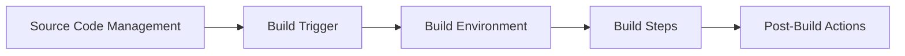
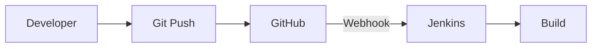
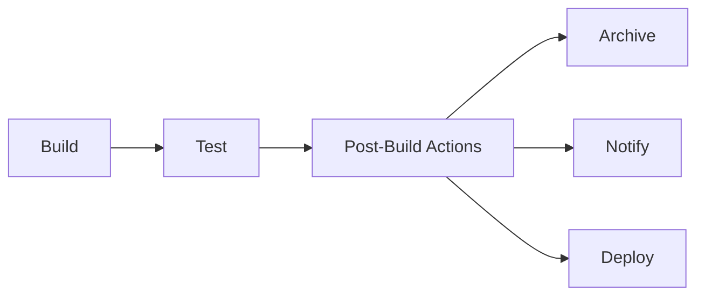
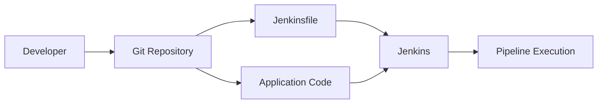
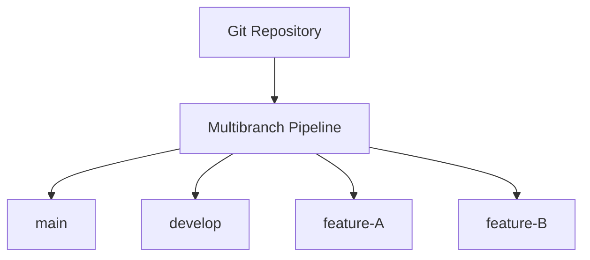
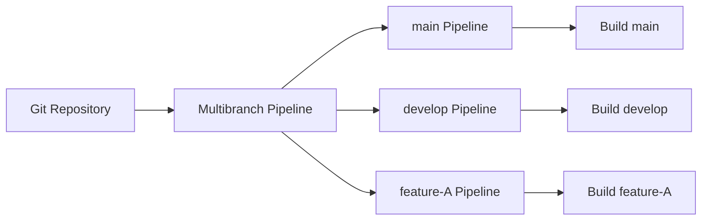
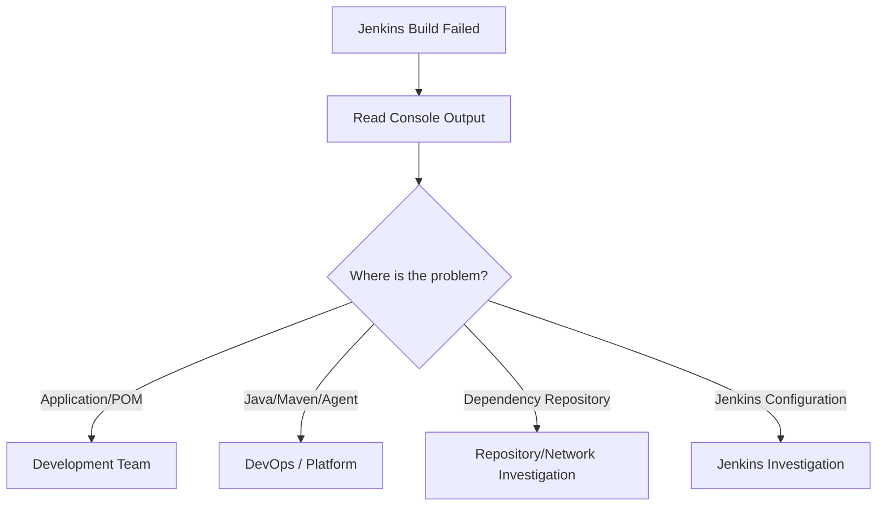
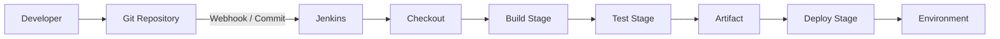
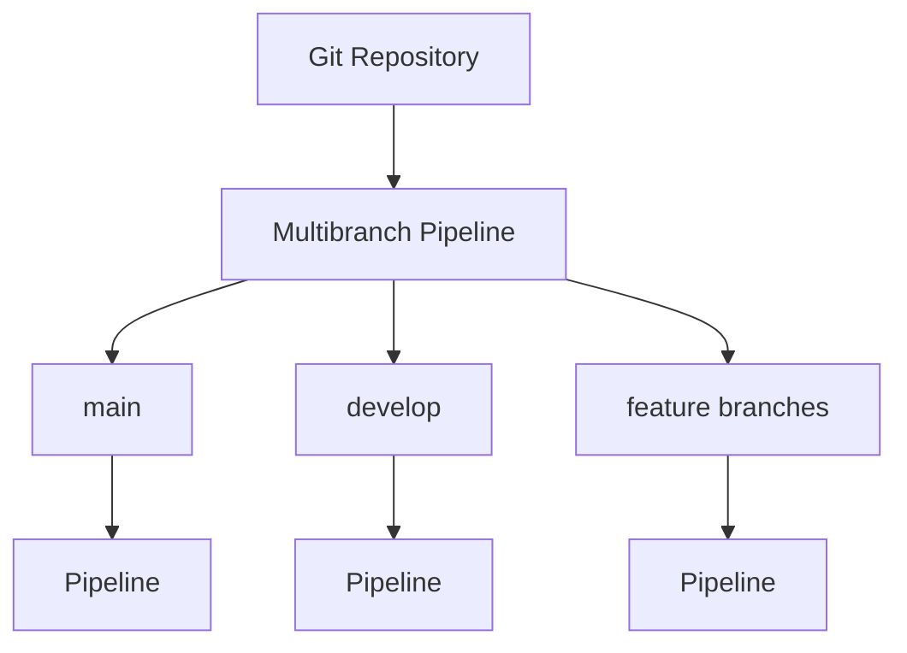

# DevOps Session — Jenkins Jobs & Pipeline as Code Notes

**Date:** 15 September 2026
**Instructor:** Rochak Agrawal
**Focus:** Freestyle Jobs, Build Triggers, Parameters, JUnit Reports, Pipeline as Code, Jenkinsfile and Multibranch Pipeline

**Source:** [Session transcript](https://raw.githubusercontent.com/jeevanadv2000-pixel/python/main/DevOps%20Session%28Morning%29%20transcript_2026-09-15_09.29.28.txt?utm_source=chatgpt.com)

> Transcript condensed to instructor content; participant chatter and repetition removed. Obvious speech-to-text errors such as “MBN” → `mvn` and “Jenkins file” → **Jenkinsfile** are corrected. 

---

## 1. Jenkins Job Types

The session starts with two major approaches:

| Type                     | Configuration                                                       | Best suited for                     |
| ------------------------ | ------------------------------------------------------------------- | ----------------------------------- |
| **Freestyle Job**        | Configured through Jenkins UI                                       | Simple jobs                         |
| **Pipeline**             | Pipeline defined as code                                            | Complex CI/CD workflows             |
| **Multibranch Pipeline** | Pipeline automatically applied to branches containing a Jenkinsfile | Repositories with multiple branches |

The instructor first demonstrates Freestyle and then explains why Pipeline as Code is preferred for more complex workflows. 

---

# 2. Freestyle Job

A Freestyle job is configured **manually through the Jenkins web interface**.

Typical structure:



### Main configuration areas

1. Source Code Management
2. Build Triggers
3. Build Environment
4. Build Steps
5. Post-Build Actions

You can have multiple build steps, triggers and post-build actions. 

---

# 3. Source Code Management

Jenkins needs to know where the source code exists.

Example:

```text
Jenkins
   ↓
GitHub Repository
   ↓
Checkout source code
   ↓
Build
```

For a **public repository**, credentials may not be required.

For a **private repository**, Jenkins needs appropriate credentials configured in Jenkins' credential store. 

---

# 4. Build Triggers

A very important interview topic.

Jenkins can trigger jobs in different ways.

| Trigger                        | Meaning                                                                   |
| ------------------------------ | ------------------------------------------------------------------------- |
| **Build periodically**         | Run at a scheduled time regardless of source changes                      |
| **Poll SCM**                   | Check the repository on a schedule and build only if changes are detected |
| **GitHub hook trigger**        | GitHub webhook triggers Jenkins after repository events                   |
| **Trigger remotely**           | External system calls Jenkins to trigger the job                          |
| **Build after other projects** | Start this job after another Jenkins job completes                        |


---

## 5. Build Periodically vs Poll SCM

This is **very important**.

### Build periodically

Suppose:

```text
Every day at 7 AM
```

Jenkins will run the build every day.

Even if:

```text
Friday → no code change
Saturday → no code change
```

Saturday's scheduled build still runs.

### Poll SCM

Jenkins checks the repository according to the schedule.

```text
7 AM
 ↓
Check Git
 ↓
Changes?
 ├── Yes → Build
 └── No  → Don't build
```

So:

> **Build periodically = schedule controls the build.**

> **Poll SCM = schedule controls the check; source changes control whether the build runs.**


---

# 6. GitHub Webhook

For GitHub-based CI, Jenkins can be triggered using a webhook.



Typical flow:

```text
Developer
   ↓
git push
   ↓
GitHub
   ↓
Webhook
   ↓
Jenkins
   ↓
Build
```

The instructor demonstrates configuring the GitHub webhook with the Jenkins endpoint and a push event. 

### Why webhook instead of polling?

Webhook provides event-driven triggering:

```text
Code changed
     ↓
GitHub immediately notifies Jenkins
     ↓
Jenkins starts build
```

This avoids Jenkins repeatedly asking GitHub whether anything changed.

---

# 7. Jenkins Workspace

Every Jenkins job gets a workspace.

Conceptually:

```text
Jenkins Home
   └── workspace
       ├── job-A
       ├── job-B
       └── job-C
```

The workspace contains the files Jenkins checks out and works with during the build.

Build-generated files can also appear there. 

### Delete workspace before build

This option cleans the previous workspace before starting a new build.

Useful when:

* Old files can affect the build
* Stale artifacts cause problems
* You need a clean checkout

Conceptually:

```text
Old Workspace
      ↓
Delete
      ↓
Fresh Checkout
      ↓
Build
```

---

# 8. Build Steps

A **build step** defines what Jenkins should actually execute.

For a Maven application:

```bash
mvn clean package
```

Jenkins can invoke Maven through its configured Maven integration.

Alternatively, Jenkins can execute the command directly:

```bash
mvn clean package
```

using an Execute Shell step, provided Maven is available on the execution machine. 

### Multiple build steps

Example:

```text
Step 1 → echo "Build started"
Step 2 → mvn clean
Step 3 → mvn package
Step 4 → security scan
```

Build steps normally execute sequentially in a Freestyle job. 

---

# 9. Post-Build Actions

Post-build actions happen after the build.

Examples:

* Archive artifacts
* Trigger another Jenkins job
* Publish test results
* Send email notification
* Deploy application
* Execute quality gates



The exact options available depend on installed Jenkins plugins. 

---

# 10. JUnit Test Results

Jenkins can publish JUnit test reports.

Typical flow:

```text
Maven Test
    ↓
JUnit XML Report
    ↓
Jenkins
    ↓
Test Results / History
```

If Jenkins is configured to publish a JUnit report but the application does not generate the expected report, Jenkins cannot find the test results.

The instructor demonstrated this failure and explained that the necessary JUnit configuration/report was missing. 

### Important point

Jenkins does **not magically create test results**.

The application/build process must generate the test report in a format Jenkins can consume.

---

# 11. Build Parameters

A Jenkins job can accept parameters when it is executed.

Examples:

* String
* Boolean
* Choice

Example:

```text
Environment = dev
```

Then the same job can be run with:

```text
dev
test
prod
```

instead of creating separate jobs.


### Example

```text
Build with Parameters
        │
        ├── dev
        ├── test
        └── prod
```

This makes a job reusable.

---

# 12. Why Parameters Are Useful

Suppose you have:

```text
Application deployment
```

Instead of creating:

```text
Deploy-to-Dev
Deploy-to-Test
Deploy-to-Prod
```

you can have:

```text
Deploy Application
       +
Environment parameter
```

Then choose:

```text
dev
test
prod
```

at runtime.

The instructor demonstrates using an `environment` string parameter with `dev` as the default value. 

---

# 13. Freestyle Job Limitations

This is one of the **most important sections for interviews**.

### 1. Configuration is not naturally version-controlled

Freestyle configuration lives primarily in Jenkins.

If someone changes:

```text
Build steps
Parameters
Post-build actions
Triggers
```

you don't automatically get the same Git history/review workflow as you would with a Jenkinsfile stored alongside the application.


---

### 2. Difficult to review changes

With a Jenkinsfile:

```text
Git diff
   ↓
Review pipeline change
   ↓
Approve PR
```

With a UI-configured Freestyle job, changes are much harder to review as code.

---

### 3. Difficult to replicate

If you have many settings:

```text
10–15 build steps
multiple triggers
multiple post-build actions
parameters
credentials
```

manually reproducing the same configuration can introduce human errors.


---

### 4. Poor for complex multi-stage workflows

Example:

```text
Build
  ↓
Test
  ↓
Docker Build
  ↓
Security Scan
  ↓
Deploy
```

If an earlier stage fails, later dependent stages shouldn't continue.

Pipeline provides much better control for these workflows.

---

### 5. Limited parallel execution

Freestyle build steps are generally sequential.

Complex parallel workflows are much easier to express using Pipeline. 

---

### 6. Poor scalability for many branches

Suppose repository has:

```text
main
develop
feature-A
feature-B
feature-C
```

A simple Freestyle approach could require separate jobs for branches.

With many branches, this becomes difficult to maintain.


---

# 14. Freestyle vs Pipeline

| Feature                | Freestyle         | Pipeline           |
| ---------------------- | ----------------- | ------------------ |
| Configuration          | Jenkins UI        | Code               |
| Version controlled     | ❌ Not naturally   | ✅                  |
| Code review            | Difficult         | ✅ Git PR/MR        |
| Reusable               | Limited           | ✅                  |
| Complex workflows      | Difficult         | ✅                  |
| Parallel stages        | Limited/difficult | ✅                  |
| Multiple stages        | Less convenient   | ✅                  |
| Rollback configuration | Difficult         | Easier through Git |
| Branch support         | Limited           | Strong             |
| Multibranch support    | ❌                 | ✅                  |


---

# 15. Pipeline as Code

The solution to many Freestyle limitations is **Pipeline as Code**.

The pipeline definition is stored in a:

```text
Jenkinsfile
```

and committed into the source-code repository.



The Jenkinsfile can therefore be:

* Version controlled
* Reviewed
* Reused
* Modified through Git
* Rolled back
* Shared across environments


---

# 16. Why Jenkinsfile Should Be in the Same Repository

Recommended structure:

```text
my-application/
├── src/
├── pom.xml
└── Jenkinsfile
```

Instead of maintaining pipeline configuration only inside Jenkins.

### Why?

Suppose you change:

```text
Build → Test → Deploy
```

The Jenkinsfile change becomes a Git commit.

Then:

```text
Jenkinsfile change
       ↓
Git
       ↓
PR / Review
       ↓
Merge
       ↓
Jenkins
```

You have a history of how the pipeline changed.


---

# 17. Pipeline Structure

The basic Pipeline hierarchy is:

```text
pipeline
   ↓
agent
   ↓
stages
   ↓
stage
   ↓
steps
```

The instructor describes the basic skeleton as:

```text
pipeline
 ├── agent
 ├── stages
 │    ├── stage
 │    │    └── steps
 │    ├── stage
 │    │    └── steps
 │    └── stage
 │         └── steps
 └── ...
```


---

# 18. Agent

The `agent` defines where the pipeline should execute.

Example concept:

```text
Pipeline
   ↓
Agent: Linux
```

or:

```text
Pipeline
   ↓
Agent: macOS
```

For example, an iOS build may require a macOS agent.

The instructor uses this to demonstrate that Jenkins can direct workloads to appropriate execution machines. 

---

# 19. Stages

Stages represent major parts of the CI/CD workflow.

Example:

```text
Build
  ↓
Test
  ↓
Deploy
  ↓
Monitor
```

A stage contains the actual steps.

Example:

```text
Stage: Build
    ↓
    mvn clean package
```

```text
Stage: Test
    ↓
    mvn test
```


---

# 20. Steps

Steps are the actual commands/actions executed inside a stage.

Conceptually:

```text
Stage: Build
    └── Steps
         ├── Checkout
         ├── Compile
         └── Package
```

So remember:

> **Stage = WHAT part of the workflow**

> **Step = WHAT ACTION is performed inside that stage**

---

# 21. Pipeline Syntax Generator

Jenkins provides a **Pipeline Syntax** utility.

It helps generate syntax for supported pipeline operations.

Available options depend on installed plugins.

For example:

```text
Plugin installed
      ↓
Pipeline Syntax Generator
      ↓
Related syntax available
```

This is useful while learning or creating Pipeline scripts, but the generated syntax should still be understood and reviewed rather than blindly copied. 

---

# 22. Pipeline Parameters

The same parameters available in Freestyle can be defined in Pipeline.

Example concept:

```text
pipeline
   ↓
parameters
   ↓
environment = dev
```

Then the pipeline can be run with different parameter values.

The instructor demonstrates carrying the earlier `environment` parameter concept into Pipeline as Code. 

---

# 23. Multibranch Pipeline

This is another **very important interview topic**.

Suppose your Git repository contains:

```text
main
develop
feature-A
feature-B
```

A Multibranch Pipeline can discover branches and create/manage a pipeline for each applicable branch.



The instructor demonstrates that Jenkins scans the repository and identifies branches containing a Jenkinsfile. 

---

# 24. Jenkinsfile in Multibranch Pipeline

A key concept:

> Jenkins looks for a Jenkinsfile in the branch.

For example:

```text
main
 └── Jenkinsfile       ✅

develop
 └── Jenkinsfile       ✅

feature-A
 └── no Jenkinsfile    ❌
```

The branches with the Jenkinsfile can be discovered and built by the Multibranch Pipeline. 

---

# 25. Independent Branch Builds

If a change is made to:

```text
feature-A
```

the corresponding branch pipeline can run.

If a change is made to:

```text
main
```

the main branch pipeline runs.

Conceptually:



Each branch represents an independent development stream. 

---

# 26. Multibranch Pipeline vs Separate Pipeline per Branch

You technically could create:

```text
Pipeline-main
Pipeline-develop
Pipeline-feature-A
Pipeline-feature-B
```

But this creates unnecessary management overhead.

A Multibranch Pipeline can automatically discover branches and manage their corresponding pipelines.

The instructor presents Multibranch Pipeline as the recommended approach when a repository has multiple branches. 

---

# 27. Pipeline Script vs Pipeline Script from SCM

Jenkins provides options such as:

### Pipeline script

The Jenkinsfile/pipeline code is entered directly into Jenkins.

```text
Jenkins UI
   ↓
Pipeline Script
```

Problem:

* Changes are inside Jenkins
* Not naturally reviewed through Git
* Previous configuration can be harder to track

### Pipeline script from SCM

Jenkins retrieves the Jenkinsfile from Git.

```text
Git
 ↓
Jenkinsfile
 ↓
Jenkins
 ↓
Pipeline
```

The instructor strongly emphasizes keeping the Jenkinsfile alongside the source code and loading it from SCM. 

---

# 28. Why Pipeline from SCM Is Better

Recommended:

```text
Application Repository
│
├── Application Code
├── pom.xml
└── Jenkinsfile
```

Then:

```text
Code change
     +
Pipeline change
     ↓
Git commit
     ↓
Code review
     ↓
Merge
     ↓
Jenkins
```

This provides **version control and auditability for the CI/CD configuration itself**. 

---

# 29. Build Failure Troubleshooting Example

The instructor demonstrates a Maven build failure:

```text
release version 8 not supported
```

The important DevOps lesson is not the exact error but **how to classify the problem**.

If the application code is correct but the Jenkins build machine lacks the required Java compiler/JDK configuration, this becomes an environment/platform issue.

The transcript explicitly uses this example to distinguish application-side errors from Jenkins/platform configuration problems. 

### Troubleshooting flow



This distinction is especially useful in real DevOps work.

---

# 30. Artifact — Important Correction

The instructor clarifies that:

> **JAR is specifically a Java artifact.**

A more general term is:

> **Deployable artifact**

Examples:

| Application               | Possible artifact             |
| ------------------------- | ----------------------------- |
| Java                      | JAR/WAR                       |
| Node.js                   | Application/package output    |
| .NET                      | Published application/package |
| Containerized application | Container image               |

So don't say:

> "Every application produces a JAR."

Instead:

> "The build process produces a deployable artifact appropriate to that application." 

---

# 31. CI/CD Flow from This Session

Putting everything together:



For multiple branches:



---

# 🔥 Interview Revision

### 1. What is a Freestyle job?

> A Jenkins job configured mainly through the Jenkins UI where SCM, triggers, build steps and post-build actions are manually configured.

---

### 2. What are the limitations of Freestyle jobs?

Remember:

**V-M-P-P-S**

* **V** — Configuration isn't naturally versioned with application code
* **M** — Difficult to manage multiple branches
* **P** — Limited parallel/complex pipeline workflows
* **P** — Poor replication/review compared with Pipeline as Code
* **S** — Difficult to manage complex multi-stage workflows

---

### 3. What is Pipeline as Code?

> Defining the Jenkins CI/CD workflow in a Jenkinsfile and storing it in source control.

---

### 4. Why store Jenkinsfile in Git?

Because it provides:

* Version control
* Code review
* Change history
* Rollback
* Reusability
* Auditability


---

### 5. What is the basic Jenkins Pipeline structure?

```text
pipeline
  ├── agent
  └── stages
       └── stage
            └── steps
```

---

### 6. What is Multibranch Pipeline?

> A Jenkins pipeline that automatically discovers applicable branches in a repository and creates/manages a pipeline for each branch containing the Jenkinsfile.


---

### 7. Build periodically vs Poll SCM?

**Build periodically:**

> Run according to schedule regardless of code changes.

**Poll SCM:**

> Check for source changes according to schedule and build only when changes are detected.

---

### 8. What is a Jenkins workspace?

> The working directory associated with a Jenkins job where source code is checked out and build operations occur.

---

### 9. What are build steps?

> The actual commands/actions Jenkins performs to build, test or process the application.

Example:

```bash
mvn clean package
```

---

### 10. What are post-build actions?

Actions performed after the build, such as:

* Archive artifact
* Publish test results
* Trigger another job
* Send notification
* Deploy

---

### 11. How would you troubleshoot a Jenkins build failure?

Use:

```text
Console Output
      ↓
Identify exact error
      ↓
Application issue?
      ↓
Jenkins/agent/tool issue?
      ↓
Dependency/network issue?
      ↓
Fix and rerun
```

Don't immediately assume every Jenkins failure is an application-code problem.

---

# 🧠 Final Mental Model

Remember this progression:

```text
                JENKINS JOBS
                     │
          ┌──────────┴──────────┐
          ↓                     ↓
      Freestyle              Pipeline
          │                     │
       Jenkins UI          Jenkinsfile
                                │
                         Stored in Git
                                │
                     ┌──────────┴─────────┐
                     ↓                    ↓
                  Pipeline          Multibranch
                                        │
                              ┌─────────┼─────────┐
                              ↓         ↓         ↓
                            main     develop   feature/*
```

And the most important hierarchy:

```text
Pipeline
   ↓
Agent
   ↓
Stages
   ↓
Stage
   ↓
Steps
```

### ⭐ Highest-priority topics from 15 September

1. **Freestyle vs Pipeline**
2. **Freestyle limitations**
3. **Build periodically vs Poll SCM**
4. **GitHub webhook**
5. **Jenkins workspace**
6. **Build steps vs post-build actions**
7. **Jenkins parameters**
8. **Pipeline as Code**
9. **Jenkinsfile**
10. **Pipeline → Agent → Stages → Steps**
11. **Pipeline from SCM**
12. **Multibranch Pipeline**
13. **Jenkinsfile requirement in branches**
14. **Jenkins build troubleshooting**
15. **Deployable artifact vs JAR**