# DevOps Session — Jenkins Declarative Pipeline Notes

**Date:** 18 September 2026
**Instructor:** Rochak Agrawal
**Focus:** Declarative Pipeline, Jenkins directives, `when`, parameters, parallel stages, tools, Tomcat deployment, SonarQube/Nexus integration, and pipeline optimization

The session builds on the previous Jenkins sessions and moves from **Freestyle configuration → Pipeline as Code → advanced Declarative Pipeline design**. 

---

## 1. Freestyle vs Pipeline

The instructor revisits why Freestyle jobs are less commonly used for modern CI/CD:

| Freestyle                                  | Pipeline                                 |
| ------------------------------------------ | ---------------------------------------- |
| Configured through Jenkins UI              | Defined as code                          |
| Configuration difficult to version-control | Pipeline code stored in Git              |
| Harder to review changes                   | Changes can go through PR/review         |
| Difficult to manage complex workflows      | Supports stages, conditions, parallelism |
| Difficult to maintain across branches      | Works well with Multibranch Pipeline     |

The important reason is **version control**. For example, if someone changes a Tomcat URL in a Freestyle job, tracking exactly when and why that configuration changed is difficult. 

---

# 2. Two Types of Jenkins Pipeline

Jenkins supports two major pipeline styles:

| Pipeline                 | Description                                                   |
| ------------------------ | ------------------------------------------------------------- |
| **Declarative Pipeline** | Structured, readable syntax with predefined blocks/directives |
| **Scripted Pipeline**    | More flexible, Groovy-based programming style                 |

### Declarative Pipeline

Designed to be easier to read and maintain.

```text
pipeline
   ↓
stages
   ↓
stage
   ↓
steps
```

### Scripted Pipeline

Uses more Groovy programming constructs and provides greater flexibility.

The instructor's recommendation for this course is to focus primarily on **Declarative Pipeline**, because it covers most common DevOps use cases. 

---

# 3. Declarative Pipeline Structure

Basic mental model:

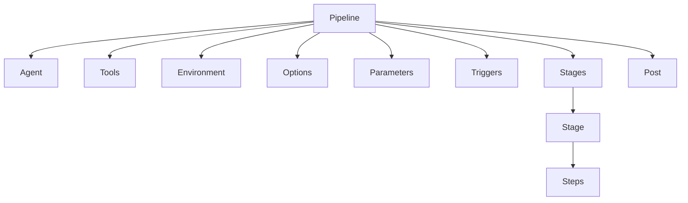

The instructor explains that `pipeline`, `stages`, `steps`, `agent`, `tools`, `environment`, `options`, `parameters`, `triggers`, `when`, and `post` are important Declarative Pipeline constructs/directives. 

---

# 4. `agent`

`agent` determines **where the pipeline or stage executes**.

Examples:

```text
agent any
```

or a specific labeled agent.

### Important point

Different stages don't necessarily have to execute on the same agent.

For example:

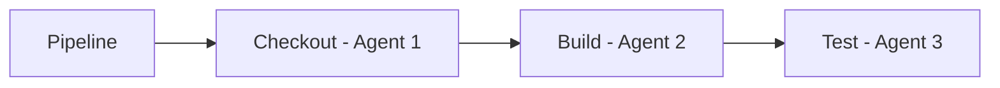

This is useful when different stages require different operating systems or tools. 

---

# 5. `tools`

The `tools` section tells Jenkins which configured tool installation should be used.

Examples:

* JDK
* Maven
* Git
* Other configured build tools

Suppose Jenkins has:

```text
Maven 3.9.x
Maven 2.x
```

The pipeline can explicitly select the required Maven installation.

```text
Pipeline
   ↓
tools
   ↓
Maven CI Server
   ↓
Maven 3.9.x
```

The instructor recommends centrally managing tool versions through Jenkins when possible, especially when multiple versions exist, to reduce conflicts. 

### Important distinction

If Maven is already installed on the execution machine, Jenkins can use it.

But when multiple managed versions exist, explicitly selecting the required version makes the pipeline more predictable.

---

# 6. `environment`

The `environment` directive defines environment variables that can be available to the pipeline or a specific stage.

Examples:

```text
BUILD_NUMBER
environment name
database configuration
application configuration
```

Jenkins also provides built-in environment information such as build-related values. 

### Important security note

The instructor mentions examples such as database username/password. In real projects, **passwords and secrets should not be hardcoded into the Jenkinsfile**. Use Jenkins Credentials or an appropriate external secret-management system.

---

# 7. `options`

`options` controls pipeline behavior.

Examples discussed include:

| Option        | Purpose                            |
| ------------- | ---------------------------------- |
| Timeout       | Stop excessively long builds       |
| Retry         | Retry certain operations           |
| Build discard | Remove old build history           |
| Throttle      | Control concurrent build execution |

### Example scenario

If a build normally takes 5 minutes but gets stuck because of a network or infrastructure problem:

```text
Build starts
   ↓
5 min
   ↓
Still running
   ↓
Timeout reached
   ↓
Build stopped
```

This prevents indefinitely running builds from consuming Jenkins resources. 

---

# 8. Parameters

Parameters provide **runtime input** to the pipeline.

Example:

```text
Environment:
  dev
  test
  prod
```

Then the same Jenkins pipeline can deploy to different environments.

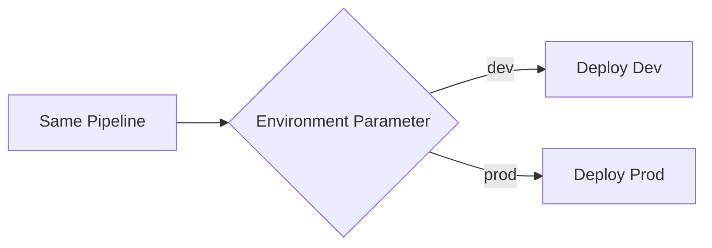

The important principle is:

> **Don't create separate pipeline code for every environment when the same workflow can be parameterized.**

The instructor specifically explains that the same pipeline/Jenkinsfile can be used for dev, test and production, with the environment selected at execution time. 

---

# 9. `when` Directive

`when` is one of the most important concepts from this session.

It allows a stage to execute **only when a condition is satisfied**. 

Example concept:

```text
Environment = dev
        ↓
Deploy Dev     → RUN
Deploy Prod    → SKIP
```

If:

```text
Environment = prod
```

then:

```text
Deploy Dev     → SKIP
Deploy Prod    → RUN
```

### Pipeline flow

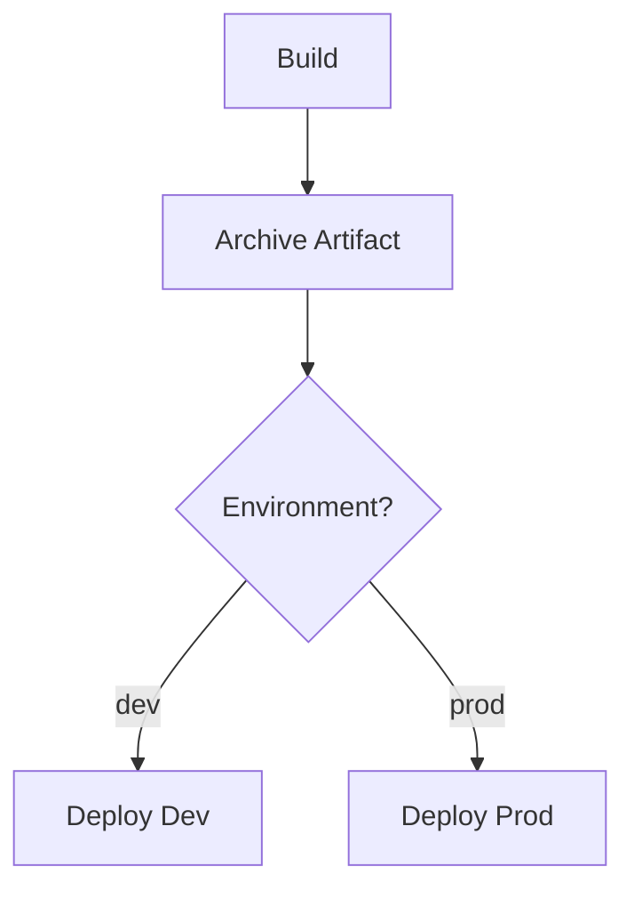

The transcript demonstrates that Jenkins explicitly reports a stage as **skipped due to the `when` condition** when the condition isn't satisfied. 

---

# 10. `when` + Branch Conditions

`when` can also be used for branch-based behavior.

Example:

```text
main branch
    ↓
Production deployment

develop branch
    ↓
Development deployment
```

This allows one pipeline design to behave differently based on the branch or other conditions. 

### Interview example

> "I use branch/environment conditions in the pipeline so production deployment only happens for the appropriate branch, while development branches follow the development deployment path."

---

# 11. `post`

`post` is used for actions that should happen after stages/pipeline execution.

Typical scenarios:

```text
Build successful
      ↓
Post action

Build failed
      ↓
Failure notification
```

Possible uses:

* Notifications
* Cleanup
* Publishing results
* Success actions
* Failure actions
* Always-run cleanup

The instructor relates this to the Freestyle **post-build action** concept. 

---

# 12. Sequential Pipeline Execution

By default, stages execute sequentially.

Example:

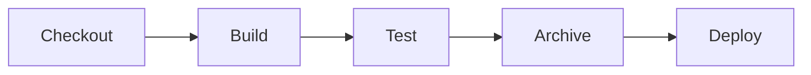

If Build fails:

```text
Checkout ✅
   ↓
Build ❌
   ↓
Test → Not executed
Archive → Not executed
Deploy → Not executed
```

The instructor explicitly demonstrates this default behavior. 

---

# 13. Parallel Stages

Not everything needs to run sequentially.

Suppose after building the application you need to perform:

* Code coverage analysis
* Docker image analysis

If they are independent, they can run in parallel.

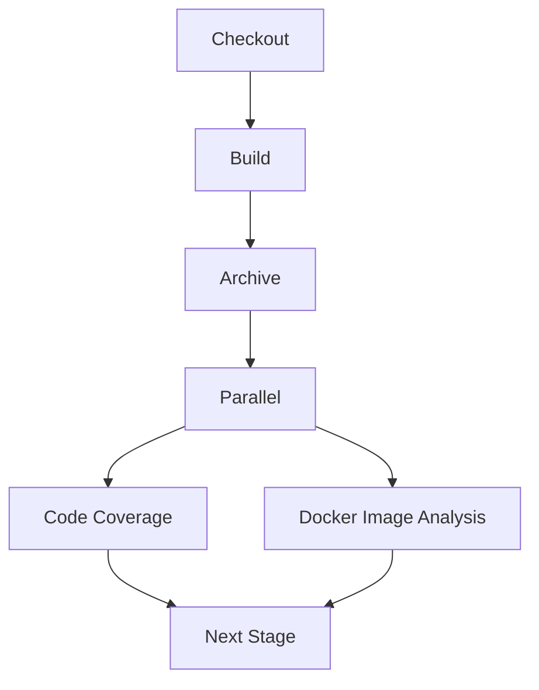

The instructor emphasizes:

> If the output of one stage is not required as the input of another, the stages may be candidates for parallel execution. 

---

# 14. Pipeline Optimization — Interview Question

### Question:

> "My Jenkins pipeline takes 15 minutes. How would you reduce execution time?"

### Good answer:

1. Analyze stage execution times.
2. Identify independent stages.
3. Run independent stages in parallel.
4. Keep dependent stages sequential.
5. Avoid unnecessary builds/scans.
6. Use appropriate agents/resources.
7. Cache dependencies where appropriate.

Example:

```text
Before:

Build
 ↓
Test A
 ↓
Test B
 ↓
Security Scan
 ↓
Deploy

After:

Build
 ↓
 ┌──────────┬──────────┬────────────┐
 ↓          ↓          ↓
Test A    Test B    Security Scan
 └──────────┴──────────┴────────────┘
              ↓
           Deploy
```

The instructor specifically uses parallelization as a pipeline optimization strategy. 

### Important

You **cannot parallelize everything**.

For example:

```text
Checkout → Build → Deploy
```

has dependencies:

```text
No code → Cannot build
No build → Cannot deploy
```

So these must remain sequential. 

---

# 15. Parallel Deployment

The instructor demonstrates deploying to **Dev and Prod in parallel** as an example of what Jenkins can technically support.

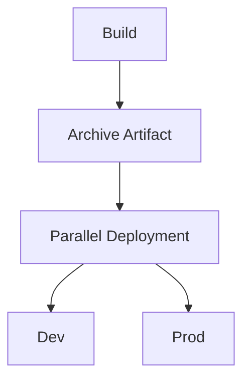

Whether this is appropriate in a real organization depends on the organization's release process, approvals, compliance requirements and risk controls.

The important Jenkins concept is:

> Parallel execution is a capability; the pipeline designer decides where it is appropriate. 

---

# 16. Tomcat Deployment

The practical portion demonstrates a Java application deployment to **Tomcat**.

The application produces a:

```text
WAR
```

The Jenkins job then deploys that WAR to Tomcat.

Basic flow:

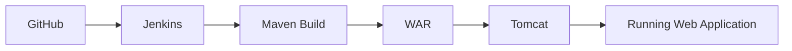

The Freestyle demonstration uses a deployment-to-container post-build action with:

* WAR file path
* Tomcat version
* Credentials
* Tomcat URL
* Context path

The instructor emphasizes that the "container" in this Jenkins/Tomcat deployment plugin is **not a Docker container**. It refers to the application container/server such as Tomcat. 

---

# 17. WAR File Path and `*`

The transcript explains a wildcard used in the WAR file path.

For example, conceptually:

```text
target/*.war
```

means:

> Find a WAR file under the target directory.

`*` is a wildcard.

So:

```text
target/myapp.war
```

specifies an exact file, whereas:

```text
target/*.war
```

can match WAR files according to the wildcard pattern. 

This connects back to your Linux/shell scripting knowledge.

---

# 18. Jenkins + GitHub + Maven + Tomcat

The complete demonstration becomes:

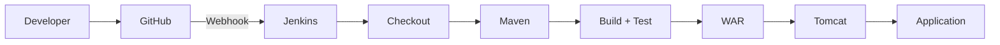

After the webhook is configured:

```text
Developer changes code
        ↓
Git push
        ↓
GitHub webhook
        ↓
Jenkins automatically triggered
        ↓
Maven build
        ↓
Test
        ↓
WAR deployment
        ↓
Tomcat
```

The instructor changes the application's message from version 1 to version 2 and demonstrates that the GitHub change automatically triggers Jenkins and results in the updated application being deployed. 

---

# 19. Jenkins Doesn't Build the Application Itself

This is a **very important conceptual point**.

Jenkins is primarily an **orchestrator/integration platform**.

For this example:

| Activity            | Tool       |
| ------------------- | ---------- |
| Source control      | Git/GitHub |
| Build               | Maven      |
| Application server  | Tomcat     |
| CI/CD orchestration | Jenkins    |

So:

```text
GitHub → Source
Maven → Build
Tomcat → Run application
Jenkins → Coordinate everything
```

The instructor summarizes the concept as Jenkins integrating the other tools rather than replacing them. 

---

# 20. Nexus in the Pipeline

The current demonstration is intentionally simple.

The instructor explains that a more mature pipeline can introduce **Nexus** between build and deployment.

Instead of simply keeping the artifact in the Jenkins workspace:

```text
Build
 ↓
WAR
 ↓
Deploy
```

you can have:

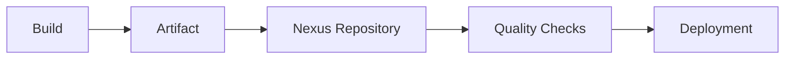

Nexus can maintain artifact versions such as:

```text
myapp 1.0
myapp 1.1
myapp 1.2
```

This provides centralized artifact storage and versioning. 

---

# 21. SonarQube Quality Gate

The instructor then introduces **SonarQube** as a quality-analysis step.

Conceptually:

```text
Build
 ↓
SonarQube Analysis
 ↓
Quality Gate
 ↓
Deploy
```

If the quality gate passes:

```text
SonarQube ✅
     ↓
Deployment
```

If it fails:

```text
SonarQube ❌
     ↓
Deployment blocked
```

The exact quality rules depend on how the organization configures SonarQube. 

---

# 22. Mature CI/CD Pipeline

The instructor gives a future-state pipeline that will become more advanced as Docker, Kubernetes and Ansible are introduced.

A representative flow from the session is:

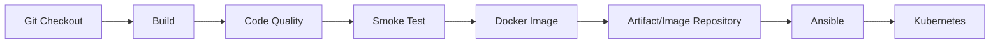

The current Tomcat pipeline is therefore a **learning-stage pipeline**, not the final architecture.

The instructor explains that the pipeline will mature over time as more DevOps tools are introduced. 

---

# 23. Jenkins Pipeline Is Organization-Specific

There is no single "correct" pipeline for every company.

For example:

### Startup

```text
Git → Build → Test → Deploy
```

### Regulated organization

```text
Git
 ↓
Build
 ↓
Test
 ↓
Security Scan
 ↓
Quality Gate
 ↓
Artifact Repository
 ↓
Approval
 ↓
Deploy
 ↓
Verification
```

Both can produce the same application, but the process can differ because of:

* Compliance
* Security
* Release policies
* Approval requirements
* Infrastructure
* Application architecture

The instructor emphasizes that pipeline design depends on organizational requirements. 

---

# 24. Jenkins Tools — Multiple Versions

Suppose Jenkins has:

```text
Maven 3.9.x
Maven 2.x
```

Different applications may require different versions.

Therefore:

```text
Application A → Maven 3.9.x
Application B → Maven 2.x
```

The pipeline should explicitly select the required tool version rather than relying on whichever executable happens to be first in `PATH`. 

### Interview scenario

**Question:**
"My Jenkins server has two Maven versions. How do you make sure a particular job uses Maven 3.9?"

**Answer:**

> Configure Maven installations in Jenkins Global Tool Configuration and explicitly reference the required Maven installation from the pipeline/job.

---

# 25. Parameters + Automatic Webhook

An interesting question discussed in the session:

> What happens when a webhook automatically triggers a parameterized pipeline?

Suppose:

```text
Environment:
  dev
  prod
```

If the webhook triggers the pipeline automatically, there is no person available to manually select the parameter.

A default value can therefore be configured.

Example:

```text
Default = dev
```

Then:

```text
Webhook
   ↓
Jenkins
   ↓
No manual input
   ↓
Use default = dev
```

If someone manually starts a parameterized build, they can select the required value. 

---

# 26. Multibranch Pipeline + Jenkinsfile

Each branch has its own copy/version of the Jenkinsfile because the Jenkinsfile is stored in Git.

Example:

```text
main
 └── Jenkinsfile

develop
 └── Jenkinsfile

feature-A
 └── Jenkinsfile
```

The important principle discussed is **consistency**.

If the pipeline logic needs to change, the corresponding branches need to receive the intended Jenkinsfile changes as well. Branch-specific behavior can be controlled with conditions such as `when`. 

### Example

```text
main branch
   ↓
when branch == main
   ↓
Production deployment
```

```text
develop branch
   ↓
when branch == develop
   ↓
Development deployment
```

---

# 27. Pipeline Maturity

A real DevOps pipeline usually evolves.

### Stage 1 — Basic

```text
Git
 ↓
Build
 ↓
Deploy
```

### Stage 2 — Testing

```text
Git
 ↓
Build
 ↓
Unit Test
 ↓
Deploy
```

### Stage 3 — Quality

```text
Git
 ↓
Build
 ↓
Test
 ↓
SonarQube
 ↓
Quality Gate
 ↓
Deploy
```

### Stage 4 — Artifact Management

```text
Git
 ↓
Build
 ↓
Test
 ↓
Nexus
 ↓
Deploy
```

### Stage 5 — Containerized

```text
Git
 ↓
Build
 ↓
Test
 ↓
Docker Image
 ↓
Repository
 ↓
Kubernetes
```

### Stage 6 — Automated Infrastructure/Deployment

```text
Git
 ↓
Build
 ↓
Test
 ↓
Security
 ↓
Artifact/Image Repository
 ↓
Ansible
 ↓
Kubernetes
 ↓
Monitoring
```

This "start simple and continuously improve" concept is one of the strongest lessons from this session. 

---

# 🔥 Interview Revision

## 1. Declarative vs Scripted Pipeline

| Declarative                    | Scripted                        |
| ------------------------------ | ------------------------------- |
| Structured syntax              | Groovy programming style        |
| Easier to read                 | More flexible                   |
| Fixed structure                | More programmatic               |
| Easier for beginners           | More advanced                   |
| Suitable for most common CI/CD | Useful for complex/custom logic |

The instructor recommends focusing on Declarative Pipeline for the course. 

---

## 2. What is `when`?

> `when` controls whether a stage should execute based on a condition.

Example:

```text
Environment = dev
      ↓
Deploy Dev → Execute
Deploy Prod → Skip
```

---

## 3. What is `agent`?

> `agent` defines where pipeline/stage execution takes place.

---

## 4. What is `tools`?

> `tools` allows a pipeline to use configured tool installations such as Maven or JDK.

---

## 5. What is `environment`?

> Defines environment variables available to the pipeline or a stage.

---

## 6. What is `options`?

> Controls pipeline behavior such as timeout, retry, build retention and concurrency/throttling.

---

## 7. What is `post`?

> Defines actions to execute after pipeline/stage execution, such as success/failure handling, notifications or cleanup.

---

## 8. Are Jenkins stages sequential?

**By default, yes.**

But independent stages can be explicitly configured to execute in parallel. 

---

## 9. How do you optimize a slow Jenkins pipeline?

> Identify independent stages and execute them in parallel while keeping dependency-driven stages sequential.

For example:

```text
Build
 ↓
 ┌───────────┬─────────────┐
 ↓           ↓             ↓
Unit Test   Security     Code Quality
 └───────────┴─────────────┘
              ↓
           Deploy
```

---

## 10. Why use Nexus?

> To centrally store and version build artifacts/images so the same validated artifact can be promoted across environments.

---

## 11. Why use SonarQube?

> To perform code-quality analysis and enforce quality gates before deployment.

---

## 12. What is Jenkins actually doing?

A strong interview answer:

> Jenkins orchestrates and integrates the different tools involved in the CI/CD process. Git handles source control, Maven can build the application, SonarQube can perform quality analysis, Nexus can store artifacts, and deployment tools/platforms handle deployment. Jenkins coordinates these activities.

This is more accurate than saying **"Jenkins builds the application."** 

---

# ⭐ Scenario-Based Interview Answer

### "Explain your Jenkins pipeline for a Java application."

A good answer based on this session:

> "The developer pushes code to GitHub, which triggers Jenkins through a webhook. Jenkins checks out the source code and uses the configured Maven version to build and test the application. After the build, we can perform code-quality analysis through SonarQube and enforce a quality gate. The generated artifact is stored in Nexus so that we have versioned, centrally managed artifacts. Based on the pipeline conditions and target environment, the artifact can then be deployed. In a more mature setup, we can build a Docker image and deploy it to Kubernetes, with Ansible or another deployment automation tool handling part of the process. Independent pipeline stages can run in parallel to reduce execution time."

That answer demonstrates **architecture + tools + reasoning**, rather than simply listing Jenkins features. 

---

# 🧠 Final Mental Model

Remember this structure:

```text
                         JENKINS PIPELINE
                                │
       ┌────────────────────────┼───────────────────────┐
       ↓                        ↓                       ↓
     Agent                    Tools                Environment
       │                        │                       │
       └────────────────────────┼───────────────────────┘
                                ↓
                             Options
                                ↓
                           Parameters
                                ↓
                              Stages
                                │
              ┌─────────────────┼─────────────────┐
              ↓                 ↓                 ↓
           Checkout           Build             Test
              │                 │                 │
              └─────────────────┼─────────────────┘
                                ↓
                         Quality / Security
                                ↓
                           Nexus Artifact
                                ↓
                         ┌──────┴──────┐
                         ↓             ↓
                       Dev           Prod
                         │             │
                         └──────┬──────┘
                                ↓
                              Post
```

### 🔥 Highest-priority topics from this session

1. **Declarative vs Scripted Pipeline**
2. **Pipeline directives**
3. **`agent`**
4. **`tools`**
5. **`environment`**
6. **`options`**
7. **Parameters**
8. **`when` conditions**
9. **`post` actions**
10. **Sequential vs parallel stages**
11. **Pipeline optimization**
12. **Jenkins + Maven + Tomcat**
13. **Nexus artifact repository**
14. **SonarQube quality gate**
15. **Parameterized deployments**
16. **Multibranch Jenkinsfile consistency**
17. **How a CI/CD pipeline matures over time**
18. **Jenkins as an orchestrator rather than the build/deployment tool itself**