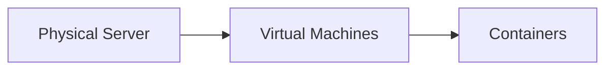
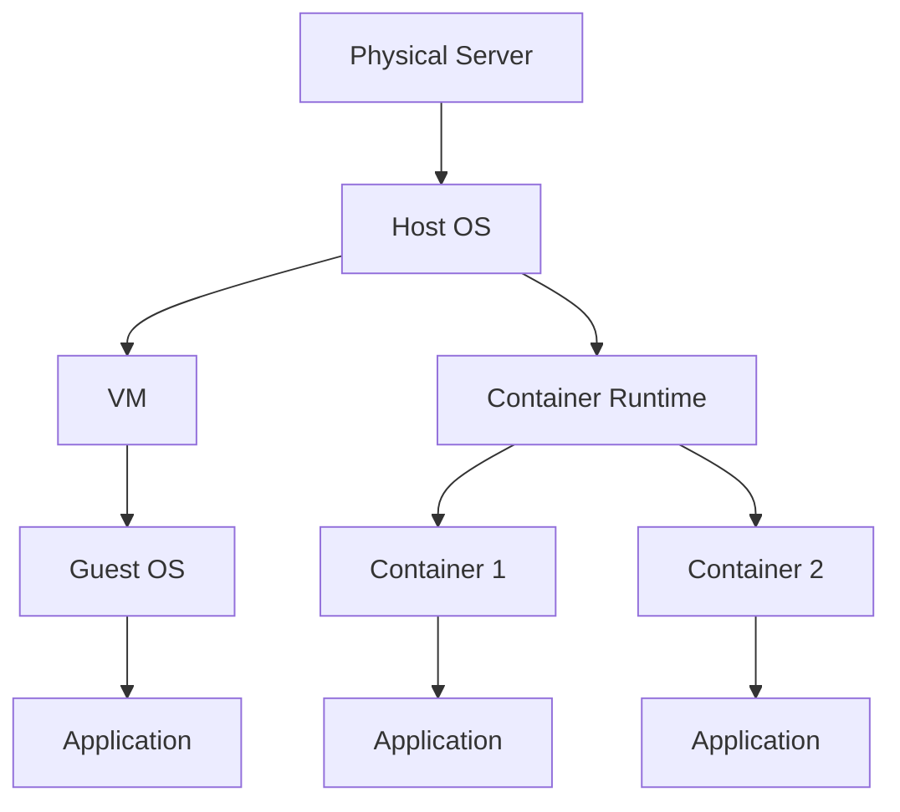
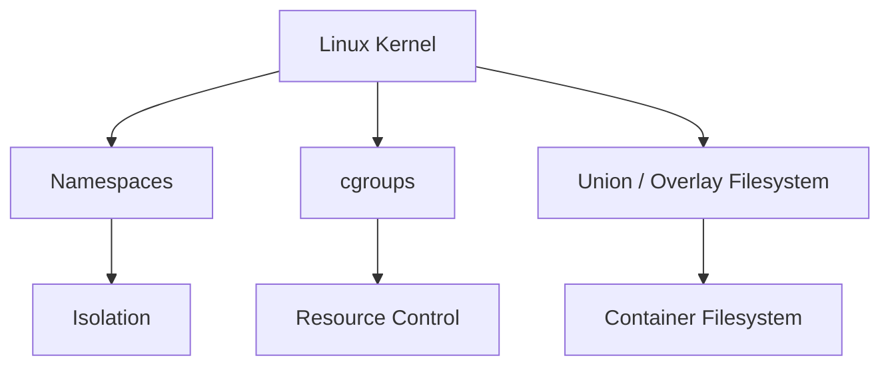
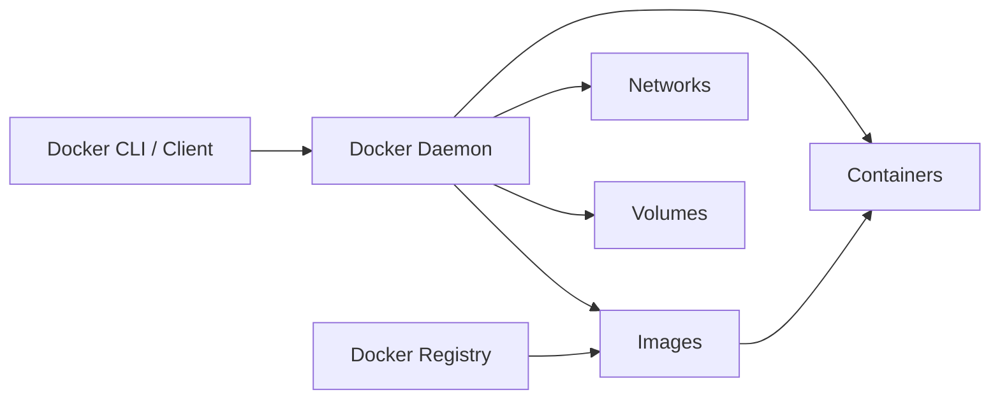
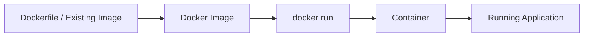
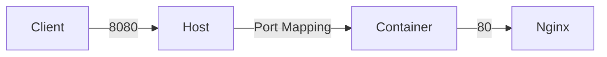
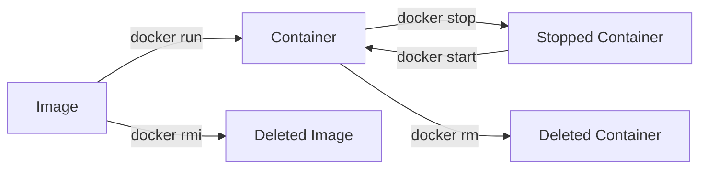
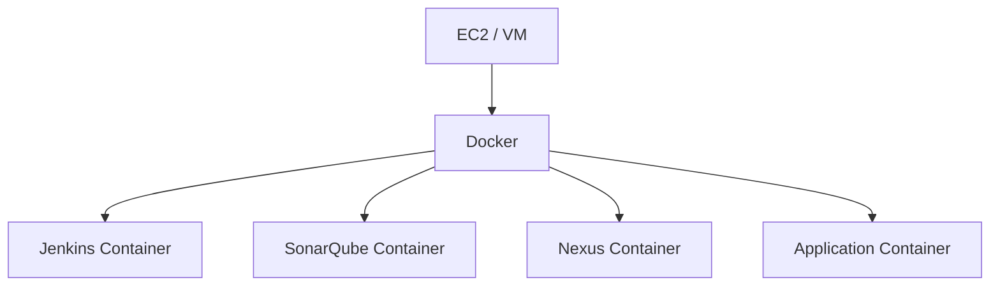
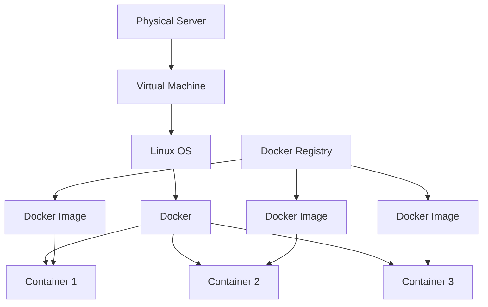

# DevOps Session — Docker & Containerization Notes

**Date:** 22 September 2026
**Instructor:** Rochak Agrawal
**Focus:** Docker fundamentals, containers vs VMs, Linux containerization, Docker architecture, images, registries, networking, volumes, and essential Docker commands

> This session is the introduction to **Docker** before moving into the Jenkins project. I’ve kept the notes crisp and interview-focused, removed participant chatter, and corrected obvious transcript errors. 

---

## 1. Why Docker?

Before Docker, applications were commonly installed directly on servers/VMs.

An application typically needs:

```text
Application
 ├── Code
 ├── Libraries
 └── Dependencies
```

For example, Jenkins requires Java.

If one machine has Java 17 and another has Java 21, the same application may behave differently depending on compatibility.

This creates:

* **Version drift**
* Dependency conflicts
* Environment mismatch
* Slow application onboarding
* Difficult server configuration
* Resource wastage

The instructor uses Jenkins/Tomcat as an example: if both require the same port, such as `8080`, they cannot simply bind to that same host port simultaneously. 

---

# 2. The Evolution: Physical Server → VM → Container



### Physical server

```text
Physical Server
      ↓
Application
```

Problems:

* Expensive
* Slow provisioning
* Hardware may remain underutilized
* Historically common to dedicate a server to an application

### Virtual Machine

```text
Physical Server
      ↓
Hypervisor
 ┌────┼────┐
 ↓    ↓    ↓
VM1  VM2  VM3
 ↓    ↓    ↓
OS   OS   OS
```

Each VM has its own complete operating system. 

### Container

```text
Physical Server / VM
        ↓
    Host OS
        ↓
Container Runtime
 ┌──────┼──────┐
 ↓      ↓      ↓
 C1     C2     C3
App    App    App
```

Containers share the host kernel while remaining isolated from each other. They don't need a separate full guest OS for each application. 

---

# 3. Physical Server

A physical server is actual hardware.

```text
CPU
RAM
Disk
Network
   ↓
Physical Server
   ↓
Operating System
   ↓
Application
```

### Problems

| Problem      | Explanation               |
| ------------ | ------------------------- |
| Provisioning | Can take significant time |
| Cost         | Hardware is expensive     |
| Utilization  | Resources can remain idle |
| Isolation    | Applications can conflict |
| Maintenance  | Hardware must be managed  |

The instructor describes physical servers as the starting point in the evolution toward virtualization and containers. 

---

# 4. Virtual Machines

A VM is a **logical machine running on physical infrastructure**.

Example:

```text
Physical Server
      ↓
   Hypervisor
 ┌────┼────┐
 ↓    ↓    ↓
VM1  VM2  VM3
 ↓    ↓    ↓
Linux Windows Linux
```

Each VM has:

* Virtual CPU
* Virtual memory
* Virtual disk
* Network interface
* **Its own operating system**

AWS **EC2 instances are an example of virtual machines from the user's perspective**. 

---

# 5. Hypervisor

A **hypervisor** is virtualization software that allows multiple VMs to run on physical hardware.

Examples mentioned:

* VMware
* Oracle VirtualBox
* Other virtualization platforms

Conceptually:

```text
Physical Hardware
       ↓
    Hypervisor
       ↓
 ┌─────┼─────┐
 ↓     ↓     ↓
 VM1   VM2   VM3
```

The hypervisor manages the underlying physical resources allocated to VMs. 

### Easy interview answer

> A hypervisor is a virtualization layer that allows multiple isolated virtual machines to run on the same physical host.

---

# 6. Why VM Isn't Enough

VMs solved many physical-server problems, but some issues remain.

Suppose one VM runs:

```text
Jenkins
Tomcat
```

Both applications might:

* Require different Java versions
* Use the same port
* Have conflicting dependencies
* Need different library versions

The VM itself is isolated, but **applications inside the same VM can still conflict**.

Also, each VM carries a complete OS.

Therefore:

```text
VM
 ↓
Full OS
 ↓
Application
```

has more overhead than:

```text
Container
 ↓
Application
```

The instructor uses this as the motivation for containerization. 

---

# 7. What Is a Container?

A container is an **isolated application process/environment** that shares the host operating system kernel.

Key characteristics:

* No separate full guest OS
* Shares host kernel
* Isolated processes
* Lightweight
* Fast startup
* Packages application and required userspace dependencies together


### Mental model

Think:

```text
Apartment Building
 ├── Apartment 1 → Container 1
 ├── Apartment 2 → Container 2
 └── Apartment 3 → Container 3
```

The apartments are isolated, but they share the building's common infrastructure.

---

# 8. VM vs Container

This is a **must-know interview question**.

| Feature               | VM                         | Container                  |
| --------------------- | -------------------------- | -------------------------- |
| Virtualization level  | Hardware/OS virtualization | OS-level virtualization    |
| Guest OS              | Full OS                    | No separate full guest OS  |
| Kernel                | Own guest kernel           | Shares host kernel         |
| Size                  | Generally larger           | Generally smaller          |
| Startup               | Usually slower             | Usually very fast          |
| Isolation             | Strong VM isolation        | Process/resource isolation |
| Resource overhead     | Higher                     | Lower                      |
| Application packaging | Less portable              | Highly portable            |
| Typical use           | Full OS workloads          | Application workloads      |

### Visual



---

# 9. Containers Do Not Replace VMs

This is an important correction to a common misconception.

Containers and VMs are **not necessarily alternatives**.

A common cloud architecture is:

```text
Cloud Infrastructure
       ↓
Virtual Machine
       ↓
Linux OS
       ↓
Docker
       ↓
Containers
```

So:

> A container can run **inside a VM**.

The instructor specifically emphasizes that containers often run inside VMs in cloud environments. 

---

# 10. Docker

**Docker is containerization software/platform.**

To run Docker containers, you need a container runtime/engine.

The instructor compares:

```text
VM
 ↓
Hypervisor / virtualization software
```

with:

```text
Container
 ↓
Docker / container runtime
```


Docker provides capabilities for:

* Building images
* Running containers
* Managing containers
* Networking
* Volumes
* Communicating with registries


---

# 11. What Problem Does Docker Solve?

Without containers:

```text
Server
 ├── Java
 ├── Maven
 ├── Jenkins
 ├── Tomcat
 └── Other dependencies
```

Configuration can become difficult to reproduce.

With containers:

```text
Docker
 ├── Jenkins Container
 ├── SonarQube Container
 ├── Nexus Container
 └── Application Container
```

Each application can have its own isolated userspace environment.

This helps reduce:

* Dependency conflicts
* Version drift
* Environment differences
* Setup time

---

# 12. Docker's Three Important Linux Concepts

The instructor introduces three Linux technologies behind containerization:

1. **Namespaces**
2. **Control Groups (cgroups)**
3. **Union/overlay filesystem**




---

# 13. Linux Namespaces

Namespaces provide **isolation**.

They control what a process can see.

For example, a container can have its own view of:

* Processes
* Network interfaces
* Hostname
* Mount points
* Users

The process behaves as if it has its own machine.


### Common namespaces

| Namespace | Purpose                     |
| --------- | --------------------------- |
| PID       | Process IDs                 |
| NET       | Network interfaces/routing  |
| MNT       | Mount points/filesystems    |
| UTS       | Hostname/domain name        |
| IPC       | Inter-process communication |
| USER      | User/group IDs              |


### Easy memory trick

> **Namespace = What can the container SEE?**

---

# 14. Control Groups — cgroups

Namespaces provide isolation.

**cgroups provide resource control.**

They can control/track resources such as:

* CPU
* Memory
* Disk I/O
* Number of processes
* Other resource consumption


### Easy memory trick

> **cgroups = How much can the container USE?**

Apartment analogy:

```text
Namespace
    ↓
Your apartment boundary

cgroup
    ↓
Your electricity/water quota
```

---

# 15. Union / Overlay Filesystem

The third important component is the container filesystem.

Docker images use layered filesystem concepts.

A simplified mental model:

```text
Image Layer 3
Image Layer 2
Image Layer 1
Base Layer
────────────
Container writable layer
```

The instructor introduces the filesystem here and notes that it will become clearer when Docker images are studied. 

---

# 16. Docker Architecture

The session introduces four major concepts:

```text
Docker Client
      ↓
Docker Daemon
      ↓
Images
      ↓
Containers

Registry
      ↕
Images
```


### Architecture



---

# 17. Docker Client

The Docker CLI is what you interact with.

Examples:

```bash
docker pull nginx
docker run nginx
docker ps
docker images
```

The client sends commands to the Docker daemon.

The daemon performs the actual Docker operations. 

---

# 18. Docker Daemon

The Docker daemon is responsible for the actual work.

It manages:

* Images
* Containers
* Networks
* Volumes

The Docker client can communicate with a daemon running locally or, depending on configuration, with a daemon on another machine. 

### Simple model

```text
You
 ↓
docker command
 ↓
Docker Client
 ↓
Docker Daemon
 ↓
Actual operation
```

---

# 19. Docker Image

An image is a **read-only template/blueprint** used to create containers.

Think:

```text
Image
  ↓
Container
```

The instructor compares:

> **Image = CD**

> **Container = movie playing from the CD**


### Image vs Container

| Image                     | Container                  |
| ------------------------- | -------------------------- |
| Template/blueprint        | Running instance           |
| Read-only                 | Has writable runtime layer |
| Static                    | Runtime                    |
| Used to create containers | Created from image         |

### Interview answer

> A Docker image is an immutable/read-only template containing the application and its required filesystem content. A container is a running or created instance of that image.

---

# 20. Docker Registry

A registry stores and distributes Docker images.

Examples:

| Registry              | Provider                        |
| --------------------- | ------------------------------- |
| Docker Hub            | Docker                          |
| ECR                   | AWS                             |
| ACR                   | Azure                           |
| GCR/Artifact Registry | Google Cloud                    |
| Nexus                 | Third-party artifact repository |

The instructor compares Docker Hub conceptually with GitHub:

```text
GitHub
 ↓
Source Code

Docker Hub
 ↓
Docker Images
```


---

# 21. Docker Hub

Docker Hub is a public registry where you can find images for many applications.

Examples mentioned include:

* Nginx
* Ubuntu
* Node.js
* Python
* PostgreSQL
* Redis
* SonarQube
* OpenJDK
* PHP
* MariaDB

Official images are available for many popular technologies. 

For example:

```bash
docker pull nginx
```

If no other registry is specified, Docker uses Docker Hub by default in the normal Docker CLI workflow. 

---

# 22. Docker Image vs Container — Most Important Diagram



Remember:

> **Image = blueprint**

> **Container = runtime instance**

---

# 23. Important Docker Commands

The session demonstrates the basic Docker command set.

| Command                    | Purpose                          |
| -------------------------- | -------------------------------- |
| `docker images`            | List local images                |
| `docker pull <image>`      | Download image                   |
| `docker run <image>`       | Create/start container           |
| `docker ps`                | Show running containers          |
| `docker ps -a`             | Show all containers              |
| `docker stop <container>`  | Stop container                   |
| `docker start <container>` | Start stopped container          |
| `docker rm <container>`    | Remove container                 |
| `docker rm -f <container>` | Force-remove container           |
| `docker rmi <image>`       | Remove image                     |
| `docker rmi -f <image>`    | Force-remove image               |
| `docker logs <container>`  | View container logs              |
| `docker exec`              | Execute command inside container |


---

# 24. `docker images`

Lists images stored locally.

```bash
docker images
```

Example concept:

```text
REPOSITORY    TAG       IMAGE ID
nginx         latest    ...
ubuntu        latest    ...
postgres      12        ...
```

The instructor demonstrates downloading Nginx and then verifying that the image appears locally. 

---

# 25. `docker pull`

Downloads an image from a registry.

```bash
docker pull nginx
```

Flow:

```text
Docker CLI
    ↓
Registry
    ↓
Download Image
    ↓
Local Docker Host
```

If the image is already available locally, Docker can reuse it rather than downloading it again for a normal `docker run` operation. 

---

# 26. `docker run`

Creates and starts a container from an image.

```bash
docker run nginx
```

Conceptually:

```text
Image exists locally?
       │
   ┌───┴───┐
  Yes      No
   │        │
   │     Pull image
   │        │
   └───┬────┘
       ↓
Create container
       ↓
Start container
```

The instructor demonstrates that if the image is missing locally, Docker first downloads it and then creates the container. 

---

# 27. `docker run -d`

`-d` means **detached mode**.

Without `-d`:

```bash
docker run nginx
```

the container runs in the foreground and occupies the terminal.

With:

```bash
docker run -d nginx
```

it runs in the background.


### Remember

```text
-d = detached/background
```

---

# 28. `--name`

You can give a meaningful name to a container.

Example:

```bash
docker run -d --name mynginx nginx
```

Without a specified name, Docker can generate a random container name. 

---

# 29. Port Mapping — `-p`

Containers are isolated and have their own networking.

To make an application accessible through the host, map a host port to the container port.

Example:

```bash
docker run -d --name mynginx -p 8080:80 nginx
```

Meaning:

```text
Host port 8080
      ↓
Container port 80
      ↓
Nginx
```


### Format

```text
-p HOST_PORT:CONTAINER_PORT
```

For example:

```bash
-p 8080:80
```

means:

> Traffic arriving at host port `8080` is forwarded to port `80` in the container.

---

# 30. Docker Networking Mental Model



This is especially important when troubleshooting containerized applications.

For example:

```text
Browser
 ↓
EC2 public IP:8080
 ↓
Docker port mapping
 ↓
Container:80
 ↓
Nginx
```

---

# 31. `docker ps`

Shows **running containers**.

```bash
docker ps
```

Important:

> `docker ps` does **not** show stopped containers.


---

# 32. `docker ps -a`

Shows **all containers**, including stopped/exited containers.

```bash
docker ps -a
```

Example:

```text
CONTAINER ID   IMAGE   STATUS
abc123         nginx   Up
def456         ubuntu  Exited
```

The instructor uses this to identify containers that had stopped previously. 

---

# 33. `docker stop`

Stops a running container.

```bash
docker stop mynginx
```

After stopping:

```bash
docker ps
```

will no longer show it.

But:

```bash
docker ps -a
```

will still show the stopped container. 

---

# 34. `docker start`

Starts an existing stopped container.

```bash
docker start mynginx
```

A key concept demonstrated in the session:

> **Stopping and starting the same container preserves its container filesystem changes.**

But deleting the container is different. 

---

# 35. `docker rm`

Removes a container.

```bash
docker rm mynginx
```

If the container is still running, Docker normally requires it to be stopped first.

Alternative:

```bash
docker rm -f mynginx
```

Force-removes the running container. 

### Remember

```text
stop → container still exists

rm → container is deleted
```

---

# 36. `docker rmi`

Removes an image.

```bash
docker rmi nginx
```

If a container still references the image, Docker may refuse to remove it.

You can either:

1. Remove the container first, or
2. Force-remove the image where appropriate.

The instructor demonstrates this image/container dependency. 

### Important relationship

```text
Image
  ↓
Container
```

Therefore, deleting an image can be blocked while a container still references it.

---

# 37. `docker logs`

View the logs produced by a container.

```bash
docker logs mynginx
```

This is one of the first commands to use when troubleshooting a containerized application. 

### Troubleshooting

```text
Application not working
        ↓
docker ps
        ↓
Is container running?
        ↓
docker logs <container>
        ↓
Check application error
```

---

# 38. `docker exec`

Allows you to execute a command **inside a running container**.

Example:

```bash
docker exec -it mynginx bash
```

Meaning:

```text
docker exec
    ↓
-i = interactive
-t = terminal
    ↓
container
    ↓
bash
```

The instructor demonstrates entering a container and executing Linux commands inside it. 

You can also execute a single command without opening an interactive shell:

```bash
docker exec mynginx ls -l /tmp
```

---

# 39. Container Data Is Ephemeral

This is a **very important Docker concept**.

Suppose you enter a container:

```bash
docker exec -it mynginx bash
```

and create:

```bash
touch /tmp/container.txt
```

If you stop and start the **same container**, the file can still exist.

But if you:

```text
Delete container
      ↓
Create new container
```

the file created inside the old container is gone.

The instructor demonstrates exactly this behavior. 

---

# 40. Don't Modify Containers as the Permanent Solution

The recommended pattern is:

```text
Change application
      ↓
Create new image
      ↓
Run new container
```

rather than manually modifying a running container and expecting those changes to survive recreation.

The instructor explicitly emphasizes creating a newer image when changes are required. 

This is a foundational **immutable infrastructure** idea.

---

# 41. Image → Container Lifecycle



Remember:

```text
Image = reusable blueprint
Container = instance created from image
```

---

# 42. Docker in Your Jenkins Project

This session is directly connected to the Jenkins project from the previous sessions.

Previously:

```text
Jenkins
Maven
SonarQube
Nexus
Tomcat
```

were treated as separate tools.

With Docker, many of these can be run as containers.

For example:



The instructor specifically explains that the upcoming project will use Docker containers for multiple tools, including SonarQube. 

---

# 43. Why This Is Useful for DevOps

Without Docker:

```text
Install Java
Install Maven
Install Jenkins
Configure Jenkins
Install SonarQube
Configure SonarQube
Install dependencies
Resolve conflicts
...
```

With containerized tools:

```text
Pull Image
   ↓
Run Container
   ↓
Application Available
```

This dramatically simplifies reproducibility and onboarding.

---

# 🔥 Interview Revision

## 1. Why was Docker introduced?

> Docker addresses problems such as dependency conflicts, environment mismatch, version drift, slow onboarding and inefficient application isolation by packaging applications with their required userspace dependencies into portable containers.

---

## 2. VM vs Container?

**Best short answer:**

> A VM virtualizes a complete machine and typically includes a full guest OS, while a container provides process-level isolation and shares the host kernel. Containers are therefore generally lighter and faster to start.

---

## 3. What is Docker?

> Docker is a containerization platform/runtime ecosystem used to build, run and manage containers and their images.

---

## 4. What is a Docker image?

> An image is a read-only, immutable template/blueprint used to create containers.

---

## 5. What is a container?

> A container is an isolated runtime instance created from an image.

---

## 6. Image vs Container?

```text
Image     = Blueprint
Container = Running/created instance
```

---

## 7. What is a Docker registry?

> A registry is a system used to store and distribute container images.

Examples:

* Docker Hub
* AWS ECR
* Azure ACR
* Google Artifact Registry
* Nexus

---

## 8. What are namespaces?

> Linux namespaces provide isolation by giving processes separate views of system resources such as processes, networking, mount points and hostnames.

---

## 9. What are cgroups?

> Linux control groups control and monitor resource consumption such as CPU, memory and I/O.

### Easy memory trick

> **Namespace → isolation**

> **cgroup → resource limitation**

---

## 10. What does `docker ps` do?

```bash
docker ps
```

Shows **running containers**.

---

## 11. What does `docker ps -a` do?

Shows **all containers**, including stopped containers.

---

## 12. What does `docker pull` do?

Downloads an image from a registry.

```bash
docker pull nginx
```

---

## 13. What does `docker run` do?

Creates and starts a container from an image.

```bash
docker run nginx
```

---

## 14. What does `-d` mean?

```bash
docker run -d nginx
```

Runs the container in **detached/background mode**.

---

## 15. What does `-p` mean?

```bash
docker run -p 8080:80 nginx
```

Maps:

```text
Host 8080 → Container 80
```

---

## 16. How do you enter a running container?

```bash
docker exec -it <container> bash
```

---

## 17. How do you see container logs?

```bash
docker logs <container>
```

---

## 18. What happens to files created inside a container?

> Changes made inside a container can disappear when the container is deleted and recreated. Persistent application data should therefore be stored using appropriate persistent storage/volumes, while application changes should generally be built into a new image.

The session demonstrates the loss of container-local files after container recreation. 

---

# 🧩 Docker Command Cheat Sheet

```bash
# List images
docker images

# Download image
docker pull nginx

# Run container
docker run nginx

# Run in background
docker run -d nginx

# Give container a name
docker run -d --name mynginx nginx

# Port mapping
docker run -d --name mynginx -p 8080:80 nginx

# Running containers
docker ps

# All containers
docker ps -a

# Stop
docker stop mynginx

# Start
docker start mynginx

# Remove container
docker rm mynginx

# Force remove container
docker rm -f mynginx

# Remove image
docker rmi nginx

# Force remove image
docker rmi -f nginx

# View logs
docker logs mynginx

# Execute command inside container
docker exec mynginx ls -l /tmp

# Open interactive shell
docker exec -it mynginx bash
```

The command behavior above follows the demonstrations in the session. 

---

# 🧠 Final Mental Model

The entire session can be remembered like this:



And the most important relationship:

```text
                  REGISTRY
                     │
                 docker pull
                     ↓
                   IMAGE
                     │
                 docker run
                     ↓
                 CONTAINER
                     │
              ┌──────┼──────┐
              ↓      ↓      ↓
           process  network filesystem
              │
        Linux namespaces
              +
           cgroups
```

### ⭐ Highest-priority topics from 22 September

1. **Why Docker?**
2. **Physical Server → VM → Container evolution**
3. **VM vs Container**
4. **Containers do not necessarily replace VMs**
5. **Docker architecture**
6. **Docker Client vs Docker Daemon**
7. **Image vs Container**
8. **Docker Registry**
9. **Docker Hub vs ECR/ACR/Nexus**
10. **Linux namespaces**
11. **cgroups**
12. **`docker pull`**
13. **`docker run`**
14. **`-d` detached mode**
15. **`-p` port mapping**
16. **`docker ps` vs `docker ps -a`**
17. **`docker stop` vs `docker rm`**
18. **`docker rmi`**
19. **`docker logs`**
20. **`docker exec -it`**
21. **Container data/ephemeral filesystem**
22. **Why Docker is useful in Jenkins/DevOps projects**

**One-line memory trick:**

> **Image is the blueprint → Docker runs it as a container → namespaces isolate it → cgroups control its resources → registry stores/distributes the image.** 
 