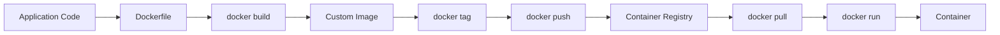

# DevOps Session — Docker Commands, Dockerfile & Custom Images Notes

**Date:** 24 September 2026
**Instructor:** Rochak Agrawal
**Focus:** Docker container lifecycle, container modes, port mapping, `docker inspect`, Dockerfile, image layers, custom images, image tagging/pushing, and Docker + CI/CD integration.

> **Note:** I condensed the transcript, removed participant chatter/repetition, and corrected obvious speech-to-text errors such as “Dockerfile,” “Docker exec,” and `docker rm -f`. The transcript ends by introducing Docker volumes and networking, which are covered in the next session. 

---

## 1. Image vs Container

Two core Docker concepts:

| Concept       | Meaning                                                                    |
| ------------- | -------------------------------------------------------------------------- |
| **Image**     | Read-only blueprint/template containing application + required environment |
| **Container** | Running instance created from an image                                     |

Example:

```bash
docker run nginx
```

This effectively:

```text
NGINX Image
     │
     │ docker run
     ▼
Container
     │
     ▼
NGINX application running
```

`docker run` **creates and starts** the container in one command. 

---

# 2. Container Lifecycle

Important commands:

| Command                      | Purpose                        |
| ---------------------------- | ------------------------------ |
| `docker run nginx`           | Create + start container       |
| `docker ps`                  | Show running containers        |
| `docker ps -a`               | Show all containers            |
| `docker stop <container>`    | Gracefully stop                |
| `docker start <container>`   | Start stopped container        |
| `docker restart <container>` | Restart container              |
| `docker kill <container>`    | Immediately terminate          |
| `docker rm <container>`      | Delete stopped container       |
| `docker rm -f <container>`   | Force-delete running container |

### Stop vs Kill

**`docker stop`**

* Attempts graceful shutdown.
* Gives the application an opportunity to finish/handle shutdown.

**`docker kill`**

* Immediately terminates the container.
* Similar to forcefully terminating a process.

```bash
docker stop mynginx
docker kill mynginx
```


### Important

You normally cannot remove a running container with:

```bash
docker rm mynginx
```

Stop it first:

```bash
docker stop mynginx
docker rm mynginx
```

Or force-remove:

```bash
docker rm -f mynginx
```

---

# 3. Image Commands

```bash
docker images
```

Shows images available locally.

```bash
docker pull nginx
```

Downloads an image from a registry.

```bash
docker rmi nginx
```

Removes an image.

```bash
docker inspect nginx
```

Displays detailed information about the image.

---

# 4. `docker inspect`

One of the **most important troubleshooting commands**.

```bash
docker inspect <image>
```

or

```bash
docker inspect <container>
```

It can provide information such as:

* Image configuration
* Container state
* Environment variables
* User
* Working directory
* Entry point
* Exposed ports
* Port bindings
* Network configuration
* Exit code
* Error information
* OOM-killed status

For example, if a container is unexpectedly terminated:

```bash
docker inspect mynginx
```

Look at fields such as:

```text
State
ExitCode
Error
OOMKilled
```

If `OOMKilled` is true, the container was terminated because of an out-of-memory condition. 

### Interview scenario

**Q: A Docker container suddenly stopped. How would you troubleshoot?**

```text
docker ps -a
      ↓
docker logs <container>
      ↓
docker inspect <container>
      ↓
Check ExitCode / Error / OOMKilled
      ↓
Check CPU & memory
```

---

# 5. Container Logs

```bash
docker logs <container>
```

Used to view application output/logs from the container.

Example:

```bash
docker logs mynginx
```

Very useful when:

* Application fails to start
* Container exits unexpectedly
* Application throws errors
* Port/application configuration is wrong


---

# 6. Docker Info, Stats and Top

### `docker info`

Shows information about the Docker installation/daemon.

```bash
docker info
```

Examples of information:

* Docker/server version
* Number of containers
* Number of images
* Storage information
* Docker root directory
* Operating system
* Memory
* Docker Swarm status
* Registry configuration

---

### `docker stats`

Shows live resource usage of containers.

```bash
docker stats
```

Typical information:

| Metric    | Meaning               |
| --------- | --------------------- |
| CPU %     | CPU consumption       |
| MEM USAGE | Memory currently used |
| MEM %     | Memory utilization    |
| NET I/O   | Network traffic       |
| BLOCK I/O | Disk I/O              |

Useful when troubleshooting resource problems. 

---

### `docker top`

Shows processes running inside a container.

```bash
docker top mynginx
```

Think of it as checking the processes running **inside that specific container**. 

---

# 7. Three Container Running Modes

Docker containers can be run in three common modes:

```text
                 Container
                     │
       ┌─────────────┼─────────────┐
       ▼             ▼             ▼
    Attached      Detached     Interactive
    Foreground    Background    Shell access
```

## Attached Mode

```bash
docker run nginx
```

The container runs attached to your terminal.

You see its output directly.

Useful for:

* Quick testing
* Debugging
* Seeing application output immediately

`Ctrl+C` can stop the attached container. 

---

## Detached Mode

```bash
docker run -d nginx
```

`-d` = **detached**

The container runs in the background and your terminal remains available.

Typical production-style usage:

```bash
docker run -d --name mynginx nginx
```


### Important interview point

`-d` **does NOT mean port mapping.**

It only means:

> Run the container in the background.

---

## Interactive Mode

```bash
docker run -it ubuntu bash
```

`-i` → Keep standard input open
`-t` → Allocate a terminal

This allows you to get a shell inside the container.

Example:

```bash
docker run -it ubuntu bash
```

Then:

```bash
pwd
ls
cd /tmp
```

You are executing commands **inside the container**. 

---

# 8. Port Mapping

Containers have their own networking namespace and container ports are not automatically reachable from outside the host.

Example NGINX:

```text
Host
Port 8080
   │
   │ Docker port mapping
   ▼
Container
Port 80
   │
   ▼
NGINX
```

Command:

```bash
docker run -d --name mynginx -p 8080:80 nginx
```

Format:

```text
-p HOST_PORT:CONTAINER_PORT
```

Therefore:

```text
8080:80
│    │
│    └── Container port
└─────── Host port
```

Traffic arriving at:

```text
Host:8080
```

is forwarded to:

```text
Container:80
```


### Important

The ports don't have to be identical.

For example:

```bash
docker run -d -p 8087:80 nginx
```

means:

```text
Host 8087 → Container 80
```

Without `-p`, the container port isn't published to the host in the normal Docker bridge networking scenario. 

### Check port mapping

```bash
docker port mynginx
```

or:

```bash
docker inspect mynginx
```

---

# 9. Registry vs Image

Docker images are stored/distributed through a **container registry**.

Examples:

* Docker Hub
* Amazon ECR
* Azure Container Registry
* Google Artifact Registry
* Nexus

The instructor mentioned using Docker Hub for practice and Nexus for the project. 

Mental model:

```text
Developer
   │
   │ docker build
   ▼
Docker Image
   │
   │ docker tag
   ▼
Tagged Image
   │
   │ docker push
   ▼
Container Registry
   │
   │ docker pull
   ▼
Other Server
```

---

# 10. Pre-built vs Custom Images

### Pre-built image

Example:

```bash
docker pull nginx
```

You are using an image created by someone else.

### Custom image

You create your own:

```text
Application
     +
Base Image
     +
Configuration
     +
Dependencies
     ↓
Dockerfile
     ↓
docker build
     ↓
Custom Image
```

Most real applications require custom images rather than simply running an untouched public image. 

---

# 11. Dockerfile

A **Dockerfile is a recipe/instruction file** used to create a Docker image.

Example:

```dockerfile
FROM nginx

LABEL maintainer="Jeevana"

COPY index.html /usr/share/nginx/html/

EXPOSE 80

CMD ["nginx", "-g", "daemon off;"]
```

Then:

```bash
docker build -t my-nginx:1.0 .
```

This creates:

```text
Dockerfile
    │
    │ docker build
    ▼
my-nginx:1.0
```

The transcript emphasizes that Dockerfile instructions are processed sequentially and form image layers. 

---

# 12. Important Dockerfile Instructions

| Instruction  | Purpose                                           |
| ------------ | ------------------------------------------------- |
| `FROM`       | Defines the base image                            |
| `LABEL`      | Adds metadata                                     |
| `WORKDIR`    | Sets working directory                            |
| `COPY`       | Copies files into image                           |
| `ENV`        | Sets environment variables                        |
| `RUN`        | Executes command during image build               |
| `EXPOSE`     | Documents the container port                      |
| `USER`       | Defines user for subsequent operations/runtime    |
| `CMD`        | Default command when container starts             |
| `ENTRYPOINT` | Defines the container's executable/entry behavior |

### `FROM`

Most important starting point.

```dockerfile
FROM nginx
```

or:

```dockerfile
FROM ubuntu
```

The choice of base image depends on the application. 

---

### `WORKDIR`

Sets the working directory:

```dockerfile
WORKDIR /app
```

Equivalent conceptually to establishing the default directory inside the container.

---

### `COPY`

Copies files from build context into the image:

```dockerfile
COPY app.jar /app/app.jar
```

For a Java application, this might mean copying the Maven-generated JAR into the image.

The exact files depend on the application type. 

---

### `ENV`

```dockerfile
ENV APP_ENV=production
```

Defines an environment variable.

---

### `EXPOSE`

```dockerfile
EXPOSE 8080
```

Documents that the application listens on port 8080.

**Important:** `EXPOSE` itself does not publish the port to the host.

Publishing is done with:

```bash
docker run -p 8080:8080 ...
```

---

### `RUN`

Executes commands **while building the image**.

Example:

```dockerfile
RUN npm install
```

or:

```dockerfile
RUN apt-get update
```

---

### `CMD`

Defines the default command used when the container starts.

Example:

```dockerfile
CMD ["node", "server.js"]
```

The transcript used this concept to keep NGINX running. 

---

# 13. Example: Java Application Dockerfile

The instructor connected Docker with the Maven process learned earlier.

Typical flow:

```text
Java Source Code
       │
       ▼
    Maven
       │
       ▼
   app.jar
       │
       ▼
 Dockerfile
       │
       │ COPY app.jar
       ▼
 Docker Image
       │
       ▼
 Container
```

Example:

```dockerfile
FROM eclipse-temurin:21-jre

WORKDIR /app

COPY target/my-app.jar app.jar

EXPOSE 8080

USER 1000

ENTRYPOINT ["java", "-jar", "app.jar"]
```

The exact base image and instructions depend on the application.

---

# 14. Node.js Docker Example

The instructor also demonstrated a Node.js application.

Conceptually:

```dockerfile
FROM node:20

WORKDIR /app

COPY package*.json ./

RUN npm install

COPY . .

EXPOSE 3000

CMD ["node", "server.js"]
```

Build:

```bash
docker build -t my-node-app:1.0 .
```

Run:

```bash
docker run -d -p 3000:3000 my-node-app:1.0
```

The instructor demonstrated the same overall pattern: Node base image → working directory → copy package files → `npm install` → copy application → run Node application. 

---

# 15. Docker Image Layers

This is an **important interview concept**.

Suppose the Dockerfile has:

```dockerfile
FROM nginx
COPY index.html /usr/share/nginx/html/
EXPOSE 80
CMD ["nginx", "-g", "daemon off;"]
```

Docker builds the image in layers.

```text
Layer 1 → FROM
Layer 2 → COPY
Layer 3 → EXPOSE
Layer 4 → CMD
```

Conceptually:

```text
┌─────────────────────┐
│      Layer 4        │
├─────────────────────┤
│      Layer 3        │
├─────────────────────┤
│      Layer 2        │
├─────────────────────┤
│      Layer 1        │
└─────────────────────┘
```

The image layers are immutable/read-only.

When a container starts, Docker adds a **writable container layer** on top.

```text
          Container
       Writable Layer
              ▲
              │
       ─────────────
       Image Layer 4
       Image Layer 3
       Image Layer 2
       Image Layer 1
```


---

# 16. Why Container Data Disappears

Suppose you create:

```bash
docker exec mynginx touch /tmp/test.txt
```

The file exists in the container's writable layer.

If you:

```bash
docker stop mynginx
docker start mynginx
```

the file normally remains because the same container still exists.

But if you:

```bash
docker rm mynginx
```

the writable container layer is deleted.

Therefore:

```text
Image
  +
Writable container layer
  ↓
Container
```

Delete container:

```text
Container deleted
      ↓
Writable layer deleted
      ↓
Container-created data disappears
```

Persistent data should therefore be stored using Docker volumes or external persistent storage. The instructor says Docker volumes are the next topic. 

---

# 17. Docker Build Cache

Suppose:

```dockerfile
FROM nginx
COPY config.conf /etc/nginx/
COPY index.html /usr/share/nginx/html/
EXPOSE 80
```

You modify only:

```text
index.html
```

Docker can reuse unchanged previous layers and rebuild from the changed point.

```text
Old build:

Layer 1 ── reused
Layer 2 ── reused
Layer 3 ── changed
Layer 4 ── rebuilt
```

This makes subsequent builds faster when earlier layers remain unchanged. 

### Practical Dockerfile optimization

Put relatively stable instructions earlier and frequently changing application files later.

For example:

```dockerfile
COPY package.json package-lock.json ./
RUN npm install

COPY . .
```

This can allow Docker to reuse the dependency-installation layer when only application source changes.

---

# 18. Image Versioning / Tagging

Images should be versioned.

Example:

```bash
docker build -t my-nginx:1.0 .
```

Later:

```bash
docker build -t my-nginx:2.0 .
```

Now:

```text
my-nginx:1.0
my-nginx:2.0
```

You can run either version:

```bash
docker run my-nginx:1.0
```

or:

```bash
docker run my-nginx:2.0
```

This gives you a clear way to distinguish application versions. 

---

# 19. `docker tag`

Tag an image:

```bash
docker tag my-nginx:1.0 username/my-nginx:1.0
```

The tag prepares the image name for pushing to a registry.

Then:

```bash
docker push username/my-nginx:1.0
```

The instructor demonstrated building an image, tagging it, and pushing it to a registry so others can pull and run the same image. 

---

# 20. Custom Image Workflow

The complete process:



---

# 21. Docker + Maven + Jenkins

This is one of the **most important DevOps connections** from the session.

Previously:

```text
Git
 ↓
Jenkins
 ↓
Maven Build
 ↓
JAR
 ↓
Tomcat
```

With Docker:

```text
Developer
    │
    ▼
Git Repository
    │
    ▼
Jenkins
    │
    ▼
Maven Build
    │
    ▼
JAR
    │
    ▼
Docker Build
    │
    ▼
Docker Image
    │
    ▼
Container Registry
    │
    ▼
Deploy Container
```

The instructor explained that whenever source code changes, Jenkins can trigger the Maven build and then build a new Docker image containing the updated JAR. 

---

# 22. Typical CI/CD Flow

```mermaid
flowchart LR
    A[Developer commits code] --> B[Git Repository]
    B --> C[Jenkins Trigger]
    C --> D[Maven Build]
    D --> E[Unit Tests]
    E --> F[Create JAR]
    F --> G[Docker Build]
    G --> H[Docker Image]
    H --> I[Tag Image]
    I --> J[Push to Registry]
    J --> K[Deploy Container]
```



Example:

```text
Code change
     ↓
Jenkins triggered
     ↓
mvn package
     ↓
app.jar
     ↓
docker build
     ↓
my-app:2.0
     ↓
docker push
     ↓
Registry
     ↓
Deployment
     ↓
New container
```

The transcript explicitly connects this future Docker workflow with Jenkins CI/CD. 

---

# 23. `docker exec` vs Interactive `docker run`

These are commonly confused.

### `docker run -it`

Used when **creating and starting a new container** interactively:

```bash
docker run -it ubuntu bash
```

### `docker exec`

Used to execute a command **inside an already-running container**:

```bash
docker exec -it mynginx bash
```

Or:

```bash
docker exec mynginx ls -l /usr/share/nginx/html
```

Mental model:

```text
docker run
    ↓
Create + start new container

docker exec
    ↓
Run command inside existing running container
```


---

# 24. Production Application Example

Suppose you have an AEM-related Java service or another Java application.

Developer changes:

```text
Application source
```

Jenkins performs:

```text
Maven build
```

Result:

```text
application.jar
```

Dockerfile:

```dockerfile
FROM eclipse-temurin:21-jre

WORKDIR /app

COPY target/application.jar application.jar

EXPOSE 8080

ENTRYPOINT ["java", "-jar", "application.jar"]
```

Then:

```bash
docker build -t my-app:2.0 .
docker push my-registry/my-app:2.0
```

Deployment system pulls:

```bash
docker pull my-registry/my-app:2.0
```

and runs:

```bash
docker run -d \
  --name my-app \
  -p 8080:8080 \
  my-registry/my-app:2.0
```

This is the bridge between your **Maven knowledge and Docker knowledge**.

---

# 🔥 Interview Revision

### 1. What is the difference between an image and a container?

**Image** is a read-only template.
**Container** is a running instance created from that image.

---

### 2. What does `docker run` do?

It creates and starts a container from an image.

---

### 3. Difference between `docker stop` and `docker kill`?

| `docker stop`                   | `docker kill`                                 |
| ------------------------------- | --------------------------------------------- |
| Graceful shutdown               | Immediate termination                         |
| Gives application time to stop  | Forcefully terminates                         |
| Preferred for normal operations | Useful when immediate termination is required |

---

### 4. What does `-d` mean?

Detached/background mode.

```bash
docker run -d nginx
```

---

### 5. What does `-p 8080:80` mean?

```text
Host port 8080 → Container port 80
```

---

### 6. What is Dockerfile?

A text file containing instructions used to build a Docker image.

---

### 7. What is `FROM`?

Defines the base image.

```dockerfile
FROM nginx
```

---

### 8. Difference between `RUN` and `CMD`?

| `RUN`                        | `CMD`                                        |
| ---------------------------- | -------------------------------------------- |
| Executes during image build  | Defines default command at container startup |
| Creates/changes image layers | Runs when container starts                   |

---

### 9. Difference between `COPY` and `EXPOSE`?

```dockerfile
COPY app.jar /app/
```

Copies files into the image.

```dockerfile
EXPOSE 8080
```

Documents the port the application uses.

---

### 10. Why do Docker images have layers?

Layers allow Docker to reuse unchanged parts of an image and rebuild only changed portions, improving build efficiency.

---

### 11. Why does data disappear when a container is deleted?

Data written to the container's writable layer belongs to that container. Removing the container removes that writable layer.

For persistent data, use volumes/persistent storage.

---

### 12. How would you troubleshoot a stopped container?

```bash
docker ps -a
docker logs <container>
docker inspect <container>
docker stats
```

Check:

```text
ExitCode
Error
OOMKilled
```

---

### 13. How do you enter a running container?

```bash
docker exec -it <container> bash
```

---

### 14. How do you create a custom image?

```bash
docker build -t my-app:1.0 .
```

---

### 15. How does Docker fit into Jenkins?

```text
Git
 ↓
Jenkins
 ↓
Maven Build
 ↓
JAR
 ↓
Docker Build
 ↓
Docker Image
 ↓
Registry
 ↓
Deploy Container
```

---

# 🧠 Final Mental Model

Remember this sequence:

```text
                DOCKER
                   │
        ┌──────────┴──────────┐
        ▼                     ▼
      IMAGE               CONTAINER
   Read-only             Running instance
        │                     │
        │ docker run          │
        └────────────────────►│
                              │
                    ┌─────────┼─────────┐
                    ▼         ▼         ▼
                  logs      inspect    stats
                    │         │         │
                    └─────────┴─────────┘

Custom Image:
Dockerfile
    ↓
FROM
    ↓
RUN / COPY / ENV / WORKDIR
    ↓
EXPOSE
    ↓
CMD / ENTRYPOINT
    ↓
docker build
    ↓
Image
    ↓
docker tag
    ↓
docker push
    ↓
Registry
```

And for your DevOps workflow:

```text
Developer
   ↓
Git
   ↓
Jenkins
   ↓
Maven
   ↓
JAR
   ↓
Docker Build
   ↓
Docker Image
   ↓
Registry
   ↓
Container
```

**Highest-priority topics to revise from this session:**
`docker run/stop/start/rm`, `docker inspect`, `docker logs`, `docker stats`, attached vs detached vs interactive, `-p HOST:CONTAINER`, Dockerfile directives, image layers, Docker build cache, image tagging, registry, `docker exec`, and **Jenkins → Maven → Docker image → registry → container**.  
