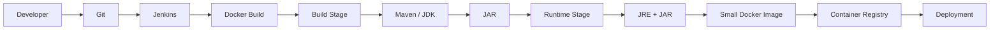
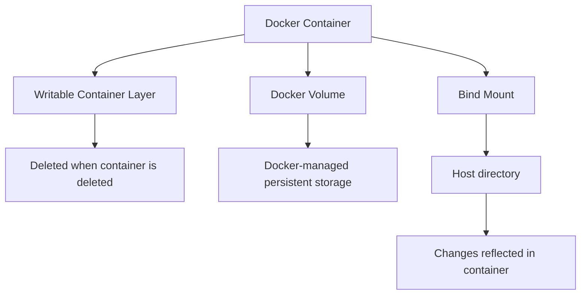

# DevOps Session — Docker Multi-Stage Builds, Volumes & Bind Mounts Notes

**Date:** 28 September 2026
**Instructor:** Rochak Agrawal
**Focus:** Multi-stage Docker builds, `CMD` vs `ENTRYPOINT`, Docker volumes, bind mounts, Docker commands, cleanup/prune, and interview-oriented Docker concepts.

> **Note:** I condensed the transcript, removed participant chatter/repetition, and corrected obvious speech-to-text errors such as “entity point” → `ENTRYPOINT`, “WorkDIA” → `WORKDIR`, and “Docker volume create.” 

---

# 1. Multi-Stage Docker Build

The main topic of this session is **how to make Docker images smaller and cleaner**.

The instructor first demonstrated a normal Go Docker image where the same image was used to:

1. Download dependencies
2. Compile the Go application
3. Build the application
4. Run the application

This resulted in a relatively large image because the final image contained build tools and dependencies that were only needed during compilation. 

### Problem

```text
Go source code
     ↓
Go compiler + dependencies
     ↓
Build application
     ↓
Run application
```

If everything happens in one image:

```text
Final Image
├── Go compiler
├── Go dependencies
├── Build tools
├── Source/build files
└── Application
```

The runtime container doesn't actually need most of these components.

---

# 2. Multi-Stage Build Solution

A **multi-stage Docker build** separates the build environment from the runtime environment.

```text
Stage 1: Builder
────────────────
Large image
Go/JDK/Maven
Source code
Dependencies
Compiler
     │
     │ Build
     ▼
Application artifact
     │
     │ COPY --from=builder
     ▼
Stage 2: Runtime
────────────────
Small image
Runtime only
Application artifact
```

The previous stages are temporary/build stages; the **last stage becomes the final image**. 

---

# 3. Go Multi-Stage Example

A simplified version of the instructor's example:

```dockerfile
# Stage 1 — Build
FROM golang:1.23 AS builder

WORKDIR /app

COPY main.go .

RUN go build -o main main.go


# Stage 2 — Runtime
FROM alpine:3.20

WORKDIR /app

COPY --from=builder /app/main .

CMD ["./main"]
```

### What happens?

### Stage 1

```text
golang image
    ↓
COPY main.go
    ↓
go build
    ↓
/app/main
```

### Stage 2

```text
Alpine
   +
compiled /app/main
   ↓
Final image
```

The final image doesn't need the complete Go compiler environment. 

---

# 4. Why Multi-Stage Builds?

| Single-stage                 | Multi-stage                      |
| ---------------------------- | -------------------------------- |
| Build + runtime in one image | Build and runtime separated      |
| Larger image                 | Smaller image                    |
| Build tools remain           | Build tools excluded             |
| More dependencies            | Only required runtime components |
| Larger attack surface        | Smaller attack surface           |
| More storage/network usage   | Less storage/network usage       |

The instructor demonstrated a significant reduction in image size when moving from the full Go image to a lightweight Alpine runtime image. 

### Security benefit

Fewer unnecessary packages → smaller attack surface → potentially fewer vulnerabilities to scan and maintain. 

---

# 5. Java Multi-Stage Build

This is especially important because you are learning **Maven + Docker** together.

Typical approach:

```text
Stage 1 — Build
────────────────
Maven + JDK
pom.xml
source code
dependencies
       ↓
mvn package
       ↓
application.jar
       │
       ▼
Stage 2 — Runtime
──────────────────
JRE
+
application.jar
```

Example:

```dockerfile
# Stage 1
FROM maven:3.9-eclipse-temurin-21 AS build

WORKDIR /app

COPY pom.xml .
RUN mvn dependency:go-offline

COPY src ./src
RUN mvn package -DskipTests


# Stage 2
FROM eclipse-temurin:21-jre

WORKDIR /app

COPY --from=build /app/target/my-app.jar app.jar

EXPOSE 8080

ENTRYPOINT ["java", "-jar", "app.jar"]
```

### Final image contains approximately:

```text
JRE
+
JAR
```

It doesn't need:

```text
Maven
JDK
Source code
Build dependencies
```

The instructor specifically explained that the final Java image can contain the runtime and JAR while leaving Maven/JDK/build dependencies in the temporary build stage. 

---

# 6. Multi-Stage Build in CI/CD

This connects directly with your previous Maven/Jenkins sessions.



One major advantage is that the **build environment is isolated inside Docker**.

Therefore, the machine performing the Docker build doesn't necessarily need Maven installed directly; Maven can exist inside the builder image. 

---

# 7. `CMD` vs `ENTRYPOINT`

This is a **very important interview topic**.

Both define what happens when a container starts, but they behave differently.

## `CMD`

`CMD` provides a **default command/arguments**.

It can be overridden when starting the container.

Example:

```dockerfile
CMD ["python", "app.py"]
```

You can provide another command at runtime:

```bash
docker run myimage python another.py
```

The Dockerfile's default `CMD` is replaced.

---

## `ENTRYPOINT`

`ENTRYPOINT` defines the main executable for the container.

Example:

```dockerfile
ENTRYPOINT ["java", "-jar", "app.jar"]
```

It is intended to remain the container's primary executable.

The instructor's explanation emphasizes keeping something that should remain fixed as the `ENTRYPOINT`, while values that may vary can be provided through `CMD`. 

---

# 8. `ENTRYPOINT` + `CMD` Together

This is the most useful way to understand them.

```dockerfile
ENTRYPOINT ["java", "-jar"]
CMD ["app.jar"]
```

When you run:

```bash
docker run myimage
```

Docker effectively executes:

```bash
java -jar app.jar
```

If you run:

```bash
docker run myimage another.jar
```

the `CMD` value is replaced:

```bash
java -jar another.jar
```

So:

```text
ENTRYPOINT = fixed executable
CMD        = default argument
```

### Mental model

```text
ENTRYPOINT
     +
   CMD
     ↓
Final container command
```

The transcript demonstrates this distinction through examples where the default CMD value is overridden at runtime while the entry point remains the primary executable. 

---

# 9. `CMD` vs `ENTRYPOINT` — Interview Table

| Feature                   | CMD                       | ENTRYPOINT                              |
| ------------------------- | ------------------------- | --------------------------------------- |
| Purpose                   | Default command/arguments | Main executable                         |
| Can be overridden easily? | Yes                       | Not by simply supplying another command |
| Best for                  | Defaults that may vary    | Fixed application executable            |
| Can work together?        | Yes                       | Yes                                     |
| Typical example           | Default arguments         | `java -jar`, executable                 |

### Easy way to remember

> **ENTRYPOINT = What the container is**
> **CMD = Default values for how it runs**

---

# 10. Docker Volumes

Containers are ephemeral by design.

If application data exists only inside the container's writable layer, deleting the container can delete that data.

For persistent data, Docker provides **volumes**.

```text
Container
    │
    │ mount
    ▼
Docker Volume
    │
    ▼
Persistent data
```

A volume is managed by Docker and exists separately from the lifecycle of an individual container. 

---

# 11. Why Do We Need Volumes?

Imagine PostgreSQL running inside a container.

```text
PostgreSQL Container
       │
       ▼
Database data
```

If you delete the container without persistent storage:

```text
Container deleted
       ↓
Database data may be lost
```

With a volume:

```text
PostgreSQL Container
       │
       ▼
PostgreSQL Volume
       │
       ▼
Persistent database data
```

Now:

```text
Container 1
     ↓
 Volume
     ↑
Container 2
```

A new container can attach to the same volume and access the existing data. 

---

# 12. Docker Volume Commands

### Create

```bash
docker volume create myvolume
```

### List

```bash
docker volume ls
```

### Inspect

```bash
docker volume inspect myvolume
```

### Remove

```bash
docker volume rm myvolume
```

### Remove unused volumes

```bash
docker volume prune
```

The transcript covers these commands and warns that `volume prune` should be used carefully because unused volumes may still contain information that could be needed later. 

---

# 13. Using a Named Volume

Example:

```bash
docker volume create myvolume
```

Run a container using it:

```bash
docker run -d \
  --name nginx-volume \
  -v myvolume:/app \
  nginx
```

Here:

```text
myvolume → /app
```

Inside the container:

```text
/app
```

is backed by the Docker volume.

---

# 14. Named vs Anonymous Volumes

The instructor distinguishes two types:

| Type                 | Description                         |
| -------------------- | ----------------------------------- |
| **Named volume**     | You explicitly provide a name       |
| **Anonymous volume** | Docker generates an identifier/name |

Example named volume:

```bash
docker volume create postgres-data
```

You can easily identify it later:

```bash
docker volume ls
```

Anonymous volumes are less convenient to manage because their generated names aren't meaningful. 

---

# 15. Volume Sharing Between Containers

Suppose:

```bash
docker run -d --name container1 -v myvolume:/app nginx
```

Create a file:

```text
/app/test.txt
```

Then another container:

```bash
docker run -d --name container2 -v myvolume:/app nginx
```

The second container can also see:

```text
/app/test.txt
```

Why?

Because both containers use:

```text
        myvolume
        /      \
       /        \
container1    container2
```

The transcript demonstrates this behavior directly. 

---

# 16. Bind Mount

A **bind mount** is different from a Docker-managed volume.

With a bind mount, you choose an existing directory on the host.

Example:

```text
Host
/home/ubuntu/project
        │
        │ bind mount
        ▼
Container
/app
```

Changes on either side are reflected on the other side. 

---

# 17. Bind Mount Example

Modern syntax:

```bash
docker run -d \
  --name bind-nginx \
  --mount type=bind,source=/home/ubuntu/project,target=/app \
  nginx
```

Meaning:

```text
source = /home/ubuntu/project
target = /app
```

So:

```text
Host:
 /home/ubuntu/project
          ↕
Container:
 /app
```

The instructor demonstrated creating a file on the host and seeing it inside the container, and vice versa. 

---

# 18. Bind Mount — Important Behavior

Suppose host has:

```text
/home/ubuntu/project/
├── host.txt
└── container.txt
```

Inside container:

```text
/app/
├── host.txt
└── container.txt
```

If you delete:

```text
/home/ubuntu/project/host.txt
```

then:

```text
/app/host.txt
```

also disappears.

Why?

Because they represent the **same underlying host directory**.

The transcript demonstrates this bidirectional behavior explicitly. 

---

# 19. Volume vs Bind Mount

This is an important interview comparison.

| Feature                           | Docker Volume               | Bind Mount                     |
| --------------------------------- | --------------------------- | ------------------------------ |
| Managed by                        | Docker                      | You/host OS                    |
| Source                            | Docker-managed storage      | Specific host path             |
| Example                           | `myvolume:/app`             | `/home/user/project:/app`      |
| Portability                       | Generally easier            | Host-path dependent            |
| Good for                          | Persistent application data | Development/local file sharing |
| Host directory knowledge required | No                          | Yes                            |

### Simple memory trick

```text
Volume
Docker manages the storage.

Bind Mount
You bind an existing host path.
```

---

# 20. `docker inspect` for Mounts

You can verify how a container is storing data:

```bash
docker inspect <container>
```

Look for:

```text
Mounts
```

For a bind mount:

```text
Type: bind
Source: /home/ubuntu/project
Destination: /app
RW: true
```

For a volume:

```text
Type: volume
Source: myvolume
Destination: /app
```

The instructor used `docker inspect` to verify both the bind mount source/destination and volume information. 

---

# 21. Volume Cannot Always Be Deleted

If a container references a volume, Docker may prevent deletion.

Example:

```bash
docker volume rm myvolume
```

may return an error indicating that the volume is in use.

You need to remove the reference first by removing/stopping the relevant container(s), depending on the situation.

The instructor demonstrated this behavior in the session. 

---

# 22. Docker Prune Commands

Docker provides cleanup commands.

### Unused volumes

```bash
docker volume prune
```

### Dangling images

```bash
docker image prune
```

### Unused containers

```bash
docker container prune
```

### Unused networks

```bash
docker network prune
```

### General system cleanup

```bash
docker system prune
```

### ⚠️ Be careful

Prune commands can remove resources you may later need.

Especially:

```bash
docker volume prune
```

should not be run casually on a production system because an unused volume may still contain important data. 

---

# 23. Docker Command Structure

The instructor emphasizes that Docker commands are organized around resources.

The major resources are:

```text
Docker
├── Containers
├── Images
├── Volumes
└── Networks
```

Examples:

```bash
docker container ...
docker image ...
docker volume ...
docker network ...
```

You can also use shorter/common commands such as:

```bash
docker ps
docker images
docker run
docker build
```

Docker itself can show available commands and help:

```bash
docker --help
```

For example:

```bash
docker image --help
docker volume --help
docker network --help
```

The transcript specifically recommends using Docker's command help/cheat sheet rather than trying to memorize every command. 

---

# 24. Important Docker Command Categories

### Container

```bash
docker run
docker ps
docker stop
docker start
docker restart
docker rm
docker exec
docker logs
docker inspect
docker stats
```

### Image

```bash
docker images
docker build
docker pull
docker push
docker tag
docker inspect
docker history
docker rmi
docker image prune
```

### Volume

```bash
docker volume create
docker volume ls
docker volume inspect
docker volume rm
docker volume prune
```

### Network

```bash
docker network ls
docker network create
docker network inspect
docker network connect
docker network disconnect
docker network rm
```

The instructor explicitly points out that Docker's built-in help can be used to discover these command groups. 

---

# 25. Do You Need to Memorize Every Docker Command?

**No.**

The important thing is to understand:

1. What the command does
2. Why you would use it
3. What resource it operates on
4. How it fits into troubleshooting/deployment

For example, you should understand:

```bash
docker logs
```

means:

> Show container/application logs.

And:

```bash
docker inspect
```

means:

> Show detailed configuration/state information.

The exact syntax can be looked up when needed. The instructor explicitly discusses this and emphasizes understanding the concept rather than memorizing every syntax variation. 

---

# 26. What Matters in Interviews

Interviewers are more likely to ask:

### Concept

> What is a multi-stage Docker build?

### Why

> Why would you use it?

### Scenario

> Your Docker image is 1 GB. How would you reduce it?

### Experience

> Have you implemented multi-stage builds?

rather than simply:

> Write a Docker command from memory.

The instructor specifically recommends explaining the **concept, reason, and real-world experience**. 

---

# 27. Scenario — Image Is Too Large

### Problem

Your Java Docker image is:

```text
800 MB
```

### Investigation

You discover it contains:

```text
Maven
JDK
Source code
Dependencies
JAR
```

### Solution

Use multi-stage build:

```text
Stage 1
Maven + JDK
     ↓
Build JAR
     ↓
Stage 2
JRE + JAR
```

### Result

```text
Smaller image
       +
Less unnecessary software
       +
Reduced attack surface
       +
Faster image transfer
```

This is exactly the type of practical reasoning the session emphasizes. 

---

# 28. Scenario — Container Deleted but Data Must Survive

### Problem

A PostgreSQL container is deleted.

You don't want the database data to disappear.

### Solution

Use a volume:

```text
PostgreSQL
    │
    ▼
postgres-data volume
```

Delete/recreate the container:

```text
Container 1
    ↓
deleted

Container 2
    ↓
same postgres-data volume
```

The data remains in the volume.

---

# 29. Scenario — Developer Needs Local Code Inside Container

Suppose a developer has:

```text
/home/ubuntu/project
```

and wants the container to see it immediately.

Use a bind mount:

```text
Host:
~/project
   ↕
Container:
/app
```

Now changes made locally are immediately visible inside the container.

This is a common development use case for bind mounts.

---

# 30. Complete Docker Storage Mental Model



---

# 🔥 Interview Revision

### 1. What is a multi-stage Docker build?

A Docker build that uses multiple stages to separate **building the application** from **running the application**.

---

### 2. Why use multi-stage builds?

* Smaller images
* Fewer unnecessary dependencies
* Reduced attack surface
* Faster image transfer
* Cleaner production images

---

### 3. What is the difference between a builder and final stage?

**Builder stage:** contains compilers, Maven/JDK/Go tools and dependencies.

**Final stage:** contains only what is required to run the application.

---

### 4. What is `COPY --from=builder`?

It copies files/artifacts from an earlier build stage into the final stage.

Example:

```dockerfile
COPY --from=builder /app/target/app.jar app.jar
```

---

### 5. What is `CMD`?

The default command or arguments used when the container starts.

It can be overridden at runtime.

---

### 6. What is `ENTRYPOINT`?

The main executable/entry behavior of the container.

It is intended to remain fixed.

---

### 7. Can CMD and ENTRYPOINT be used together?

Yes.

```dockerfile
ENTRYPOINT ["java", "-jar"]
CMD ["app.jar"]
```

Result:

```bash
java -jar app.jar
```

---

### 8. What is a Docker volume?

Docker-managed persistent storage that exists independently from the lifecycle of an individual container.

---

### 9. What is a bind mount?

A mapping between a specific host directory and a directory inside the container.

```text
Host directory ↔ Container directory
```

---

### 10. Volume vs bind mount?

**Volume:** Docker manages the storage.

**Bind mount:** You specify the host filesystem path.

---

### 11. Can multiple containers use the same volume?

Yes.

```text
       Volume
       /    \
Container1  Container2
```

Both can access the same persisted data, subject to application-level consistency and access requirements. 

---

### 12. What happens to a bind-mounted file?

Changes on the host are visible inside the container, and changes inside the mounted directory can be reflected back on the host when the mount is read-write. 

---

### 13. How do you inspect a volume?

```bash
docker volume inspect myvolume
```

---

### 14. How do you inspect a container's mounts?

```bash
docker inspect <container>
```

Look under:

```text
Mounts
```

---

### 15. What does `docker volume prune` do?

Removes unused local Docker volumes.

⚠️ Use carefully because those volumes may contain data you still need. 

---

# 🧠 Final Mental Model

Keep these **five concepts** together:

```text
                    DOCKER
                       │
       ┌───────────────┼────────────────┐
       ▼               ▼                ▼
     IMAGE          CONTAINER         STORAGE
       │               │                │
       │               │        ┌───────┴────────┐
       │               │        ▼                ▼
       │               │     VOLUME         BIND MOUNT
       │               │        │                │
       │               │     Docker            Host
       │               │     managed           path
       │               │
       │               └── CMD / ENTRYPOINT
       │
       └── Multi-stage build
              │
       ┌──────┴───────┐
       ▼              ▼
    Builder         Runtime
   Maven/JDK       JRE + JAR
   Dependencies
       │
       ▼
      JAR
       │
       └──────────────► Small final image
```

### The most important connection from this session:

```text
Maven + JDK
    │
    │ Build
    ▼
  JAR
    │
    │ COPY --from=builder
    ▼
JRE + JAR
    │
    ▼
Small Docker Image
    │
    ▼
Registry
    │
    ▼
Container
```

And for storage:

```text
Container data
     │
     ├── Temporary → Container writable layer
     │
     ├── Persistent → Docker Volume
     │
     └── Host sharing → Bind Mount
```

**🔥 Highest-priority revision:** Multi-stage builds → `CMD` vs `ENTRYPOINT` → volumes → named vs anonymous volumes → bind mounts → volume commands → `docker inspect` → prune commands → Docker command categories → how Docker integrates with Maven/Jenkins CI/CD. 
