# DevOps Session — Foundation Notes

**Date:** 25 Aug 2026
**Focus:** Why DevOps, Traditional vs Cloud, IaC, SDLC, Agile, DevOps lifecycle, Web/App Servers

I’ve kept these notes **crisp and interview-oriented**, removing participant discussion and repetition. The notes are based on the instructor's content from the transcript. 

---

## 1. Why Do We Need DevOps? ⭐⭐⭐

Earlier, applications changed relatively slowly. Development and operations were mostly separate teams:

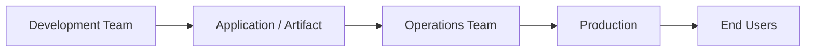

### Problems with the old approach

| Problem                             | Impact                           |
| ----------------------------------- | -------------------------------- |
| Dev & Ops worked separately         | Communication gaps               |
| Dev environment ≠ Production        | "Works on my machine" issues     |
| Infrastructure provisioned manually | Slow & error-prone               |
| Manual build/release                | Slow deployments                 |
| Large releases                      | Problems discovered late         |
| Hardware purchased upfront          | Infrastructure may become unused |

For example, code developed on Windows could behave differently when deployed to a Linux production server. 

### Why DevOps?

Modern applications such as e-commerce, streaming and food-delivery platforms change frequently and experience highly variable traffic.

**DevOps enables faster and more reliable delivery of software to end users.** 

---

# 2. Traditional / On-Premises Infrastructure

Earlier, companies had to purchase physical servers.

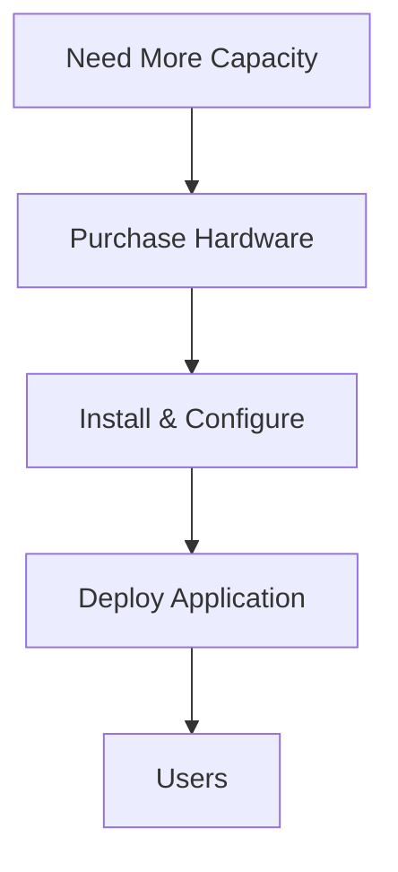

### Major problems

* Hardware procurement takes time.
* Configuration is manual.
* Scaling takes time.
* During low traffic, purchased servers may remain unused.
* High initial investment.

### Example: IPL Traffic

Suppose an application normally needs **2 servers**, but during IPL it needs **10 servers**.

With traditional infrastructure:

> Buy → configure → deploy → use

After IPL, those extra servers may remain underutilized.

This is one of the reasons cloud computing became important. 

---

# 3. Cloud Computing ☁️

Instead of **owning infrastructure**, organizations can **rent infrastructure** from a cloud provider.

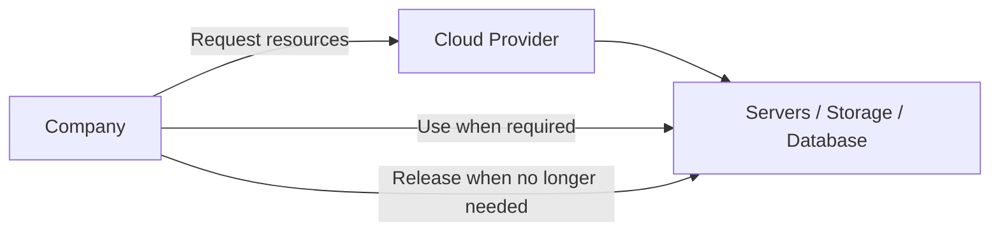

### Benefits

| Traditional              | Cloud                       |
| ------------------------ | --------------------------- |
| Buy hardware             | Rent resources              |
| Procurement takes time   | Resources available quickly |
| Large upfront investment | Pay for required resources  |
| Difficult to scale       | Easy to scale               |
| Unused hardware remains  | Resources can be released   |

The instructor used Google Drive/Google Photos as a simple analogy: instead of buying a hard disk just to temporarily store files, you can use cloud storage. 

---

# 4. Infrastructure as Code — IaC ⭐⭐⭐

Cloud solves **resource procurement**, but manually configuring many servers is still a problem.

For example:

```text
Server 1 → Java 17
Server 2 → Java 15
Server 3 → Java 17
```

Manual configuration can introduce inconsistencies and human errors. 

### IaC solution

**Infrastructure as Code = Define infrastructure in code/templates instead of configuring it manually.**

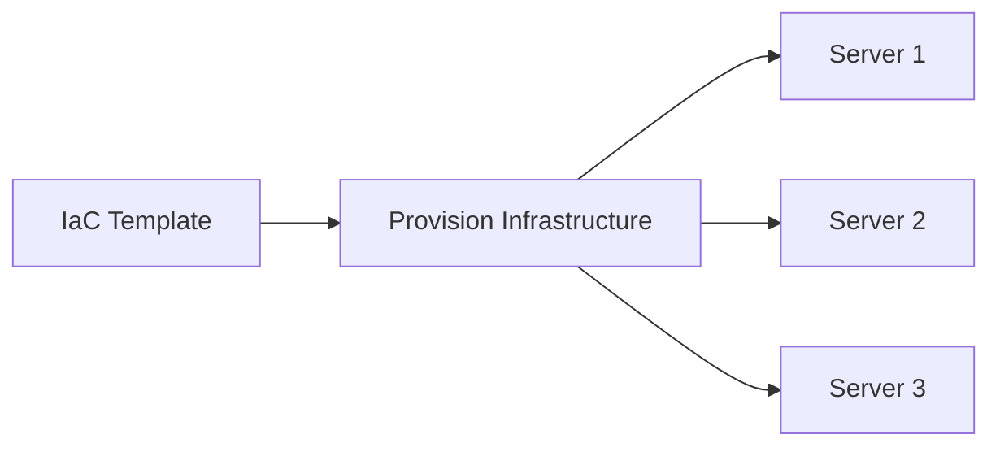

The template can specify:

* Type of server
* Required configuration
* Software/components
* Infrastructure requirements

Run the template → infrastructure is created consistently.

### Key benefits

* Automation
* Repeatability
* Consistency
* Less manual work
* Reduced human error
* Reusable infrastructure

**Tool mentioned:** Terraform. 

---

# 5. IaC + Auto Scaling

IaC can also support automated infrastructure changes.

Example:

> If CPU utilization > 75% → add another server.

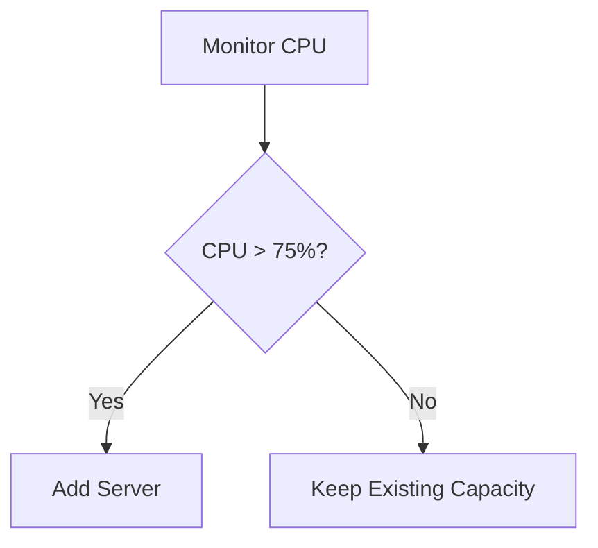

This concept is called **Auto Scaling**.

The important distinction:

* **IaC** → defines/provisions infrastructure through code.
* **Auto Scaling** → automatically adjusts capacity based on conditions. 

---

# 6. Why Manual Build & Release Was a Problem

Previously, build and release involved many manual steps.

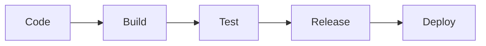

If every stage is manual:

* Takes more time
* Higher chance of errors
* Releases happen less frequently
* Difficult to respond quickly to business changes

Modern applications require much faster release cycles. 

---

# 7. SDLC — Software Development Life Cycle

The session introduced two important SDLC models:

1. **Waterfall**
2. **Agile**

For DevOps fundamentals, understanding these two is sufficient; the instructor said there is no need to go deeply into other models such as Spiral. 

---

# 8. Waterfall Model ⭐

Waterfall follows a **sequential approach**.

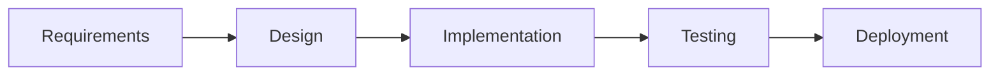

### Main characteristics

* One phase follows another.
* Requirements are defined upfront.
* Testing happens relatively late.
* Changes are difficult after development begins.

### Problems

Suppose:

```text
Requirements → 1 month
Design       → 2 months
Development  → 6 months
Testing      → 2 months
Deployment   → 1 month
```

You may discover after many months that the product doesn't match the customer's expectation.

Also, changing requirements midway is difficult. 

### Waterfall is suitable when

* Requirements are stable.
* Project is relatively small/simple.
* Major changes are unlikely.

It is less suitable for large, complex projects spanning years. 

---

# 9. Agile Model ⭐⭐⭐

Agile addresses many limitations of Waterfall by developing the product in **iterations**.

Each iteration is called a **Sprint**.

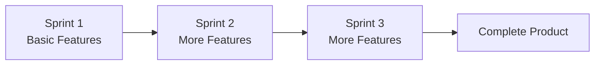

Each sprint produces a **working product increment**.

### Example

For an e-commerce application:

| Sprint   | Deliverable                     |
| -------- | ------------------------------- |
| Sprint 1 | Home page / basic functionality |
| Sprint 2 | Product functionality           |
| Sprint 3 | Cart                            |
| Sprint 4 | Payment                         |
| Sprint 5 | Additional features             |

Instead of waiting 12 months to see the final product, users can validate smaller increments early. 

### Agile advantages

* Frequent feedback
* Early testing
* Easier requirement changes
* Smaller releases
* Reduced risk of major surprises

---

# 10. Agile vs DevOps ⭐⭐⭐

This is an **important interview question**.

| Agile                                     | DevOps                                                            |
| ----------------------------------------- | ----------------------------------------------------------------- |
| Focuses mainly on software development    | Covers development **and delivery/operations**                    |
| Plan → Code → Build → Test                | Plan → Code → Build → Test → Release → Deploy → Operate → Monitor |
| Development focused                       | Dev + Ops collaboration                                           |
| Doesn't fully address production delivery | Includes making software available to users                       |

The instructor described **Agile as a subset of DevOps**. 

### Easy way to remember

> **Agile = How do we develop software quickly?**
> **DevOps = How do we develop AND deliver/run it quickly and reliably?**

---

# 11. DevOps Lifecycle ⭐⭐⭐

The DevOps lifecycle is an **infinite loop**.

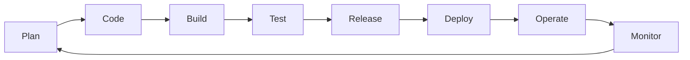

### Development side

**Plan → Code → Build → Test**

### Operations side

**Release → Deploy → Operate → Monitor**

The two sides collaborate rather than working as isolated teams. 

---

# 12. DevOps Is NOT a Technology ⭐⭐⭐

This was strongly emphasized.

**DevOps is not a single technology or tool.**

It is:

> **A framework / set of guiding principles and practices for achieving faster and reliable software delivery.**

Organizations can implement DevOps differently depending on their requirements and maturity. 

### Therefore:

You don't need every DevOps tool.

For example, automation could be done using:

* Jenkins
* Shell scripts
* Python
* Other CI/CD tools

The **concept matters more than the specific tool**. 

---

# 13. DevOps = Ecosystem of Tools

The instructor introduced tools by lifecycle stage:

| Stage            | Tool(s)     |
| ---------------- | ----------- |
| Source control   | Git, GitHub |
| Build            | Maven       |
| CI/CD / Release  | Jenkins     |
| Containerization | Docker      |
| Operations       | Kubernetes  |
| Monitoring       | Grafana     |
| IaC              | Terraform   |

The course focuses on learning the **fundamentals behind these tools**, not merely tool syntax. 

### Important concept

Tools may change, but the **underlying concepts remain similar**.

For example:

```text
Jenkins
   ↓
Azure DevOps
   ↓
GitHub Actions
```

The syntax differs, but CI/CD concepts remain largely the same. 

---

# 14. Web Server vs Application Server ⭐⭐⭐

This was a major part of the session.

### Web Server

Main responsibilities:

1. Serve **static content**
2. Act as an **entry point** and forward requests to an application server

Examples mentioned:

* Nginx
* Apache HTTPD
* IIS
* IBM HTTP Server 

### Application Server

Used when application/business logic needs to execute.

It can provide runtime capabilities such as:

* Business logic execution
* Database connectivity
* Caching
* Authentication
* Session handling
* Other application-level services 

Examples mentioned include WebLogic, WebSphere, JBoss and Tomcat. 

---

# 15. Static vs Dynamic Content ⭐

| Static Content | Dynamic Content          |
| -------------- | ------------------------ |
| Same for users | Can differ between users |
| HTML/CSS       | User-specific data       |
| Images         | Account information      |
| Videos         | Recommendations          |
| PDFs           | Location-based results   |

### Static example

A website containing:

```text
HTML
CSS
Images
PDF
```

can be served directly by a web server. 

### Dynamic example

**Zomato:** restaurants based on location.

**Netflix:** recommendations based on viewing history.

**Banking:** account balance based on logged-in user.

These require application logic. 

---

# 16. Typical 3-Tier Architecture ⭐⭐⭐

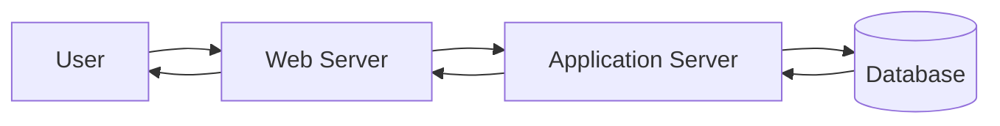

### Request flow

Example:

**User → Web Server → Application Server → Database**

Then the response travels back:

**Database → Application Server → Web Server → User**

The web server can act as an intermediary between the user and application server. 

---

# 17. Web Server ≠ Application Server

### Easy interview answer

**Web server:**

> Primarily serves static content and can act as an entry point/reverse proxy to forward requests.

**Application server:**

> Provides the runtime environment and capabilities required to execute application/business logic.

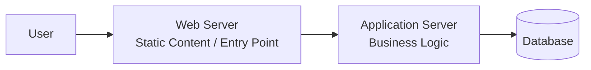

---

# 18. Microservices Connection

Modern applications are often composed of **multiple microservices** rather than one giant application.

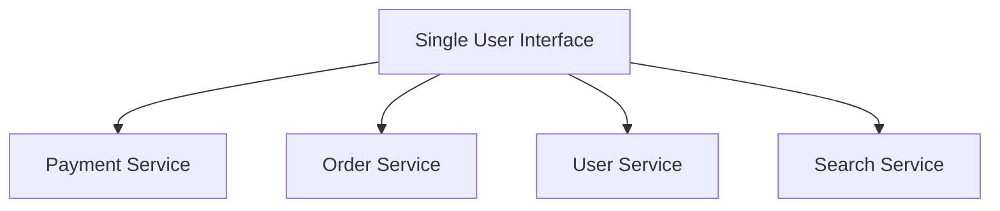

Each microservice can be a separate application.

From the user's perspective, it may look like one application, but internally many services communicate with each other. 

---

# 🔥 Interview Revision

| Question                            | Answer                                                                                |
| ----------------------------------- | ------------------------------------------------------------------------------------- |
| What is DevOps?                     | Framework/practices enabling faster and reliable software delivery                    |
| Is DevOps a technology?             | **No**                                                                                |
| Why DevOps?                         | Faster, reliable and frequent software delivery                                       |
| Traditional infrastructure problem? | Manual, slow, expensive and difficult to scale                                        |
| What is cloud?                      | Renting computing resources instead of owning infrastructure                          |
| What is IaC?                        | Managing/provisioning infrastructure using code/templates                             |
| IaC example?                        | **Terraform**                                                                         |
| What is Auto Scaling?               | Automatically adding/removing capacity based on conditions                            |
| Waterfall?                          | Sequential development model                                                          |
| Agile?                              | Iterative/incremental development                                                     |
| Sprint?                             | An iteration in Agile                                                                 |
| Agile vs DevOps?                    | Agile focuses on development; DevOps extends across development + delivery/operations |
| DevOps lifecycle?                   | Plan → Code → Build → Test → Release → Deploy → Operate → Monitor                     |
| Web server?                         | Static content + entry point for requests                                             |
| Application server?                 | Runs application/business logic                                                       |
| Static content?                     | Same content for users                                                                |
| Dynamic content?                    | Content generated/changed based on parameters                                         |
| 3-tier architecture?                | Web → Application → Database                                                          |
| Why OSI?                            | Helps understand networking and troubleshooting                                       |

## 🧠 One-page mental model

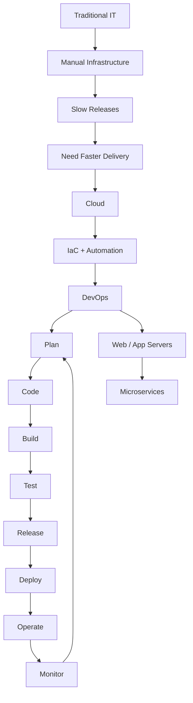

**Most important takeaway:**

> **Cloud provides infrastructure quickly → IaC automates infrastructure → Agile enables iterative development → DevOps connects development with delivery and operations → automation/tools make the entire cycle faster and more reliable.** 
