# DevOps Session — Networking Notes

**Date:** 27 Aug 2026
**Focus:** OSI Model, TCP/UDP, Load Balancers, Session Management & DNS

I’ve kept this **crisp, structured, and interview-focused**, removing participant discussions and repetition. Based on the instructor’s transcript. 

---

# 1. OSI Model ⭐⭐⭐

**OSI = Open Systems Interconnection**

It is a **7-layer conceptual model created by ISO** to explain how data moves from one device to another and to provide a common framework across different networking vendors. 

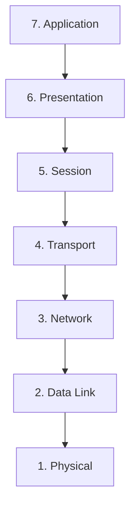

### Easy mnemonic

> **All People Seem To Need Data Processing**

| Layer | Name         | Main Responsibility              | Key Concept                 |
| ----: | ------------ | -------------------------------- | --------------------------- |
|     7 | Application  | Network services to applications | HTTP, HTTPS, DNS, FTP, SMTP |
|     6 | Presentation | Format, encrypt, compress        | JPEG, encryption            |
|     5 | Session      | Establish/manage sessions        | Session state               |
|     4 | Transport    | End-to-end delivery              | TCP, UDP, Ports             |
|     3 | Network      | Routing between networks         | IP, Router                  |
|     2 | Data Link    | Node-to-node delivery            | MAC, Frames, Switch         |
|     1 | Physical     | Physical transmission            | Bits, cables, signals       |

---

# 2. Layer 1 — Physical Layer

The **Physical Layer** is the foundation.

### Responsibilities

* Transmits raw **bits**
* Handles physical connections
* Controls transmission speed
* Deals with physical transmission media
* Synchronizes transmission

Examples:

* Cables
* Modems
* Hubs
* Physical networking equipment


Think:

> **Physical = Actual hardware + Bits**

Internet speeds such as **100 Mbps / 200 Mbps** relate to the amount of data that can be transmitted per second at the physical level. 

---

# 3. Layer 2 — Data Link Layer ⭐

Data Link handles communication between devices on the **same network**.

### Key responsibilities

* Node-to-node communication
* Uses **MAC addresses**
* Converts packets into **frames**
* Error/flow control
* Controls access to the shared medium

### Device

**Switch** is the primary example.

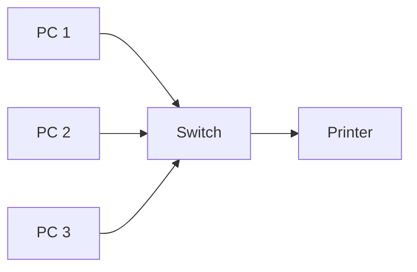

A switch uses **MAC addresses** to determine where traffic should go within the local network. 

### Packet → Frame

```text
Network Layer
      ↓
   Packet
      ↓
Data Link Layer
      ↓
    Frame
      ↓
Physical Layer
      ↓
     Bits
```

**Remember:**

> Layer 2 → **MAC + Frame + Switch**

---

# 4. Switch vs Router ⭐⭐⭐

This is an important interview question.

| Switch                            | Router                      |
| --------------------------------- | --------------------------- |
| Mainly Layer 2                    | Mainly Layer 3              |
| Uses MAC address                  | Uses IP address             |
| Connects devices within a network | Connects different networks |
| Forwards frames                   | Routes packets              |
| Example: LAN communication        | LAN → Internet              |

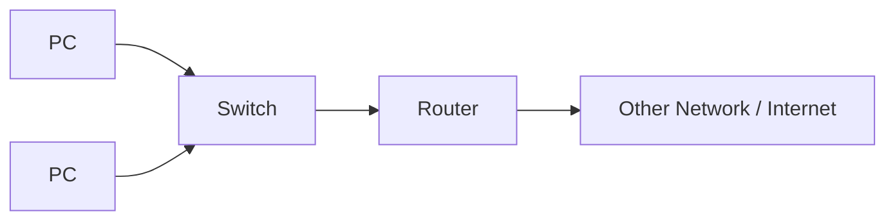

### Easy answer

> **Switch = connects devices within the same network.**
> **Router = connects different networks.**


---

# 5. Layer 3 — Network Layer ⭐⭐⭐

The Network Layer handles **logical addressing and routing**.

### Main responsibilities

* Uses **IP addresses**
* Determines destination
* Finds a route/path
* Communicates between different networks

### Device

**Router**

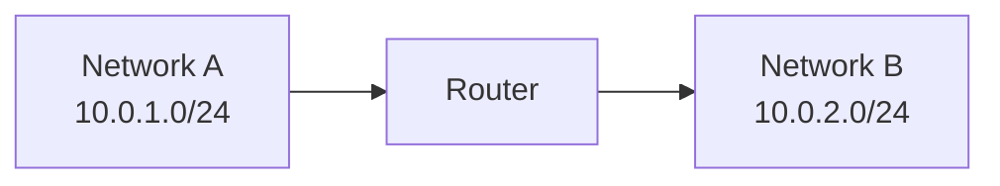

### Key concept

> **Layer 3 = IP + Routing + Router**

If data needs to travel from **A → B**, the destination IP helps determine where the packet needs to go. 

---

# 6. Layer 4 — Transport Layer ⭐⭐⭐

The Transport Layer provides **end-to-end communication**.

The two important protocols are:

* **TCP**
* **UDP**

It also uses **port numbers** to identify the specific application/process receiving the data. 

### IP vs Port

Think of an apartment:

```text
Building Address = IP Address
Flat Number      = Port Number
```

The IP gets the data to the correct machine; the **port gets it to the correct application**.

---

# 7. TCP vs UDP ⭐⭐⭐

| TCP                   | UDP                   |
| --------------------- | --------------------- |
| Connection-oriented   | Connectionless        |
| Reliable              | No delivery guarantee |
| Maintains order       | No guaranteed order   |
| Uses acknowledgements | No acknowledgement    |
| Retransmits lost data | Doesn't retransmit    |
| More overhead         | Lower overhead        |
| Reliability > speed   | Speed > reliability   |

### TCP

Before sending data, TCP establishes a connection using a **handshake**.

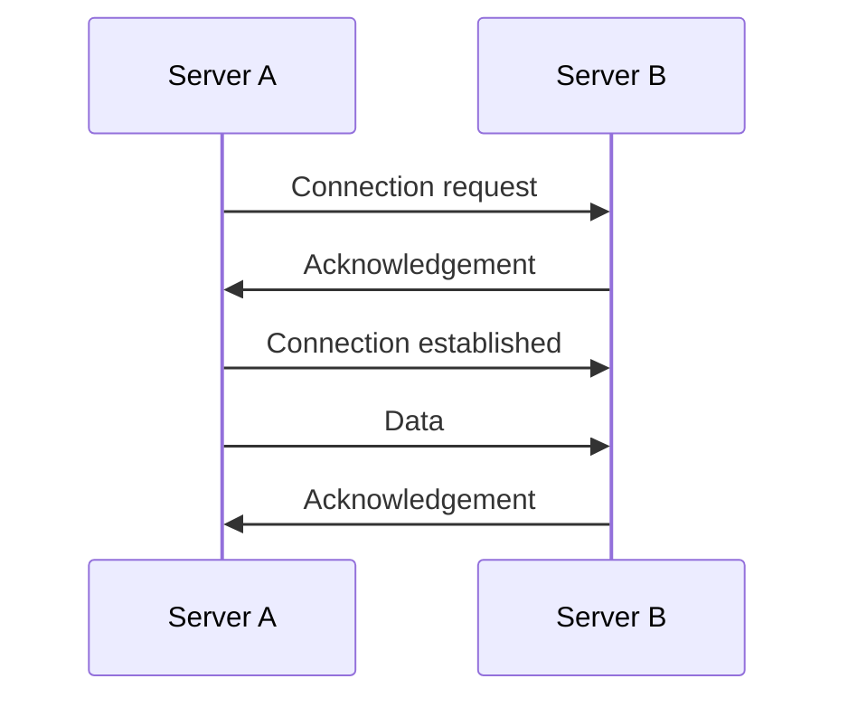

If the destination isn't listening, the connection cannot be properly established. TCP also retransmits lost data and maintains ordering. 

### UDP

UDP sends data without establishing a connection first.


This makes it faster, but packets may be lost or arrive out of order.

### Examples

| Scenario                         | Suitable |
| -------------------------------- | -------- |
| Web page                         | TCP      |
| Reliable file transfer           | TCP      |
| Video call                       | UDP      |
| Real-time streaming              | UDP      |
| Applications where speed matters | UDP      |

The instructor's key idea was:

> **TCP → Reliability**
> **UDP → Performance**


---

# 8. Layer 5 — Session Layer

The Session Layer manages the **session/state of communication**.

### Responsibilities

* Establish session
* Maintain session
* Terminate session
* Manage communication state

### Example — Netflix

Suppose you watch a movie for 30 minutes and leave.

When you return:

> **Continue Watching → Resume from where you stopped**

This requires session/state management. 

### DevOps relevance

Session information can be stored in a **cache/session store** so that it is available even when the user accesses the application again.

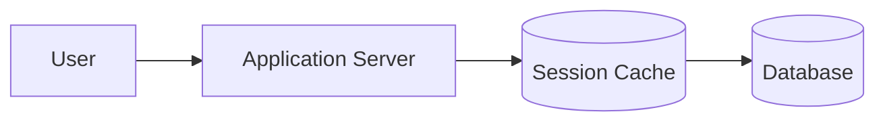

The instructor emphasized that application logic handles how the session is used, while DevOps can be responsible for maintaining the underlying cache infrastructure. 

---

# 9. Layer 6 — Presentation Layer

Also called the **Translation Layer**.

### Responsibilities

* Data formatting
* Translation
* Encryption/decryption
* Compression
* Data representation

Examples:

* JPEG
* MPEG
* GIF
* Encryption formats

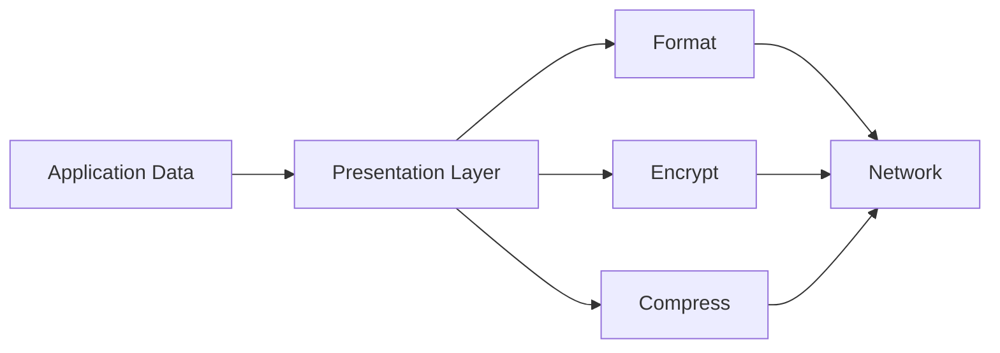

### Example

If one application expects JPEG but receives an unsupported format such as SVG, there can be a **format/representation issue**.


---

# 10. Layer 7 — Application Layer ⭐

This is the layer closest to the application/user.

### Common protocols

| Protocol | Purpose                  |
| -------- | ------------------------ |
| HTTP     | Web communication        |
| HTTPS    | Secure web communication |
| DNS      | Name resolution          |
| FTP      | File transfer            |
| SMTP     | Email                    |

The application layer provides network services used by applications such as browsers and email clients. 

---

# 11. How Data Travels Through OSI ⭐⭐⭐

This is one of the most important concepts.

### Sender

```text
Application
     ↓
Presentation
     ↓
Session
     ↓
Transport
     ↓
Network
     ↓
Data Link
     ↓
Physical
```

### Receiver

```text
Physical
     ↓
Data Link
     ↓
Network
     ↓
Transport
     ↓
Session
     ↓
Presentation
     ↓
Application
```

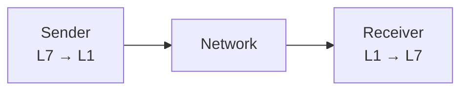

### Data transformation

| Layer       | Data representation |
| ----------- | ------------------- |
| Application | Data                |
| Transport   | Segment             |
| Network     | Packet              |
| Data Link   | Frame               |
| Physical    | Bits                |

Each layer adds its own information while sending; the receiver processes those layers in reverse. 

---

# 12. Load Balancer & OSI Layers ⭐⭐⭐

Very important for **cloud/DevOps interviews**.

There are two common types:

| Load Balancer             | OSI Layer | Traffic     |
| ------------------------- | --------: | ----------- |
| Application Load Balancer |    **L7** | Application |
| Network Load Balancer     |    **L4** | Transport   |

### L7 — Application Load Balancer

Understands application-level information such as HTTP/HTTPS.

### L4 — Network Load Balancer

Works at the **Transport Layer**, primarily with TCP/UDP.

> ⚠️ **Network Load Balancer does NOT mean Layer 3. It is a Layer 4 load balancer.**


---

# 13. DNS — Domain Name System ⭐⭐⭐

DNS converts a human-friendly domain name into an IP address.

```text
google.com
     ↓
   DNS
     ↓
IP Address
     ↓
Google Server
```

Why?

Humans remember:

> `google.com`

Computers communicate using:

> IP addresses


---

# 14. DNS Resolution Flow ⭐⭐⭐

When you enter:

`google.com`

a simplified resolution process is:

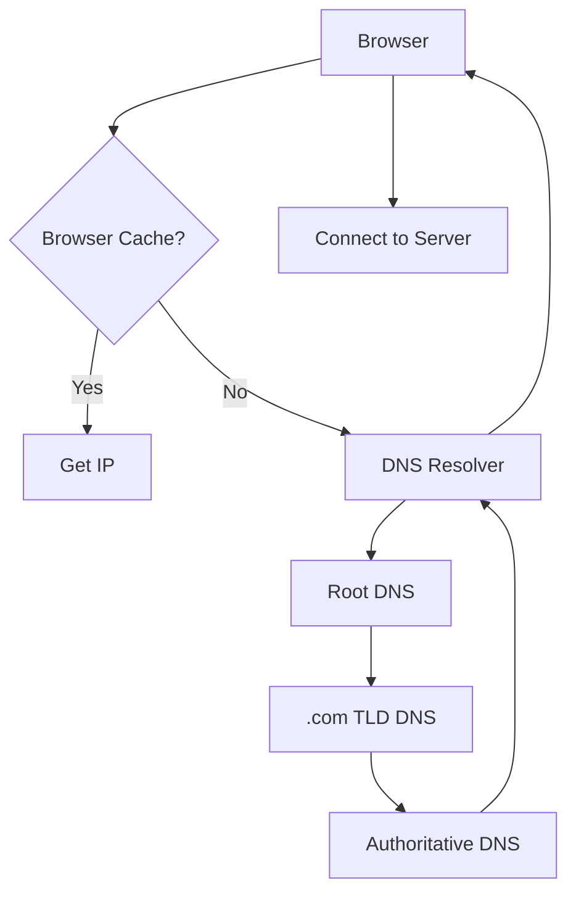

### Step-by-step

1. Browser checks its DNS cache.
2. If not found → request goes to DNS resolver.
3. Resolver contacts **Root DNS**.
4. Root directs it to the appropriate **TLD** server.
5. TLD directs it to the **Authoritative DNS**.
6. Authoritative DNS provides the DNS record/IP.
7. Resolver returns the result to the client.
8. Browser connects to the destination IP.


---

# 15. Root DNS vs TLD vs Authoritative DNS

| Component              | Responsibility                             |
| ---------------------- | ------------------------------------------ |
| Root DNS               | Directs request to appropriate TLD         |
| TLD DNS                | Handles `.com`, `.in`, `.org`, etc.        |
| Authoritative DNS      | Contains the actual DNS record             |
| Recursive DNS Resolver | Queries DNS hierarchy and caches responses |

Example:

```text
example.com
     ↓
Root DNS
     ↓
.com TLD
     ↓
Authoritative DNS
     ↓
IP Address
```

The root server doesn't directly provide the IP for `example.com`; it directs the query toward the appropriate TLD. 

---

# 16. Authoritative vs Non-Authoritative DNS ⭐⭐

| Authoritative DNS                   | Non-Authoritative / Recursive Cache   |
| ----------------------------------- | ------------------------------------- |
| Contains original DNS record        | Contains cached result                |
| Controlled by domain owner/provider | Resolver/cache                        |
| Source of truth                     | Temporary copy                        |
| Provides definitive answer          | Uses previously retrieved information |

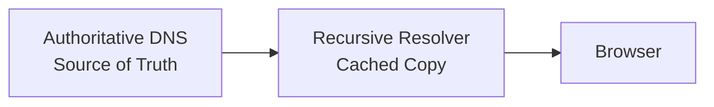

If the authoritative record changes, cached records update after their **TTL** expires. 

---

# 17. DNS TTL ⭐⭐⭐

**TTL = Time To Live**

It determines how long a DNS response can remain cached.

Example:

```text
TTL = 5 minutes
```

For those five minutes, subsequent requests can use the cached DNS result instead of performing the complete DNS lookup again. 

### Why TTL matters

| Low TTL                           | High TTL                         |
| --------------------------------- | -------------------------------- |
| Changes propagate faster          | Changes take longer to propagate |
| More DNS queries                  | Fewer DNS queries                |
| Useful when IP changes frequently | Useful for stable records        |

---

# 18. Public DNS vs Private DNS ⭐⭐⭐

### Public DNS

DNS record is resolvable over the **public Internet**.

Example:

```text
www.example.com
       ↓
Public DNS
       ↓
Public IP
```

### Private DNS

Used for internal applications that should only be accessible inside an organization's network/VPN.

Example:

```text
salary.company.com
       ↓
Private DNS
       ↓
Private IP
```

If you're connected to the company's network/VPN → it resolves.

From the public Internet → it doesn't.

The instructor specifically connected this to internal applications such as timesheet/salary systems. 

---

# 19. Where Do You Create DNS Records?

DNS records can be maintained through DNS providers/platforms such as:

* Amazon Route 53
* GoDaddy
* Azure DNS
* Infoblox

The important concept is:

> **You must own/control the domain before you can create its authoritative DNS records.**

You cannot simply create a DNS record for `google.com` or `facebook.com`. 

---

# 20. DNS + DevOps ⭐⭐⭐

As a DevOps engineer, you'll commonly work with:

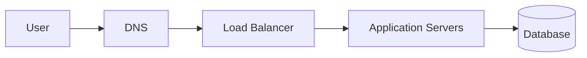

Typical responsibilities can include:

* Creating/updating DNS records
* Pointing domains to load balancers
* Managing public/private DNS
* Understanding TTL
* Troubleshooting DNS resolution
* Working with Route 53 or other DNS providers
* Understanding how DNS interacts with networking and load balancers

---

# 🔥 Interview Revision

| Question           | Short Answer                          |
| ------------------ | ------------------------------------- |
| What is OSI?       | 7-layer conceptual networking model   |
| Who created OSI?   | ISO                                   |
| How many layers?   | **7**                                 |
| Layer 1?           | Physical                              |
| Layer 2?           | Data Link                             |
| Layer 3?           | Network                               |
| Layer 4?           | Transport                             |
| Layer 5?           | Session                               |
| Layer 6?           | Presentation                          |
| Layer 7?           | Application                           |
| Layer 2 address?   | **MAC**                               |
| Layer 3 address?   | **IP**                                |
| Layer 4 uses?      | **Ports + TCP/UDP**                   |
| Switch?            | Mainly Layer 2                        |
| Router?            | Mainly Layer 3                        |
| TCP?               | Reliable, connection-oriented         |
| UDP?               | Faster, connectionless                |
| L4 Load Balancer?  | Network Load Balancer                 |
| L7 Load Balancer?  | Application Load Balancer             |
| DNS?               | Converts domain names to IP addresses |
| Root DNS?          | Directs to appropriate TLD            |
| TLD?               | `.com`, `.in`, `.org`, etc.           |
| Authoritative DNS? | Source of truth for DNS records       |
| Recursive DNS?     | Resolves and caches DNS results       |
| TTL?               | How long DNS result can be cached     |
| Public DNS?        | Internet-resolvable DNS               |
| Private DNS?       | Internal/private name resolution      |

---

## 🧠 Final Mental Model

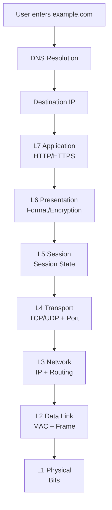

### ⭐ Remember these 5 things first

**1.** `L2 = MAC + Switch`
**2.** `L3 = IP + Router`
**3.** `L4 = TCP/UDP + Port`
**4.** `L7 = Application + HTTP/HTTPS`
**5.** `DNS = Domain name → IP`

The session's main practical takeaway for DevOps is that you don't need to become a network engineer, but you **must understand OSI conceptually, especially L4/L7 load balancing, TCP/UDP, ports, IPs and DNS troubleshooting**. 
